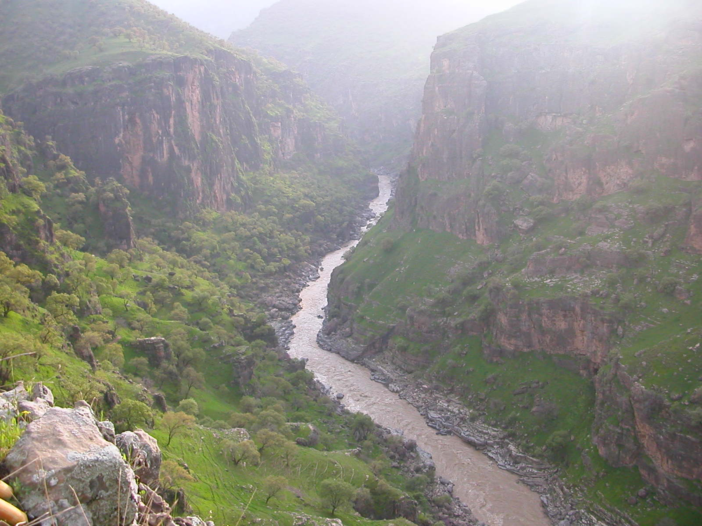

+++
# A Demo section created with the Blank widget.
# Any elements can be added in the body: https://sourcethemes.com/academic/docs/writing-markdown-latex/
# Add more sections by duplicating this file and customizing to your requirements.

widget = "blank"  # See https://sourcethemes.com/academic/docs/page-builder/
headless = true  # This file represents a page section.
active = true # Activate this widget? true/false
weight = 20  # Order that this section will appear.

title = ""
subtitle = ""

[design]
  # Choose how many columns the section has. Valid values: 1 or 2.
  columns = "1"

[design.background]
  # Apply a background color, gradient, or image.
  #   Uncomment (by removing `#`) an option to apply it.
  #   Choose a light or dark text color by setting `text_color_light`.
  #   Any HTML color name or Hex value is valid.

  # Background color.
  # color = "navy"
  
  # Background gradient.
  # gradient_start = "DeepSkyBlue"
  # gradient_end = "SkyBlue"
  
  # Background image.
  image = ""  # Name of image in `static/img/`.
  image_darken = 0.6  # Darken the image? Range 0-1 where 0 is transparent and 1 is opaque.

  # Text color (true=light or false=dark).
  text_color_light = false

[design.spacing]
  # Customize the section spacing. Order is top, right, bottom, left.
  padding = ["20px", "0", "20px", "0"]

[advanced]
 # Custom CSS. 
 css_style = ""
 
 # CSS class.
 css_class = "mini"
+++

I have a Kurdish heritage, born and raised in a small town in the West part of Iran, just half-an hour drive to Kurdish Iraqi border. 

After high school, I moved to Tehran and studied Industrial Engineering, receiving my BSc. from [K.N.Toosi University of Technology](https://en.kntu.ac.ir/) (2004). Following my graduation, I have worked in various companies in different industries as planning engineer in Tehran and South of Iran. 
I then decided to continue my studies and recieved my MSc in Industrial Engineering from [Tarabiat Modares University](https://www.modares.ac.ir/en)(2008). After working in the project managemt filed for two years, I decided to pursue my PhD in France. I moved to France in 2009 and recieved my PhD from the [University of Bordeuax](https://www.u-bordeaux.com/), France in 2014.
Following that, I have spent two years at [Ecole Central-Supelec](https://www.centralesupelec.fr/) for my post doctoral reserach.

I am now a Professor in Data-Driven Decision Science at [Cardiff University](https://www.cardiff.ac.uk/people/view/598316-rostami-tabar-bahman).

I am very passionate about forecasting, analytics, modeling and knowledge sharing. I have created [Forecasting for Social Good](https://www.f4sg.org/) initiative sponsored by the [International Institute of forecasters](https://forecasters.org/events/iif-workshops/).

I am the founder and the [Director of the Data Lab for Social Good Research Group](https://www.cardiff.ac.uk/research/explore/research-units/data-lab-for-social-good) at Cardiff University. 

I specialise in the development and application of forecasting and management science tools and techniques. My focus lies in leveraging these methodologies to provide informed insights for planning & decision-making in sectors contributing to social good, including healthcare operations, global health and humanitarian supply chains, social sustainability, and governmental policy

