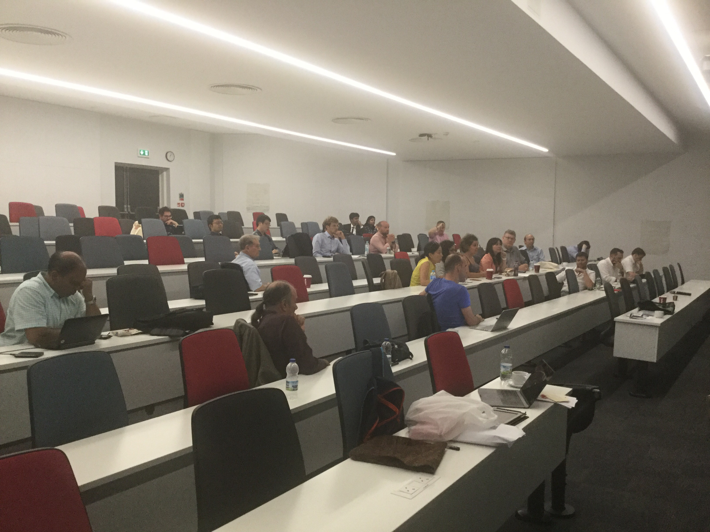
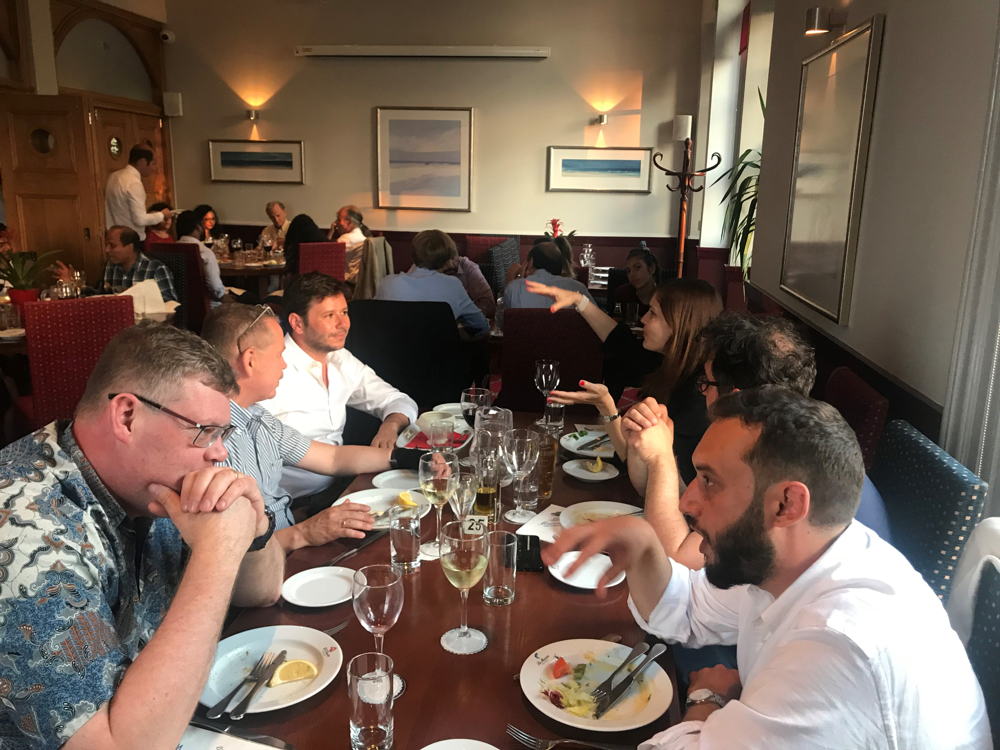

```{r setup, include=FALSE}
knitr::opts_chunk$set(collapse = TRUE)
```


The first international workshop dedicated to “Forecasting for Social Good” took place at Cardiff Business School , 12-13 July 2018. We had 38 participants from 8 countries( UK, USA, Australia, India, Norway, Switzerland, India, Germany) over two days. In particular, we had practitionaires from organisations such as NHS, International Committee of the Red Cross, United Nation High Commission for Refugees, United Nations Office for Disaster Risk Reduction, Welsh Government, Australian Government, Future Generation Commissioner for Wales.

Based on feedback I received, it is fair to conclude that the workshop was a great success! This was a great conference many of participants have said to me! Their contribution turned it into a smoothly running meeting with very interesting presentations and an excellent atmosphere for discussion and networking.

We have had a very interesting group activity to come up with a unified definition of Forecasting for Social Good.  I am going to share it with other experts in the area and then publish what we think could be a precise and comprehensive definition for forecasting for social good.

```{r echo=FALSE, fig.cap = "Group activity on what is forecasting for social good", out.width = '90%'}
knitr::include_graphics("../../static/img/ga.jpg")
```


I believe we have made an incredible start to give more attention to societal aspects of forecasting and we should continue doing it.

I am very happy to discuss any further development and delighted if you can share your suggestions on how we should continue Forecasting for Social Good initiative.

This is my roadmap for the near future. Very happy to listen to any ideas you might have.

1. I am creating a website dedicated to forecasting for social good. It will include publications, projects and blogs. The plan is to make it online by the end of July 2018. You will be invited to subscribe and contribute to it by sending you publications, projects and blogs to be published there.

2. I am planning to organise invited sessions on forecasting for social good at the annual symposiums of the IIF.

3. I am also thinking of how to recreate this fantastic workshop in other places, with biannual recurrence where we can meet and exchange ideas.

More photos are available [here](https://www.dropbox.com/sh/csm96lqav3p6zd2/AADyECWVsiHCZ6yUNM2LaXJva?dl=0)

```{r echo=FALSE,out.width = '90%'}


```


