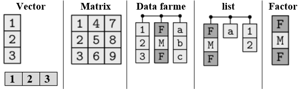

In the [previous post](https://www.bahmanrt.com/post/intro-furw/), you learned essentials to work with R and RStudio. You are all set to start your data analysis journey. In R there are always multiple ways to achieve the same goal, in general we will try to follow the [tidyverse](https://www.tidyverse.org/) and [tidyverts](https://tidyverts.org/) approaches. You have installed and loade the tidyverse packages in the previous section. Having done that, all of the tidyverse packages will be at your disposal (i.e. you don’t need to install them individually).
In this post, we 

**Learning outcomes**

By the end of this post, you should be able to:

1. describe data preperation task
2. articulate the need to prepare data
3. import data into R
4. explore raw data using R functions
5. identify various data type and data structure
6. describe the tidy data concept and its importance

##  Why do I need to prepare data? 

The simple answer to this question is: because if the data are wrong, they will give you the wrong insights and results followed by wrong decisions and planning. 

```{r garbage, fig.align='center', out.width="50%", echo=FALSE}
knitr::include_graphics("https://media.giphy.com/media/xT5LMxnlknujYHrBOU/giphy.gif")
```

The raw data given to you might not be in the right shape to start your analysis right away. The data may contain mistakes, missing values, duplications, outliers, etc. Returning to the A&E data, you need to ensure that the data we use for analysis is a quality dataset. You need to check whether it contains duplications, whether any values is missing, or any unusual values is present due to errors in the system and decide how to fix them. If any of these issues are present, then it’s crucial to fix them before you start analysing the data. You may need to have domaine knowledge to to fix some issues available in yoir dataset.

## Data preperation task

The data preparation involves various steps, such as:

* Import your data into R
* Explore raw data
* Check wether data is tidy 
* Create a tsibble
* Check for duplicated observations 
* Check for explicit and implicit missing values 
* Remove unwanted variables
* Change data type, structure
* Check for unusual observations

I cover the most important aspects of data preparation in three seperate posts. In the this post, I will discuss how to import data, ensuate it is in a tidy form and explore it.

# Import data into R

One of the most common ways you’ll want to work with data is by importing it from a file. In order to import the dataset into R, you need to know which function you should use.  

The function you use to import your dataset depends on the extension of your file. You can import data into R with any extension such as `.xlsx`, `.csv`, `.txt` and more. Different extensions need different R functions. 

If you look at the `ae.csv` file, you realise that it is a `.csv` file, therefore you need a function that import `.csv` files into R. You can use `read_csv()` from `readr` package.

```{r import-data, echo=TRUE, eval=TRUE, echo=TRUE}
library(readr)
ae_original <- readr::read_csv("my_data/ae.csv",col_types = cols(  
 arrival_time=col_datetime(format = "%d/%m/%Y %H:%M"))) 
```

This assumes that you have created a subdirectory `data` where your `ae.csv` is located. Thta is why I use relative path to readt the data. (remember this is why we created a project). 
We provide col_types argument to prevent the arrival_time from being a character. We need to have it as a data-time object. The argument `format = "%d/%m/%Y %H:%M"` corresponds to the format of `arrival_time` column in the `ae.csv` file. 

To store data to work on it later, you need to create a new data object. You create objects by assigning them to names. The assignment operator is `<-`. Think of assignment as the verb “gets”, reading left to right. So, the bit of code above can be read as “The object ae_original gets the result of importing `ae.csv` file located in subdirectory `data` using `read_csv()` function given that the type of data for column `arrival_time` must be a `datetime`. The function will guess the data type for the rest of columns. 

> **Note:** Option+minus on MacOS and Alt+minus on Windows and avois typing the assignment operator

# Explore raw data

Once you imported dataset into R, the first step in data preperation is to explore the data. There are many fucntion in R to help you explore your data. Try the following fucntions to know moe about the data:

```{r explore-data, echo=TRUE, eval=FALSE}
library(dplyr) # load package dplyr, here is for the function glimpse

str(ae_original) # what is the structure of ae_original?What isinside?

class(ae_original) # what kind of object is it?

head(ae_original,n=3) # show first n rows/observations

tail(ae_original,n=5) # show last n rows/observations

dim(ae_original) # dimensional of object

length(ae_original) # returns the number of columns/variables

nrow(ae_original) # number of rows

ncol(ae_original) # number of columns

names(ae_original) # shows the names attribute for a data frame, which gives the column names

glimpse(ae_original)# structure of the object, similar to str but slightly different

summary(ae_original)# summary of each column/variable of the data
```

## Data type

Every individual data value in R has a data type that tells us what sort of value it is. The most common data types are numbers, which R calls numeric, double or integer values, and text, which R calls character values and time which R calls datetime values. A data type defines what kind of data is held in a value. The number 23 has a numeric data type that is integer, for example, the word "twenty-three" has a character type and the time 2020-04-01 11:20 has a date and time data type. 

You can know observe the dataset you imported! You can check what type of object it is and what type of variables you have.

```{r import-data2,dependson='import-data'}
knitr::kable(head(ae_original))# head() prints the first 6 rows
```

If you type `ae_origin` and run it in Console or in your R chunk and look at the first row, you may notice the row of four-letter abbreviations under the column names. These describe the type of each variable: 

* dbl stands for doubles, or real numbers. 
* chr stands for character vectors, or strings. 
* POSIXct which is date-times (a date + a time). I don't know why they call it this, you may see `dttm` later which is a better name I guess.

There are three other common types of variables that aren’t used in this dataset but you may encounter later: 

* int stands for integers.
* lgl stands for logical, vectors that contain only TRUE or FALSE. 
* fctr stands for factors, which R uses to represent categorical variables with fixed possible values, e.g. male, female. 
* date stands for dates. 

## Data structure: Data frame, list and more

Data structures are made up of different data types. Data structures in R are tools for holding multiple values. The basic data structures used in R include vectors, matrices, `data frames`,`lists` and factors. You can think of a vector as a single column and a data frame as a rectangular table with columns and rows. A data frame is used for storing data tables. It is a list of vectors of equal length.

```{r data-type-structure, fig.align='center', echo=FALSE}

```

> Question: What is the difference between a data frame, matrix and list?

If you’re not sure what an object is, ask for its class. Every object has a class. This is the sort of object it is, whether a vector, a character string, a function, a list, and so on. Knowing an object’s class tells you a lot about what you can and can’t do with it, 

Type `class(ae_original)` in Console or R chunk and run it. It tells you `ae_original` is a tibble or data frame.


```{r import-data1,dependson='import-data'}
class(ae_original)
```

The most common data structure you work with in R is the data frame. As you work with tidyverse, you will see a modern take on data frames called `tibble`. Tibbles are data frames, but they tweak some older behaviours to make life a little easier. 
Data type and structure are important concepts in R because all functions you will use need data in one of the discussed types or structures as input and will return the value in a particular type and structure as output.

# Check if you data is tidy

**What is a tidy data?**

What does it mean for your data to be “tidy”? While “tidy” has a clear English meaning of “organized,” the word “tidy” in data science using R means that your data follows a standardized format. 

The principles of tidy data seem so obvious that you might wonder if you’ll ever encounter a dataset that isn’t tidy. Unfortunately, however, most data that you will encounter in real life will be untidy.
Most organisations store data in spreadsheets. This is not the only way to store data, however it has been the case for many organisations for many decades. Many spreadsheets are untidy data.

Please look at this presentation, [Get good data out of bad
spreadsheets](https://www.londonr.org/wp-content/uploads/sites/2/2019/05/Get-good-data-out-of-bad-spreadsheets-with-tidy-tools.pdf), for examples of untidy/messy spreadsheets quite common in many organisations.

So, if data are untidy, it means for most real analyses, you’ll need to do some tidying. Tidy data is a specific way of organizing data into a consistent format which plugs into the tidyverse set of packages for R. It is not the only way to store data and there are reasons why you might not store data in this format, but eventually you will probably need to convert your data to a tidy format in order to efficiently analyze it.

**How do I know if my data is tidy or not?**

The first step is always to figure out what the **variables** and **observations** are. Sometimes this is easy; other times you’ll need to consult with the people who originally generated the data. The second step is to resolve one of two common problems: 

* One variable might be spread across multiple columns. 
* One observation might be scattered across multiple rows. 

“Tidy” data is a standard way of mapping the meaning of a dataset to its structure. A dataset is messy or tidy depending on how rows, columns and tables are matched up with observations, variables and types. In tidy data: 

* Each variable forms a column. 
* Each observation forms a row. 
* Each type of observational unit forms a table. 

These three rules are interrelated because it’s impossible to only satisfy two of the three. That interrelationship leads to an even simpler set of practical instructions: 

* Put each dataset in a tibble. 
* Put each variable in a column 

```{r tidy_untidy, fig.align='center', out.width="50%", echo=FALSE, fig.cap="Tidy dataset"}
knitr::include_graphics("my_img/tidy-1.png")
```

**What if your data is untidy?**

If the dataset does not satisfy these conditions, then it is untidy. We then need to use functions available in `tidyr` package-part of `tidyverse`- to tidy data.

More information about tidy data and how to make untidy data tidy can be found in
in R for Data Science book, [chapter 12](https://r4ds.had.co.nz/tidy-data.html).

Please refer to the following link for more [examples](http://garrettgman.github.io/tidying/).

> Question: Is the ae_original dataset tidy?

If you look at the data `ae_original`, you see that it is a data frame with each variable in a column. So, yes it is tidy.

**Why would you put efforts in making your data tidy?**

The simple answer is it makes data analysis easier with tidyverse packages in R.

1. It helps to have a consistent data structure. That means you will focus more on the problem you want to solve and less on the structure of your data and also help developers to create tools that work on a uniform ways, tools that are easy to use and that means easier data manipulation, visualisatin and modeling/forecasting.

2. Easier to exploit R's vectorised nature that makes the thinking process much easier in data manipulation, visualisatin and modeling/forecasting.

## Summary of this post

1. Find an appropriate function dpending on your your file extenstion to import your datset into R.
2. Use functions in R to make yourself familair with the dataset. Among many available funcions you can check: `class()`, `str()`, `glimpse()`, `names()`, `nrow()`, `ncol()` and `summary()`
3. Check the data type and data structure of your data! Ensure you(data analyst) and R have the same understanding of data type (e.g. I think the variable age must be numeric and R says is numeric)
4. Figure out what the **variables** and **observations** are in your data set and Check if your data is tidy. If not, make it tidy

# Next post (Friday 13^th^ of March)

In the next post, Week 3, you will learn how to:

* Create a tsibble
* Check for duplicated observations 
* Check for explicit and implicit missing values 

# Github for forecasting using R

You can clone or download the repository for [forecasting using r]() and work on it on your own. This will include all weekly analysis.

# References

1. [Get good data out of bad spreadsheets with tidy tools ](https://www.londonr.org/wp-content/uploads/sites/2/2019/05/Get-good-data-out-of-bad-spreadsheets-with-tidy-tools.pdf)

2. [R for data Science, chapter 11](https://r4ds.had.co.nz/data-import.html)

3. [R for data Science, chapter 12](https://r4ds.had.co.nz/tidy-data.html)

4. [Statistical Inference via Data Science: A ModernDive into R and the tidyverse, chapter 4](https://moderndive.com/4-tidy.html)
