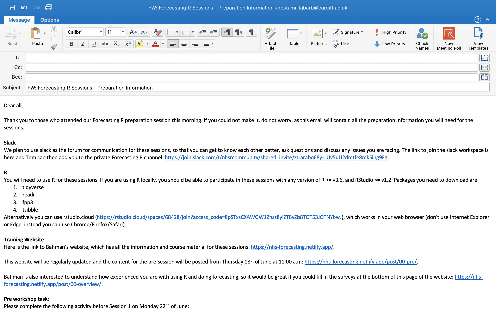
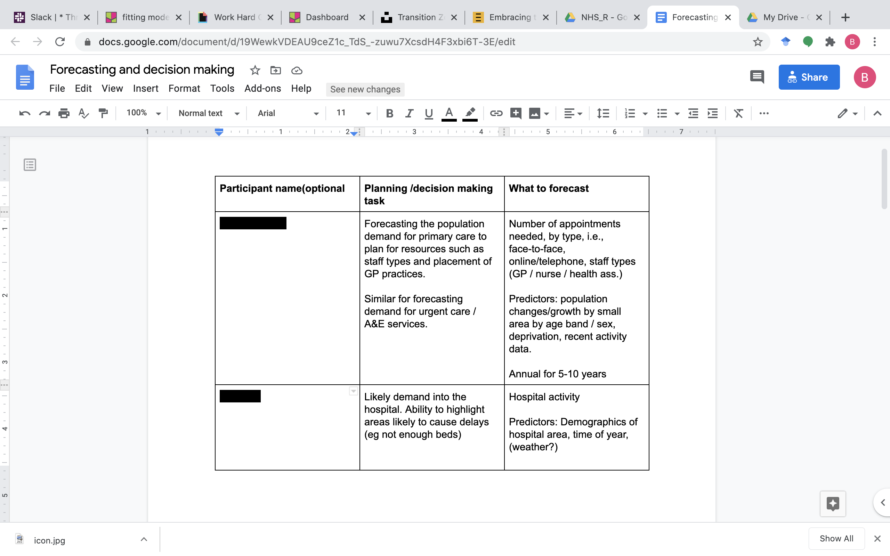
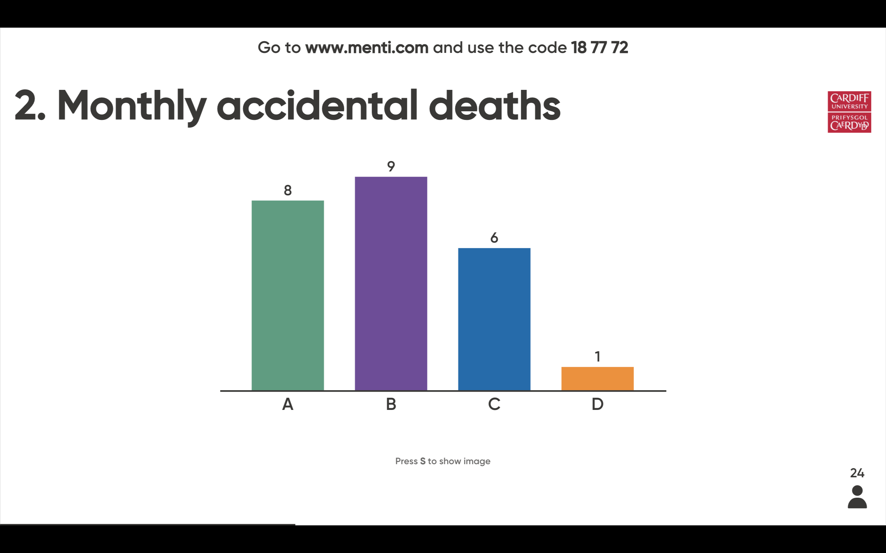
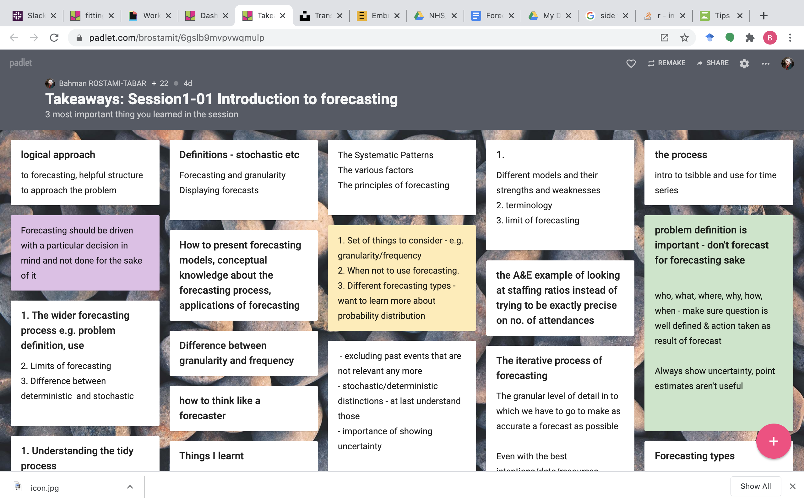
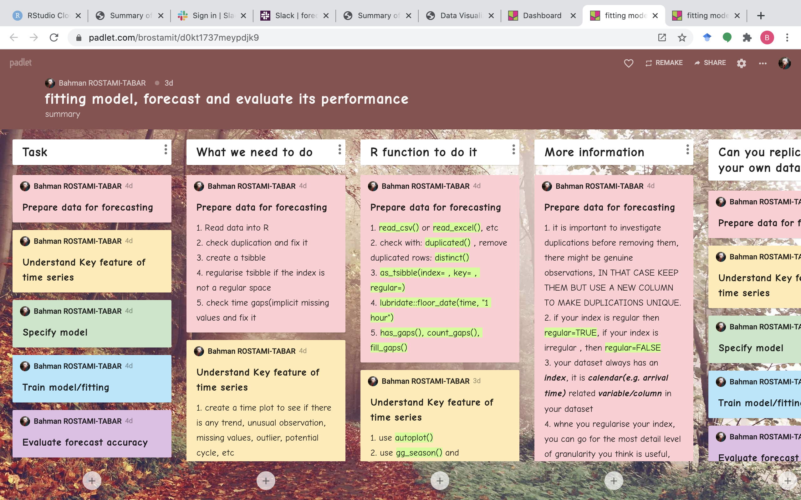
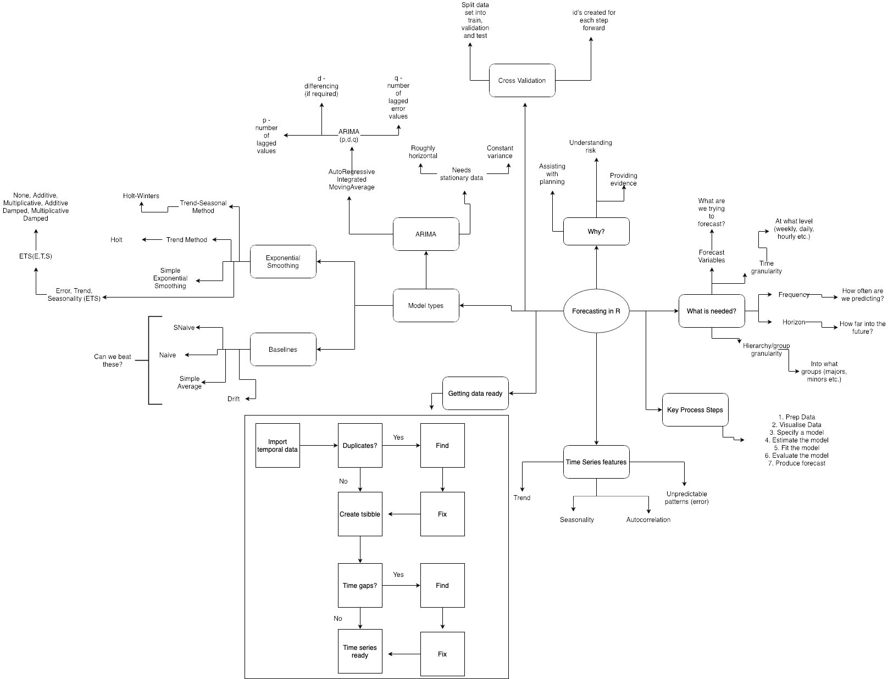
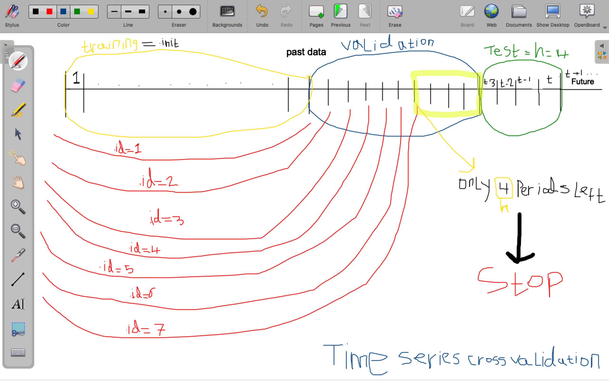

# Forecasting in R workshop

This is a free workshop to support the learning and application of forecasting using R in the NHS across the U.K. in collaboration with NHS-R community. The workshop is designed for 2 days, 90:00- 16:30.

We are offering five workshops in 2020 as per below:

1. Monday 24th & Tuesday 25th February 2020 – Nottinghamshire (done face to face)
2. Monday 22nd June 2020 – Huddersfield (virtually)
3. Thursday 13th & Friday 14th August 2020 – Gloucestershire
4. Wednesday 13th & Thursday 14th October 2020 – West Midlands
5. Thursday 12th & Friday 13th November 2020 – Cardiff

I taught the first one in February 2020 in nottinghamshire NHS trust as a 2-day workshop. Following the pandemic and a discussion with organisers, I have decided to deliver it virtually. This was my first experience delivering 2 days content (lectures and tutorials) online. 

```{r gif1, out.width="30%", echo=FALSE}
knitr::include_graphics("https://media.giphy.com/media/cEOG7nGA7448M/giphy.gif")
```

To deliver the workshop virtually, we had to make couple of decisions and plan accordingly.

# Pre-workshop Planning

I had only four weeks to prepare for the workshop with a lot to adopt and also learn new tools. I briefly discuss decisions made and  planning tasks as following:

1. **Number of sessions and time slot:** We decided to deliver six 2-hour sessions, 10:00-12:00 a.m. (BST) each day starting from Monday 22^nd^ of June.

2. **Socialising:** We decided to start tge MS Teams meeting at 09:30 a.m. to give half-an hour for socialising.

3. **Video calls:** NHS-R comminuty advised to use [MS Teams](https://www.microsoft.com/en-gb/microsoft-365/microsoft-teams/group-chat-software) platform for video communication. The video was not recorded.

4. **Q&A and communication with participants:** We used [Slack](https://slack.com/intl/en-gb/) to communicate with participants during the workshop. It helped to with Q/A and discussing any issues participants were facing. See a brief introduction to Slack [here](https://www.youtube.com/watch?v=pUZzBoAbAOs&t=482s)

5. **Workshop website**: We had to create a central hub for the workshop where participants can access anything they need at anytime. I have created a [website](http://127.0.0.1:4321/) for that purpose, this was again the first experince. This allowed participants to access syllabus, slides, lab sessions, data, reading list, etc in one place.

6. **R Software**: We needed R to work on lab exercises. Before attending the workshop, participants are asked to install [R](https://www.r-project.org/), [RStudio](https://rstudio.com/) and all packages required in the workshop. There are always few that show up unprepared. [RStudio Cloud](https://rstudio.cloud/) is very helpful to avoid any software related issues. It is a cloud-based platform provided and maintained by RStudio that is accessible through a web browser and we can preinstall required packages for all participants.

7. Organisers emailed everyone with a calendar invite that includes i) the MS Teams link ii) link to RStudio Cloud iii) Link to Slack iv) Link to the website  and v) a shared Google Doc (be sure it is editable for anyone!) asking participants to discuss a planning/decisions and how forecasting can inform it in their organisation. 

```{r email, echo=FALSE}

```

Apart from the initial email and calendar invite, all communications were in Slack and MS Teams. 

That seems like lots of preparation and har work

```{r gif2, out.width="30%", echo=FALSE}
knitr::include_graphics("https://media.giphy.com/media/Vzk5PFo9iH5AEustmv/giphy.gif")
```

# Tools I had to learn

I had to learn few new tools to be able to prepare the workshop and deliver it virtually, herte is the list of tools and some online resources that I used to lean them:

1. **Blogdown:** I have created a personal website using [Blogdown](https://bookdown.org/yihui/blogdown/) in the past which gave confidence in creating the website for this workshop. But, I still had to learn what are different ways to share materials and which one I have to choose. Another great resource from RStudio helped me to get an overview of potential options and how to do it: [Sharing on Short Notice: How to Get Your Materials Online With R Markdown](https://rstudio.com/resources/webinars/sharing-on-short-notice-how-to-get-your-materials-online-with-r-markdown/).

2. **[RStudio Cloud](https://rstudio.cloud/):** Learning RStudio Cloud was pretty easy, I had to create a base project and install all packages required in the workshop and then share the link with participants. Then, they could get a copy of the project I created and work on it. This was a relief as I was not worried whether they have already installed the software and packages! This was a real hassle in my previous workshop! Thank you RStudio! I watched a webinar to learn how to work with RStudio: [Teaching R online with RStudio Cloud](https://rstudio.com/resources/webinars/teaching-r-online-with-rstudio-cloud/)

3. **Slack:** This was my first experience using Slack, so I had to learn how to use its features! You can find plenty of good blogs written by Slack team in [Slack 101](https://slack.com/intl/en-gb/resources/slack-101).


# Delivering the workshop

We have divided each session into three block of 60 minutes- 10 minutes break - 50 minutes, which included both lectures and labs to apply the concepts discussed in leactures using R. 

## Pre-workshop session

It is crucial to hold a meeting one week before the workshop. The main idea is to ensure participants know what will be covered during the workshop, the format of the workshop,  what they need to do before coming to the training, e.g. which tools to use and know each other. Below, you see and agenda for our first meeting:
 
1. Introduction (Alysia)
2. Map icebreaker (Tom)
3. Introduction of Instructors (Alysia/Bahman)
4. Show map results (Tom)
5. Stuff needed (Tom)
    - MS Teams for calls
    - Slack: cover how to sign up
    - R/Rstudio + RStudio cloud
6. What the workshops are going to cover
    - Social 30 mins (Alysia)
    - Content for each day (Bahman)
7. Introduction to day 1, question (“1 scenario where forecasting is useful for you”) (Bahman)

## Lectures

The most challenging part of the workshop was delivering live lectures(synchronous). Apart from a pre-session which was recorded prior to the workshop and uploaded in the website, all six sessions were delivered live. For each lecture, I talked through slides to explain the concept and explicitly asked students to take notes of some sepecifc parts of the lecture which are important. Students clould also submit questions in the Slack and the chat room of MS teams.

A crucial aspect of any online teaching is the learner engagement and the success of it depends how effectively you ineract with the learner. To interact with participants during the lectures, we have used the following tools and strategies:

1. **Opening**: Openning is used to prepare learners for the workshop, connect them to each other and bring the learner's attention into the workshop. This could happen in many different ways, I asked participants how forecasting can be used to inform the decision making process in their organisation and what they need to learn to produce that forecast. This helped to set the learneing objectives. I have sent this question in a Google Doc. link to all participants before the workshop to ensure they have enough time to reflect on it and complete the document and then discussed it during the openning.

```{r googledoc, echo=FALSE, fig.align='center', fig.cap="Google Doc. used for a pre-workshop task and openning"}

```

2. **Review, review and review again and again:** Regular reviews in each session are vital for learners. I tried to ensure that key topics are reviewed at least four times throughout the workshop. The key here is two things: i) to use **`a variety of ways`** without referring to them as a review to the learners and ii) the review should be done by the learner and not by the instructor wherever possible!

  + We used both [Direct  Pool](http://directpoll.com/) and [Mentimeter](https://www.mentimeter.com/) to ask multiple choice questions. Participants engaged very well with this type of engagement.
    
```{r pool, echo=FALSE, fig.align='center', fig.cap=" Multiple choice question with Mentimeter" }

```

  + Use padlet to review content by learner. below you can see two examples where i ask participants to write the most three important thing they learnt in each session and I also provided key summaries of what I covered till session 4.
    
```{r padlet1, echo=FALSE, fig.align='center', fig.cap="Using a Padlet wall to write the most three important things"}

```

```{r padlet2, echo=FALSE, fig.align='center', fig.cap="Using a Padlet shelf to summarises the pratical steps in forecasting task in R"}

```

  + I also askd participants to create a mindmap to summarise what they have learnt in the workshop and share it with others. They could use various platforms such as [Draw](https://www.draw.io/), [Mind master](https://www.mindmeister.com/) or [Coggle](https://coggle.it/).

```{r mindmap, echo=FALSE, fig.align='center', fig.cap="Using mindmap to review the whole content"}

```

  + Moreover, I created a summary of key points after six sessions and share it with participants! this may work best after you finish half of the sessions. You can see the summary [here](summary-tillnow.html).
  
  + I have also provided incomplete piece of R code (with mistakes to correct) with blanks to complete for a particula task in forecasting.

```{r code, echo=FALSE, fig.align='center', fig.cap="Using mindmap to review the whole content"}
knitr::include_graphics("code.png")
```

4. **Whiteboard:** Uisng whiteboard is a wonderful way to communicate an idea, explain a complicated concept or describe how an algorithm works! I use [Open Board](https://openboard.ch/index.en.html) in this workshop to explain time series cross validation and correlation in multiple regression and I found it very powerful. You can also use [Good Notes](https://www.goodnotes.com/) if you are a Mac user.

```{r whiteboard, echo=FALSE, fig.align='center', fig.cap="Using white board to explain time series cross validation concept"}

```

## Labs

The structure of labs remained similar to the face to face sessions, the only difference was using RStudio Cloud. Participants had access to Rscripts in the website and RStudio Cloud for each lab prior to the session. I then explain the code written for each lab and they practiced their skills in R.

# What worked well

- Creating the [website](https://nhs-forecasting.netlify.app/) as a central hub for the workshop was a brilliant choice. Participants could access all required information and materials during the workshop. I am going to improve it over time and it remains accessible for everyone. 

- It is crucial to avoid multiple communication channels! Slacks was a great choice to that end. We use it for Q/A, announcements, sharing links, creating polls! I found it very structured and easy to use! It has many features which I have not yet used!

- Using the [whiteboard](https://openboard.ch/index.en.html) was extremely helpful to convey ideas effectively and I recommed using it in online teaching whenever appropriate!

- Using [Padlet](https://en-gb.padlet.com/dashboard), [Direct Pool](http://directpoll.com/) and [Mentimeter](https://www.mentimeter.com/) worked very wekk to interact with audiance.

- [RStudio Cloud](https://rstudio.cloud/) helped to overcome many issues I have been facing in forecasting workshops. With RStudio Cloud I don't need to be worried about attendees showing up without installing the software and required packages.

- I was fortunate to have the support of Thomas Jemmett and Alysia Dyke (NHS MIDLANDS AND LANCASHIRE COMMISSIONING SUPPORT UNIT) before and during the workshop. I think having a knowledgeable facilitator in the subject area will help alot, it does not necessarily need to be an expert in the field. It can help with the platform, technological enviroment, handling Q/A sessiosns,  etc.

```{r workedwell, echo=FALSE, fig.align='center', out.width="50%"}
knitr::include_graphics("https://media.giphy.com/media/3o7abGQa0aRJUurpII/giphy.gif")
```

# What could be done better and future plans

In this section, I will briefly describe what I could have done better and what I plan to do to improve.

1. Avoiding too much content

    I had too much content to cover for the online session. I could prioritise my content for each topic and each task based on four criteria: i) How frequently the task is used/performed in real life? ii) How easy it is to learn how to do it?	iii) How important is the task to the effectiveness of the job? and iv) What is the current level of skills and knowledge of learners? 
    Following these criteria, I am going to divide my content into **Must to Know" which will be covered in the workshop and "Good to Know" which will not be coverd but materials will be shared with participants. you can download this [Excel file]("priority.xlsx") and use it as a template.

2. Using a teaching lesson plan for each session

    It is extremely important to start prepare each session at least 12 weeks before the start day of the teaching. I have created a template which I am going to use to prepare a detail plan for each session. The template can be downloaded [here](sessionplan.docx).

3. Including more lecture content videos (asynchronous)

    I could include more pre-recorded videos to cover the main content of each session for participants to watch before each session. These videos should cover lecture slides but also it should include some questions to help students think about the content and reflect on it. Moreover, students should be encouraged to note any questions. Both types of questions should be discussed/answered during the live sessions.

4. Including interactive R sessions

    For the lab sessions, I could improve the interaction with learners  by creating interactive excercises with [learnr package](https://rstudio.github.io/learnr/) and/or fill in the blank with the [flair package](https://education.rstudio.com/blog/2020/05/flair/#example-3--mask-code-for-easy-practice-activities). This is going to happen for the next workshop.
    
5. Introducing scenarios for each session

    Scenarios put learners in realistic situations and allow learners to practice the new acquired skills to solve a challenge. I am going to include at least one scenario for each session. Another practice could be asking participants to find a public available data or their own data and define scenarios based on that which could be  


6. Use group discussion and collaboration among learners

    We use MS Teams for video calls. Although it has Breakout rooms featute but we were not allowed to use it in order to divide learners into smaller groups to work together either to answer a question or review contents. I need to be sure the platform we use will allow the Breakout room feature for the future workshops.
    
7. Using an aditional monitor

    During the online session, I was juggling between different screens on my laptop. Having an addional (or two) monitor could give me a dedicated space for things like Slack to see studnts questions easier.

```{r morework, echo=FALSE, fig.align='center', out.width="50%"}
knitr::include_graphics("https://media.giphy.com/media/WRp3ZviucNjV5bB8op/giphy.gif")
```

# Pros and Cons of virtual training from this experience

It is challenging task to transform a face-to-face training into a virtual format, but it can be done effectively with a good prepare preperation and heart. Both online and face-to-face teaching have their own and pros and cons. 

## Pros

- It is great to recognise participant's names and  faces, otherwise nearly impossible for me to remember and pronoune names correctly in the face to face session.

- It brings great opprtunities to learn new tools and ways of teaching which could be very helpful even in face-to-face teaching.

- Resources created for the virtual workshop could remain accessible after the online sessions and even to enhance face-to-face sessions.

## Cons

- I was very happy after the workshop but I felt exhausted. Althoug we had each session between 2-3 (min-max) hours but it was not easy to focus on anything important after the session;

- I miss the coffe breaks, this can not be replaced by any mean. **Often the most interesting and important things happen during breaks where you have face to face training**, with virtual there is no break;

- I could not really see/feel participant's mood during the workshop, wether they follow what I am talking about or not! Facial expressions aren’t as noticeable as in person delivery.

**`I think the best way to go forward is to combine both in person and online teaching.`**

This post will be updated once I recieve the feedback from participants.


