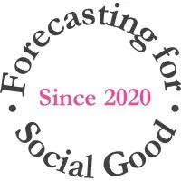
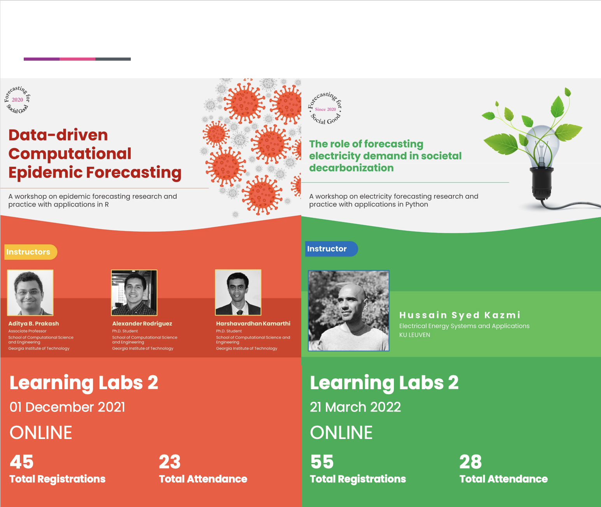
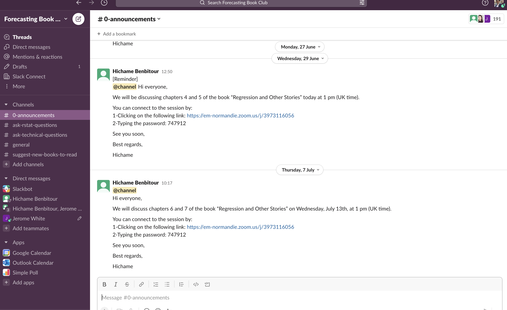

```{r initial,include=FALSE}
library(knitr)
library(fontawesome)
library(readr)
library(DT)
options(htmltools.dir.version = FALSE,
  tibble.width = 60, tibble.print_min = 6)
opts_chunk$set(
  echo = FALSE, warning = FALSE, message = FALSE, comment = "#>",
  fig.path = 'figure/', cache.path = 'cache/', cache = TRUE, fig.retina = 3,
  fig.align = 'center', fig.width = 4.5, fig.height = 4, fig.show = 'hold',
  dpi = 120
)
```


.sticker-left[]
.sticker-float[]

.center[.title[Forecasting for Social Good(F4SG)]]

Bahman Rostami-Tabar <br>
Inaugural Chair of F4SG section, International Institute of Forecasters

<br><br><br><br>
.bottom[
`r fa("chrome")`[www.f4sg.org](https://www.bahmanrt.com/)
]

---

.full-width[
```{r, echo=FALSE, fig.align='center', out.width="100%"}
knitr::include_url("https://f4sg2022.netlify.app/", height = "800px")
```
]

---
## IIF-Forecasting for Social Good Committee

.center[
```{r, echo=FALSE, fig.align='center', out.width="100%"}
knitr::include_url("https://forecasters.org/programs/communities/forecasting-for-social-good-f4sg/", height = "500px")
```
]

---

## [www.f4sg.org](www.f4sg.org)

.center[
```{r, echo=FALSE, fig.align='center', out.width="100%"}
knitr::include_url("https://www.f4sg.org/", height = "500px")
```
]

---

### F4SG Research Grant

.pull-left[
The grant can be used for:
- Research capability building in developing countries.
- Collaborative research activity on forecasting for social good.
- Promote the use of forecasting for social good in practice.

Lead applicant must be a researcher based on a .remember[low or lower-middle] income country.

**Amount of grant: US$ 5,000**

]

.pull-right[
```{r, echo=FALSE, fig.align='center', out.width="100%"}
knitr::include_url("https://forecasters.org/programs/research-awards/forecasting-for-social-good-research-grant//", height = "500px")
```
]

---

## Democratising Forecasting

.pull-left[
- An initiative to educate people about forecasting in low/middle income countries

- Delivered 8 training in 7 countries since 2018
    - Paused due to Covid-19 travel restrictions

- Six workshops will be delivered in Kenya, South Africa, Rwanda and Malawi in 2023
]

--

.pull-right[
```{r, echo=FALSE, fig.align='center', out.width="100%"}
knitr::include_url("https://ptsf.netlify.app/", height = "500px")
```
]

---
## F4SG Research Network

.pull-left[
- Forecasting for Social Good Hackathon

- Learning Labs focusing on methodologies

- Ethic, Bias & Fairness
]

.pull-right[

]
---
## Forecasting Book Club

.center[

]

---
## Community Engagement

.pull-left[
- Engage with the public

- Create a forecasting game to play in schools & colleges
]

.pull-right[


]

---
## F4SG Workshop

.full-width[
```{r, echo=FALSE, fig.align='center', out.width="100%"}
knitr::include_url("https://f4sg2022.netlify.app/", height = "800px")
```
]

---
## Get in touch

.center[
```{r, echo=FALSE, fig.align='center', out.width="100%"}
knitr::include_url("https://forecasters.org/programs/communities/forecasting-for-social-good-f4sg/", height = "500px")
```
]