```{r setup, include=FALSE}
options(htmltools.dir.version = FALSE, width = 120)

library(tidyverse)
library(knitr)
library(kableExtra)
library(fontawesome)
library(flair)
library(DT)
library(gapminder)
library(ggthemes)
library(countdown)
library(fpp3)
library(patchwork)
library(ggridges)
library(magick)
opts_chunk$set(
  echo = FALSE, warning = FALSE, message = FALSE, comment = "#>",
  fig.path = 'figure/', cache.path = 'cache/', fig.align = 'center',
  fig.width = 11, fig.height = 5, fig.show = 'hold',
  cache = TRUE, external = TRUE, dev = 'svglite', dev.args = list(bg = "transparent")
)

#fig.width = 12, fig.height = 4

# Few theme
ggplot2::theme_set(ggthemes::theme_few())

```


<br><br><br>
.center[.title[.large[Data Lab for Social Good <br> Research ~~Group~~ Team]]]
.sticker-float[]

.bottom[
## Bahman Rostami-Tabar
Slides: https://www.bahmanrt.com/talk/2025-lomsac/
]

---
background-image: url("resources/hierarchy-left.jpeg")
background-size: contain
background-position: left
class: middle

.pull-right2[
## Outline

- Who we are and what we do?

- DL4SG activities

- Projects and partners

- Future plans
]

---
background-image: url("resources/hierarchy-left.jpeg")
background-size: contain
background-position: left
class: middle

.pull-right2[
## Outline

- .remember[Who we are and what we do?]

- DL4SG activities

- Projects and partners

- Future plans
]

<!-- --- -->

<!-- - Established in October 2023 -->
<!-- - Before DL4SG and between Jan. 2018- Oct. 2023: -->

<!--     - Built relationship with organisations -->
<!--     - Created a niche area called "Forecasting for Social Good" at International Institute of Forecasters -->
<!--     - Delivered 23 3-day training on data analytics and forecasting in 15 African countries and 8 NHS Trusts across Wales and England -->
<!--     - Coordinated LSDG for 2 years -->

---
## Our focus

.center[
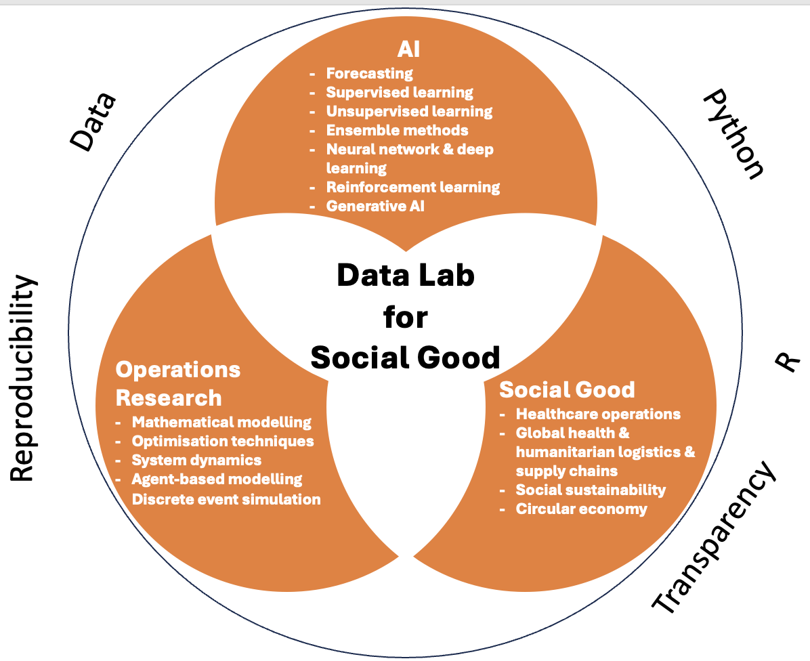
]

---
## What questions interest us?

.center[
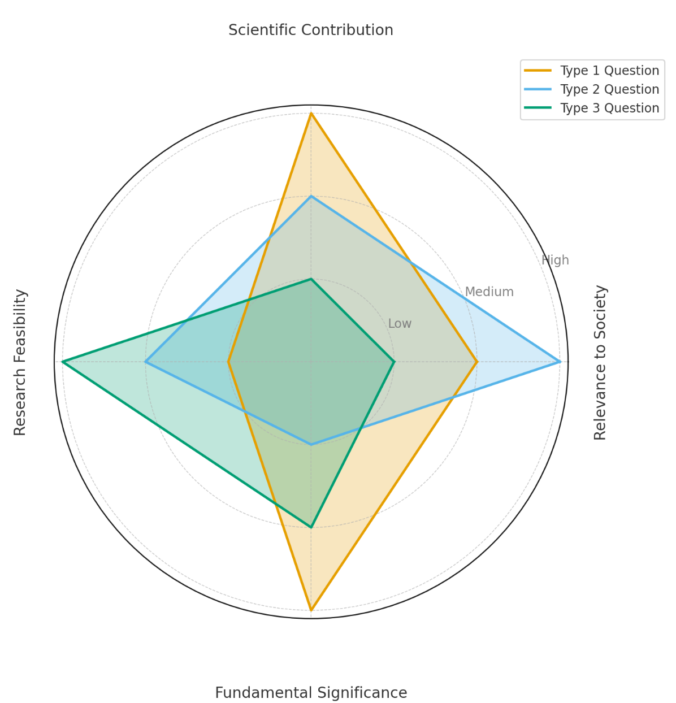
]
---
## Mission and vision

.pull-left[
- My mission at Data Lab is to create a .remember[nurturing environment] where:
 - we .remember[learn to think]
 - .remember[maximise Ph.D. students potential] as independent researchers and as human being.

- Position Data Lab as one of the .remember[leading PhD research groups in Europe by 2030].
]

--

.pull-right[
PhD graduates to be recognised internationally for their:
  
  - .small[knowledge and skills],
  - .small[rigorous methodologies],
  - .small[research integrity],
  - .small[contributions to social good].

]

<!-- --- -->
<!-- ## Members  -->

<!-- .center[ -->
<!-- 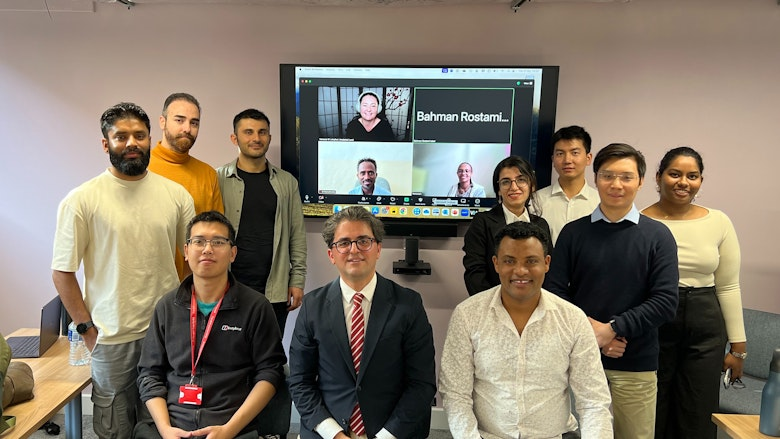 -->
<!-- ] -->

---
## Members - Academic staff

.center[
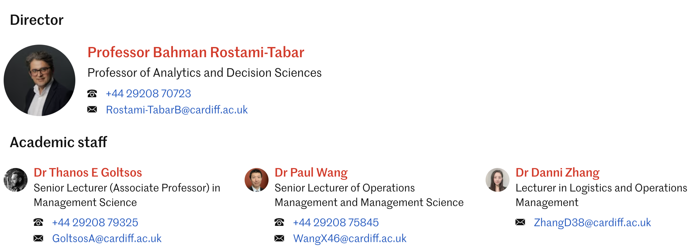
]

---
## Members - PhD students
### 13 PhD students linked to the group

.pull-left[
### Enrolled at CU

- Mr. Mustafa Aslan
- Miss. Fatemeh Monshizadeh
- Miss. Udeshi Salgado
- Mr. Amir Salimi Babmiri
- Mr. Mingzhe Shi
- Mr. Rui Xu
- Mr. Harsha Halgamuwe Hewage
- Mr. Joshua Roby-Welford
]

.pull-right[
### Visiting

- Arebu Issa Bilal, Addis Ababa University, Ethiopia
- Yemsrach Hailu, Addis Ababa University, Ethiopia
- Birhanu Shanko Dura, Bahir Dar University, Ethiopia
- Venessa Wells, University of New England, Australia
- Alfred Sallwa, University of Dar es Salaam, Tanzania
]

---
background-image: url("resources/hierarchy-left.jpeg")
background-size: contain
background-position: left
class: middle

.pull-right2[
## Outline

- Who we are and what we do?

- .remember[DL4SG activities]

- Projects and partners

- Future plans
]

---
## Lekolin - Research seminars led by Danni and Mustafa

.pull-left[
- Monthly research seminars
  - speakers from DL4SG, CU, and external
  - topics related to data, AI, operations research, and social good
- PhD students present before going to conferences
- Practice how to provide and receive critique
]

.pull-right[
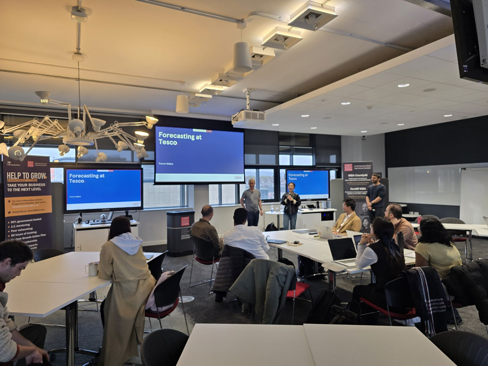
]

---
## Training led by Harsha

Delivering training for and by PhD students to the group and University based on a training need analysis

.pull-left[
### Delivered 

- Reprodicubility using Quarto
- Using Zotero
- Introduction to R & RStudio
- Introduction to Python
- AI tools for research
- Inventory modelling
]

.pull-left[
### Upcoming
- Machine learning with R and Python
- Data visualisation using R & Python
- Agent based modelling
- Optimisation: stochastic and dynamic programming
- Uncertainty quantification
- Causal modelling or modelling to explain
]

---
##  Miri - social activities led by Fatemeh

.pull-left[
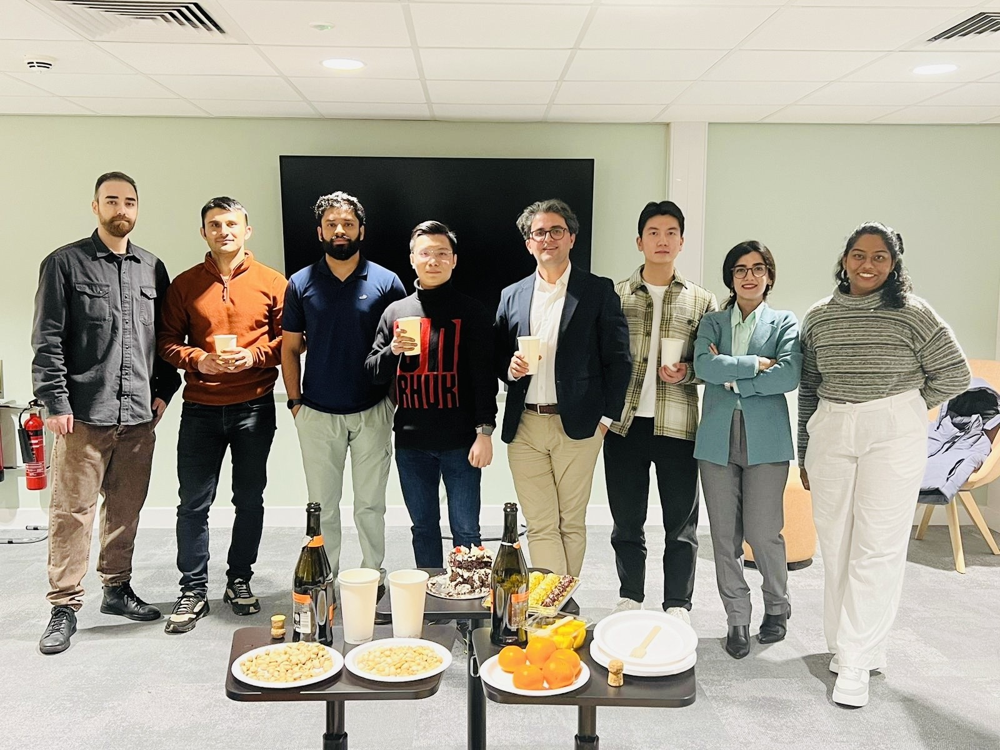
]

.pull-left[
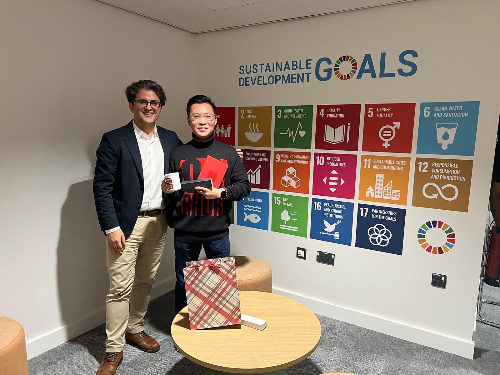
]

---
##  Yarn - learn to question and think, led by Amir

.pull-left[
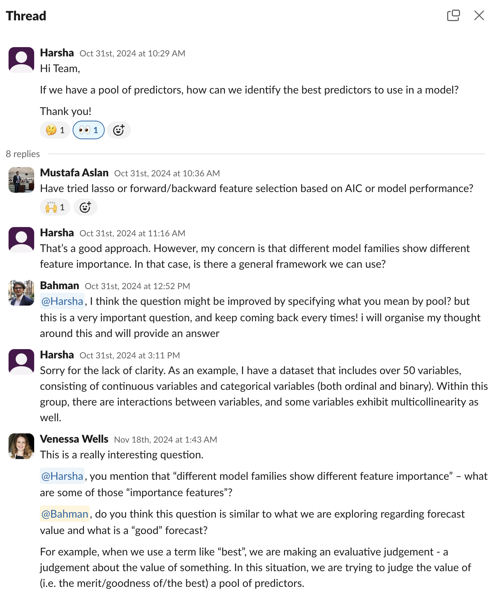
]

.pull-left[
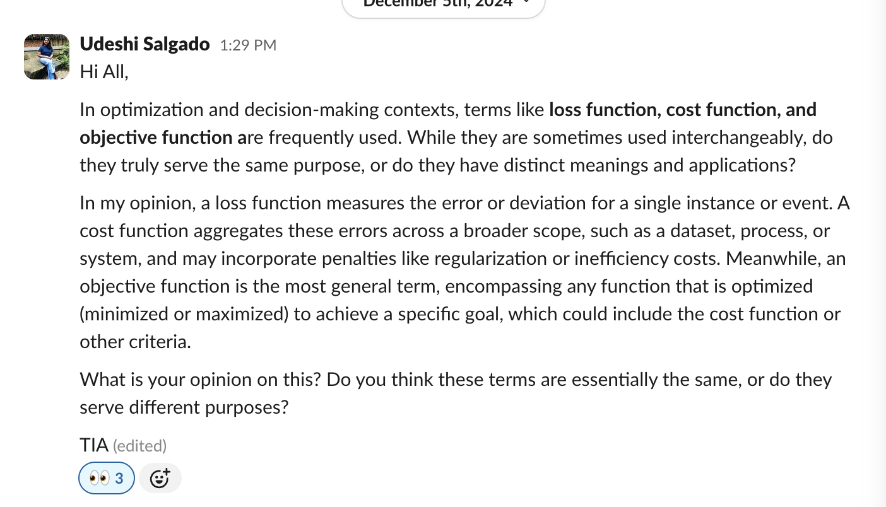
]

---
##  Linkedin page, website, mailing list led by Udeshi and Ming

.pull-left[
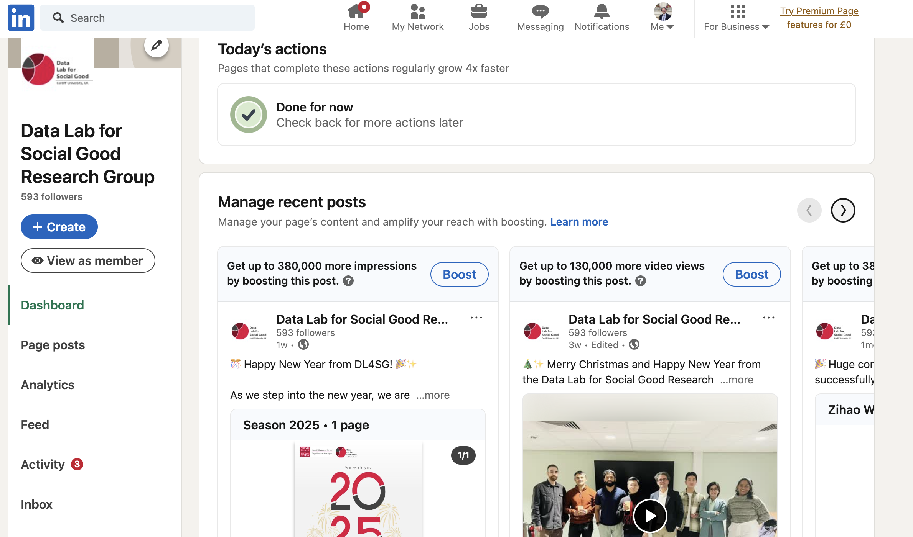
]

.pull-left[
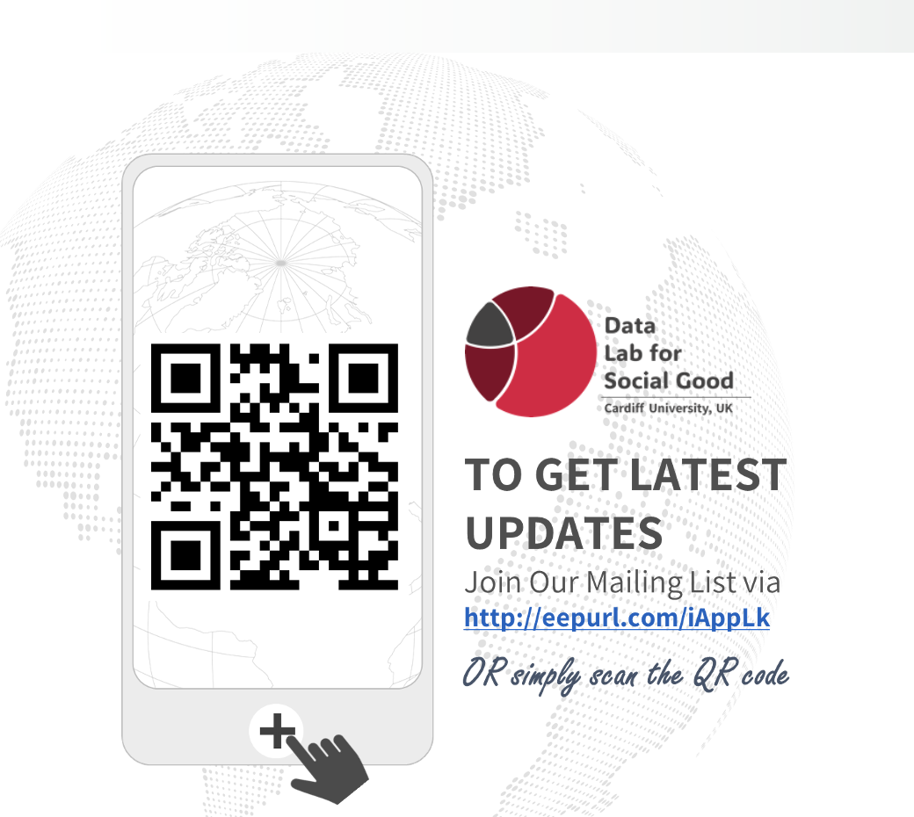
]

---
## Annual PhD workshop - Held every October

.pull-left[
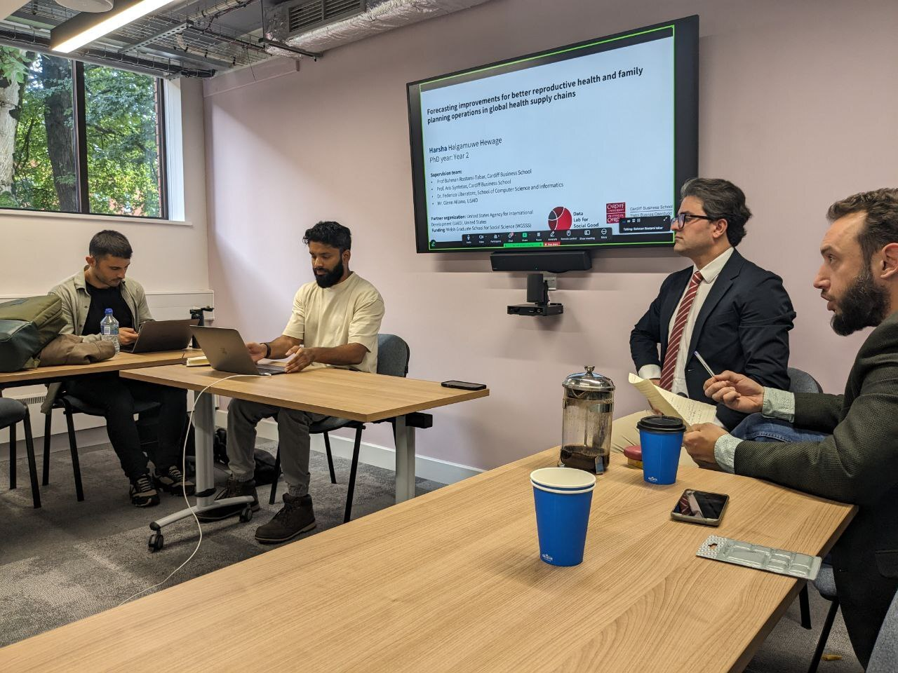
]

.pull-left[
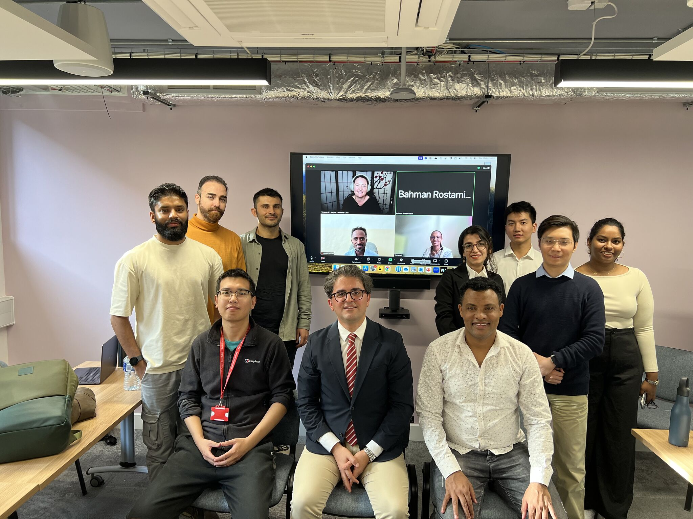
]

---
## Communication channel

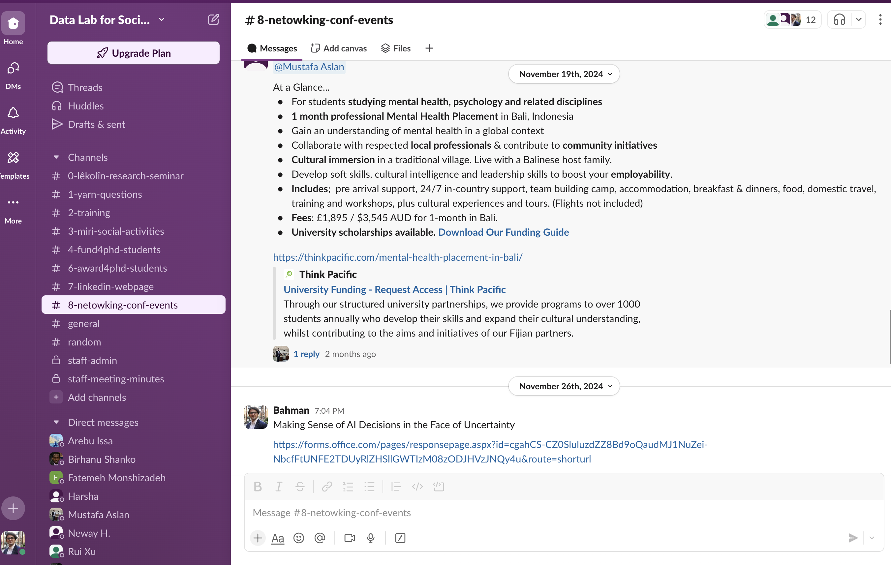


---
background-image: url("resources/hierarchy-left.jpeg")
background-size: contain
background-position: left
class: middle

.pull-right2[
## Outline

- Who we are and what we do?

- DL4SG activities

- .remember[Projects and partners]

- Future plans
]

---
## Some reserach projects

.small[
- Forecasting for staffing in unscheduled care

- Global immunisation (vaccines) supply chain

- Discharge coordination in health & care

- Generative AI in telehealth

- Reproductive health and family planning operations

- Digital twin in healthcare

- Early warning systems for drought response supply chain

- Data driven solutions in fragile settings

- Modelling consumer purchasing behaviour in modern slavery supply chains
]

---
## AFRICAST- Empowering Forecasting Excellence across Africa
### two cohors delivered with total of 180 participants

.center[
```{r, fig.align='center', out.width="100%"}
knitr::include_url("https://workshop.f4sg.org/africast/", height = "500px")
```
]

---
## Democratising forecasting
### Since 2018

.pull-left[
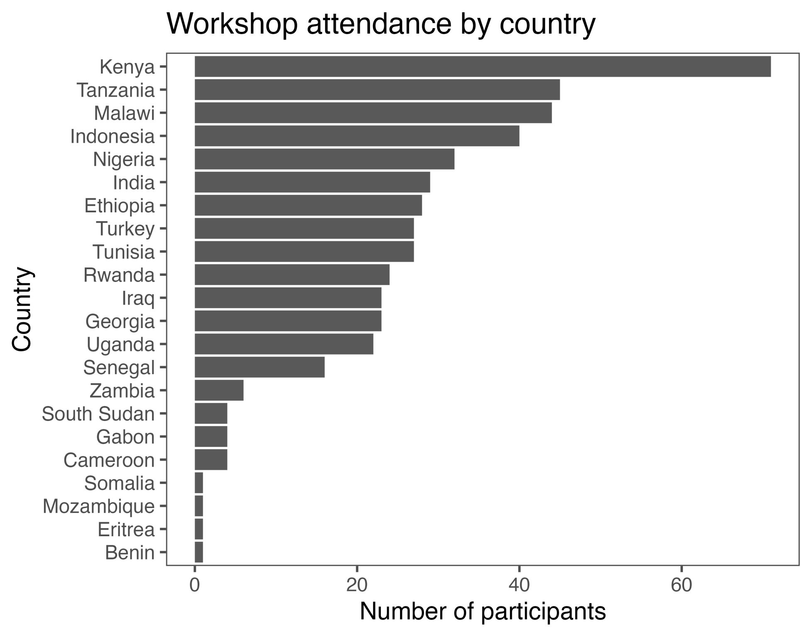
]

.pull-left[
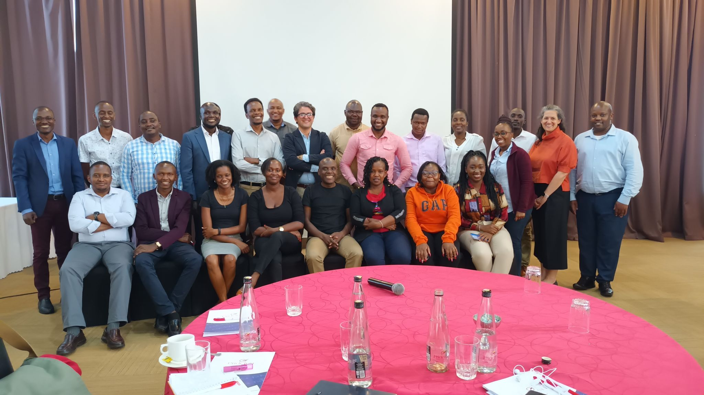
]

---
## Partners

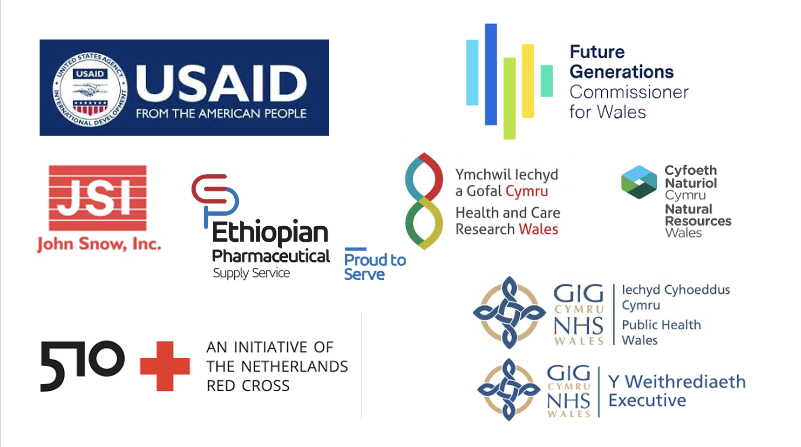


---
background-image: url("resources/hierarchy-left.jpeg")
background-size: contain
background-position: left
class: middle

.pull-right2[
## Outline

- Who we are and what we do?

- DL4SG activities

- Projects and partners

- .remember[Future plans]
]

---
## Plan for 2025-20230

.small[
- Continue and improve DL4SG activities

- Collaborate with doctoral academy to deliver 4 training for PhD students on reproducibility, forecasting, R and Python

- Recruiting 10 PhD students by 2030

- Publish a new book on forecasting & OR for healthcare management: applications in R and Python (freely accessible by 2027)

- Delivering two summer schools on **forecasting and operations research for healthcare management**

    - International Symposium of Forecasting
    - European Conference on Operational Research

- Publishing papers: Three FT, Five 4`*`, ten 3`*`

- Deliver AFRICAST

]

---
## Thank you

.pull-left[
- All PhD students
- Thanos, Paul, and Danni
- Maneesh, Daniel Gartner
- Marco & Maryam
]

---
## DL4SG honour 2024

.pull-left[
For exceptional contributions that keep the group dynamic, impactful, and aligned with its mission for excellence in research, learning and engagement.
]

.pull-right[
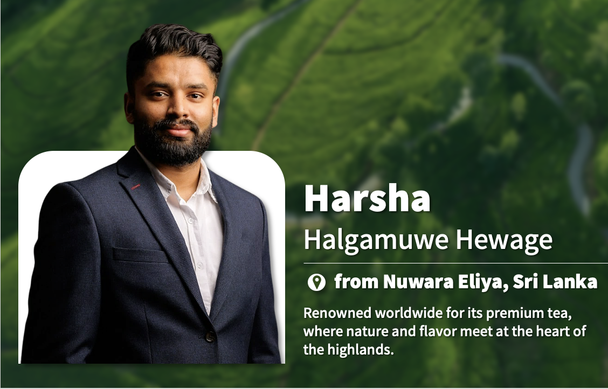
]
