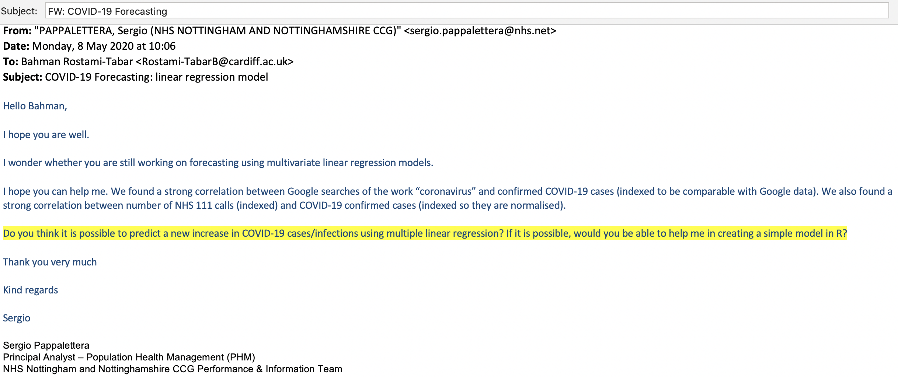
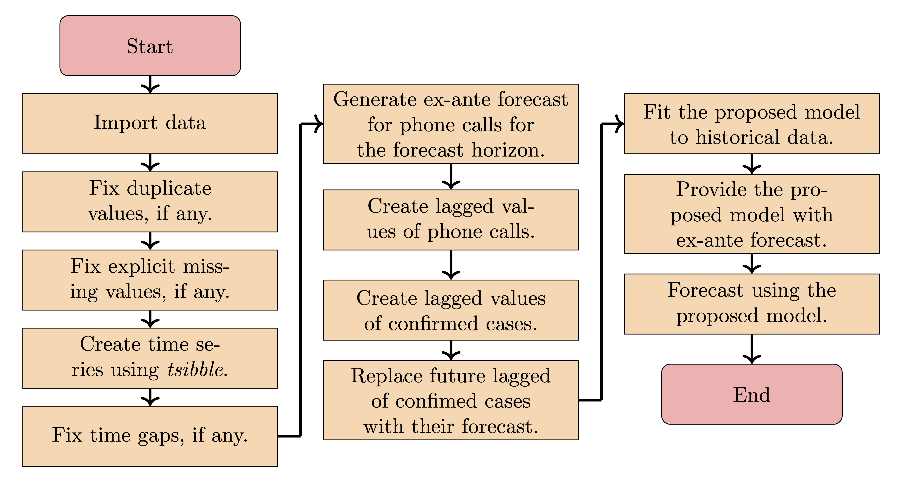

```{r child = "../setup.Rmd"}
```

```{r set-theme, include=FALSE}
library(xaringanthemer)
style_duo_accent(
  primary_color      = "#0077bb", # pantone classic blue0F4C81
  secondary_color    = "#33BBEE", # pantone baby blueB6CADA
  header_font_google = google_font("Raleway"),
  text_font_google   = google_font("Raleway", "300", "300i"),
  code_font_google   = google_font("Source Code Pro"),
  text_font_size     = "30px"
)
```

```{r package, include=FALSE, warning=FALSE}
knitr::opts_chunk$set(echo = FALSE, cache=TRUE, message = FALSE, warning = FALSE)
library(tidyverse)
library(fpp3)
library(kableExtra)
library(ggthemes)
library(scales)
library(patchwork)
library(knitr)
```

```{r, include=FALSE, cache=FALSE}
knitr::read_chunk("dataviz.R")
knitr::read_chunk("locallevel.R")
```

## Outline

- Do we really need one more forecasting model for COVID-19? we have already many!
- What are the proposed models in the literature and their limitations?
- What do we propose and how it contributes to the literature?
- How the proposed model performs comparing to benchmarks?
- What are the limitations of the model and possible extensions?

---

## Outline

- .pink[Do we really need one more forecasting model for COVID-19?]
- What are the proposed models in the literature and their limitations?
- What do we propose and how it contributes to the literature?
- How the proposed model performs comparing to benchmarks?
- What are the limitations of the model and possible extensions?

---

class: middle

.hand[Lack of a rigorous method to forecast the number of confirmed cases at ground/local level.]



---

### Why forecasting COVID-19 cases 

Decision makers at the local level need forecasts to: 

- inform general strategy; 
- adjust hospital bed capacity; 
- cancel/postpone non-urgent hospital operations; 
- redirect available medical resources to COVID-19 wards; 
- plan for extra capacity in body storage of mortuary services.


---

## Outline

- Do we really need one more forecasting model for COVID-19? we have already many!
- .pink[What are the proposed models in the literature and their limitations?]
- What do we propose and how it contributes to the literature?
- How the proposed model performs comparing to benchmarks?
- What are the limitations of the model and possible extensions?

---

## Models used to forecast COVID19 cases

- Statistical
- Machine learning
- Spatio-temporal
- Epidemiological 
- Agent based

---

## Some limitations observed in the literature

- Forecast accuracy of models is not systematically reported; 
- Forecast errors greatly vary; 
- In some studies it is unclear how forecasts are generated and evaluated;
- Most of the studies focus on point forecasts and ignore the uncertainty associated with them, which may lead to less effective decisions;
- Main focus has been on the global and national levels;
- use of phone call data has not been explored/reported.

---

## Outline

- Do we really need one more forecasting model for COVID-19? we have already many!
- What are the proposed models in the literature and their limitations?
- .pink[What do we propose and how it contributes to the literature?]
- How the proposed model performs comparing to benchmarks?
- What are the limitations of the model and possible extensions?

---

### Our contributions

- Propose a simple and interpretable multiple linear regression model;
- Examine the use of phone call data and provide evidence of their usefulness in forecasting daily confirmed cases;
- Provide probabilistic forecasts that quantify uncertainties in future confirmed cases; 
- Benchmark the accuracy of our model against five techniques including ARIMA, Exponential Smoothing State Space, Seasonal Naive, Prophet and a regression model without considering phone call data.

---

class: middle

### Steps of the forecasting process


---

.pull-left[
### Confirmwd cases, Nottingham
```{r confirm, options}
confirmed_raw <- readxl::read_excel("Nottinghamshire_Cases.xlsx")
head(confirmed_raw) %>% 
kbl() %>%
  kable_classic_2(full_width = F)

summary(confirmed_raw)
```
]

.pull-right[
### NHS111 pathway, Nottingham
```{r nhs111-call, options}
nhs111_raw <- readxl::read_excel("Nottinghamshire_111Calls.xlsx")
head(nhs111_raw) %>% 
kbl() %>%
  kable_classic_2(full_width = F)


summary(nhs111_raw)
```
]

---

```{r, weekend, fig.cap = 'Time series of daily confirmed cases',fig.align='center', fig.width=6, fig.height=2.5}
```

---

```{r, casesoverlap, fig.cap = 'Time series of daily confirmed cases',fig.align='center', fig.width=6, fig.height=2.5}
```

---

```{r, casesoverlapless, fig.cap = 'Time series of daily confirmed cases',fig.align='center', fig.width=6, fig.height=2.5}
```

---

```{r, acf, fig.cap = 'Autocorrelation and Partial Autocorrelation of the time series of confirmed cases', fig.align='center',fig.width=6, fig.height=2.5, message=FALSE}
```

---

```{r, NHS111, fig.cap = 'Time series of daily phone calls.',fig.align='center', message = FALSE, fig.width=6, fig.height=2.5}
```

---

```{r, ccf, fig.cap = 'Relationship between NHS111 calls and confirmed cases', fig.align='center',fig.width=6, fig.height=2.5, message=FALSE}
```

---

.pull-left[
### Proposed model
\begin{equation}
Y_t = \beta_0 + \beta_1 \text{NHS 111}_t+ \text{trend}_{t}+\\
\underbrace{\sum_{k=1}^{21} \beta_{k+1} \text{Y}_{t-k}}_{\text{AutoRegressive effect}}+\\ \underbrace{\sum_{k=1}^{26} \beta_{22+k} \text{NHS 111}_{t-k-4}}_{\text{NHS 111 lag effect}} + \\Weekend_t + \varepsilon_t 
\end{equation}
]

.pull-right[
- $Y_t$: number of positive confirmed cases on day $t$.
- $NHS 111_{t}$: number of NHS 111 calls on day $t$.
- $trend_{t}$: local trend on day $t$.
- $Y_{t-k}$: number of positive confirmed cases on day $t-k$.
- $NHS 111_{t-k-4}$: NHS111 calls on day $t-k-4$.
- $Weekend_{t}$: for the weekend dummy; $Weekend_{t}$ is `1` if $t$ falls on a Weekend and `0` otherwise.
]

---

.hand[Forecast is generated for 21 days ahead]

```{r, samplefcst, fig.align='center', out.width= "70%"}
knitr::include_graphics("img/pexamplefct.PNG")
```

---

## Outline

- Do we really need one more forecasting model for COVID-19? we have already many!
- What are the proposed models in the literature and their limitations?
- What do we propose and how it contributes to the literature?
- .pink[How the proposed model performs comparing to benchmarks?]
- What are the limitations of the model and possible extensions?

---

## Forecast accuracy evaluation

- Forecast horizon is 21 days
- `30%` of data is used to test the forecast accuracy

    - Time series cross validation with re-estimation is used

- Performance is evaluated using

    - 3 point forecasting metrics: `ME`(Mean Error), `MAE`(Mean Absolute Error) and `RMSE`(Root Mean Square Error)
    - Prediction interval accuracy using `Winkler` score for 95% coverage interval
    - Probabilistic forecast accuracy using `Percentile score` and Continuous Ranked Probability Score (`CRPS`)

---

## Point forecast accuracy

$e_{t} = y_{t} - \hat{y}_{t}$

\begin{align*}
  \text{Mean Error: ME} & = \text{mean}(e_{t}),\\
  \text{Mean absolute error: MAE} & = \text{mean}(|e_{t}|),\\
  \text{Root mean squared error: RMSE} & = \sqrt{\text{mean}(e_{t}^2)}.
\end{align*}

---

## Winkler score


\begin{equation}
W_{\alpha,t} = \begin{cases}
  (u_{\alpha,t} - \ell_{\alpha,t}) + \frac{2}{\alpha} (\ell_{\alpha,t} - y_t) & \text{if } y_t < \ell_{\alpha,t} \\
  (u_{\alpha,t} - \ell_{\alpha,t})   & \text{if }  \ell_{\alpha,t} \le y_t \le u_{\alpha,t} \\
  (u_{\alpha,t} - \ell_{\alpha,t}) + \frac{2}{\alpha} (y_t - u_{\alpha,t}) & \text{if } y_t > u_{\alpha,t}.
  \end{cases}
\end{equation}

---

## Percentile/Quantile score

\begin{equation}
  L(q_{i,t}, y_t) =
    \begin{cases}
    (1 - i/100)(q_{i,t} - y_t) & y_t < q_{i,t} \\ 
    (i/100)(y_t - q_{i,t}) & y_t \geq q_{i,t}.
    \end{cases}
\end{equation}

---

class: middle

## Continuous Ranked Probability Score (CRPS)

```{r cprs, fig.width=14, fig.height=9, fig.align='center'}
knitr::include_graphics("img/CRPS.png")
```

---

class: middle

.hand[Forecast accuracy summarised averaged across all horizons]


```{r, point, fig.cap = 'Forecast performance evaluation',fig.align='center', message = FALSE, out.width="70%"}
```

---

Point accuracy across forecast horizon

```{r, pointh,fig.align='center', fig.width= 10.45, fig.height=5.5}
```

---

Forecast uncertainty of models across forecast horizon

```{r, uncertainty, fig.align='center', fig.width= 10.45, fig.height=5.5}
```

## Outline

- Do we really need one more forecasting model for COVID-19? we have already many!
- What are the proposed models in the literature and their limitations?
- What do we propose and how it contributes to the literature?
- How the proposed model performs comparing to benchmarks?]
- .pink[What are the limitations of the model and possible extensions?]

---

## Limitations

- Access to more granular data such as age group, minority group, health condition, local regulations, knockdown, duration of knockdown, and so on. 
Further improvements of the proposed model can be achieved by incorporating additional information. 

- Another limitation of the study is that the dataset does not contain hospital information such as COVID-19 admission and bed occupancy. This information allows for translating the forecast of COVID-19 confirmed cases into hospital admissions and bed capacity. 

---

## Future study

.hand[Developing a forecasting model for COVID19 hospital admission]

- Using Apple & Google mobility data
- NHS111 phone calls
- Confirmed cases based on age groups
- Historical data of COVID19 admission in 3 hospitals in Nottingham
- Additional information such as Lockdown and foodbankd data

---

.hand-large[This paper is fully reproducible written in RMarkdown]

---

.hand-large[thank you!]

- Full paper is available [here](https://www.bahmanrt.com/publication/203/) 

- Email [rostami-tabarb@cardiff.ac.uk](mailto:rostami-tabarb@cardiff.ac.uk)

- Website [www.bahmanrt.com](www.bahmanrt.com)

- Twitter [@Bahman_R_T](https://twitter.com/Bahman_R_T)
