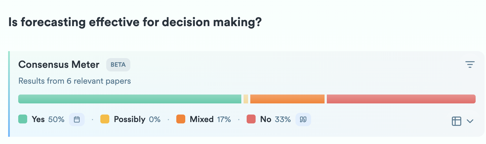
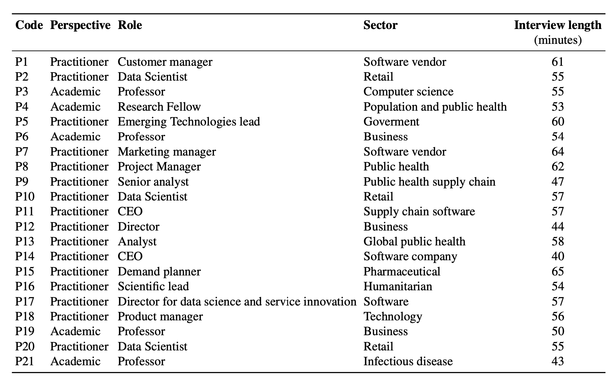
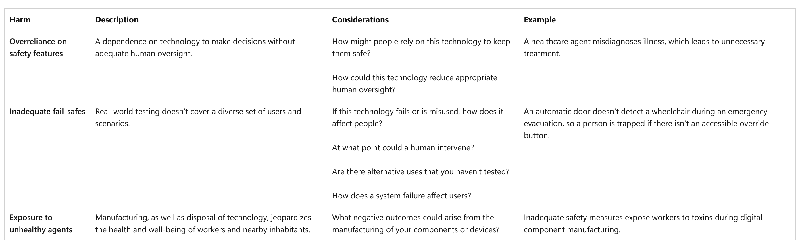
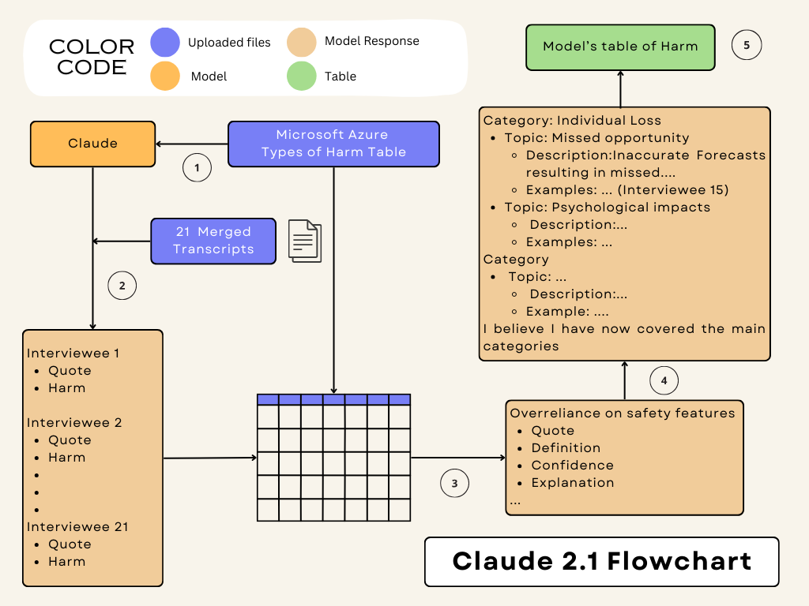
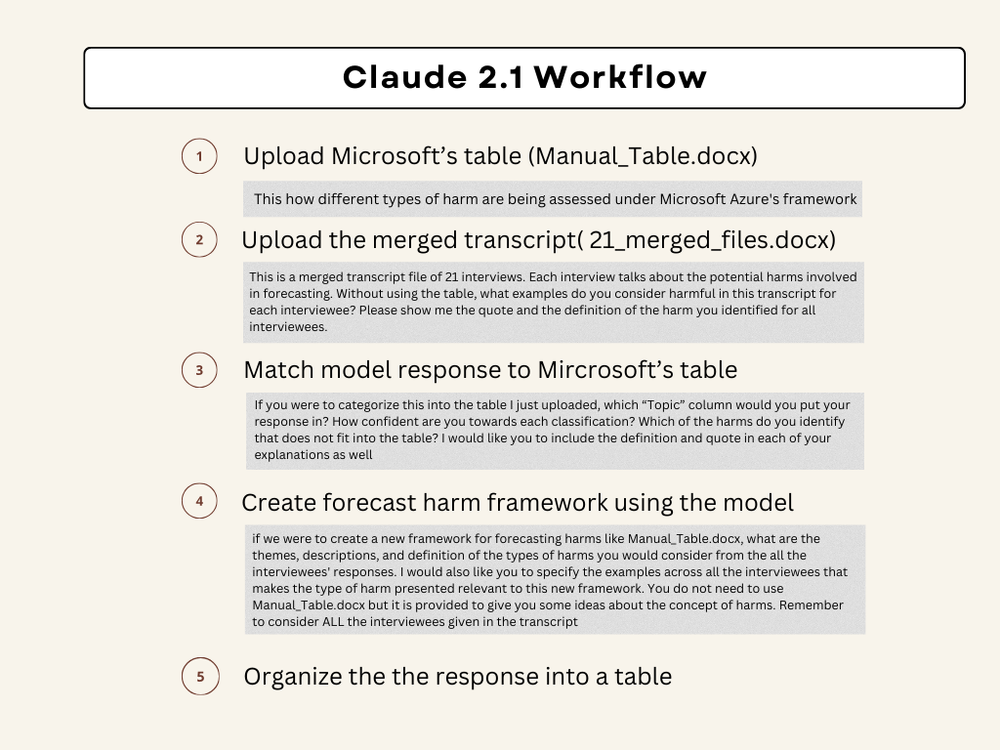
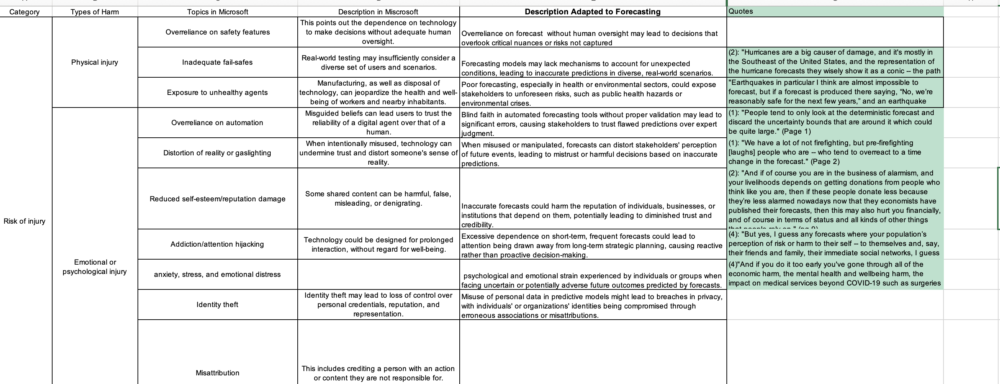

```{r setup, include=FALSE}
options(htmltools.dir.version = FALSE, width = 120)

library(tidyverse)
library(knitr)
library(kableExtra)
library(fontawesome)
library(flair)
library(DT)
library(gapminder)
library(ggthemes)
library(countdown)
library(fpp3)
library(patchwork)
library(ggridges)
library(magick)
opts_chunk$set(
  echo = FALSE, warning = FALSE, message = FALSE, comment = "#>",
  fig.path = 'figure/', cache.path = 'cache/', fig.align = 'center',
  fig.width = 11, fig.height = 5, fig.show = 'hold',
  cache = TRUE, external = TRUE, dev = 'svglite', dev.args = list(bg = "transparent")
)

#fig.width = 12, fig.height = 4

# Few theme
ggplot2::theme_set(ggthemes::theme_few())

```


<br><br>
.center[.title[.small[Towards Socially Responsible Forecasting:
Identifying and Typifying Forecasting Harms]]]
.sticker-float[]
.sticker-left[]

.bottom[
### Bahman Rostami-Tabar, Professor of Analytics and Decision Sciences
### Director of Data Lab for Social Good Reserach Group, Cardiff University
### Co-authors: Travis Greene, Galit Shmueli, Rob J. Hyndman <br>

### Slides: https://www.bahmanrt.com/slides/euro2025
]

---
background-image: url("resources/hierarchy-left.jpeg")
background-size: contain
background-position: left
class: middle

.pull-right2[
## Outline

- Problem and motivation

- Data collection, and analysis

- Findings & discussion

- Conclusion and research agenda
]

---
background-image: url("resources/hierarchy-left.jpeg")
background-size: contain
background-position: left
class: middle

.pull-right2[
## Outline

- .remember[Problem and motivation]

- Data collection, and analysis

- Findings & discussion

- Conclusion and research agenda
]

---
## Is forecasting beneficial?

.pull-left[
.center[

]


.center[

]
]

.pull-right[

Benefits are widely accepted, the potential harms are far less examined. And yet, ignoring those harms doesn’t make them disappear

In this talk, I want to make the case that forecasting is not inherently good or bad—it is a powerful tool. 

And like all powerful tools, it requires responsibility, reflection, and care. This is the foundation of what I call .remember[socially responsible forecasting].

]

???
I began thinking seriously about this research nearly five years ago, after reading The Black Swan by Nassim Taleb. One line in particular stayed with me: 'Anyone who causes harm by forecasting should be treated as either a fool or a liar. Some forecasters cause more damage to society than criminals.' At first, it felt extreme—but the more I sat with it, the more it raised a question I hadn’t seen discussed in our field: is forecasting truly beneficial? To explore this, I recently posed the question on the expert research platform Consensus. The responses were far from unanimous: about 50% said yes, 33% said no, and 17% gave mixed or conditional answers. What this tells us is that while the benefits of forecasting—improved planning, efficiency, and foresight—are widely accepted, the potential harms are far less examined. And yet, ignoring those harms doesn’t make them disappear. In this talk, I want to make the case that forecasting is not inherently good or bad—it is powerful. And like all powerful tools, it requires responsibility, reflection, and care. This is the foundation of what I call socially responsible forecasting."

---
## Motovation

- Emerged from candid discussions with forecasting experts in both industry and academia

 >“I hadn’t heard this question posed like this before, but just bringing awareness makes a difference." - EiC of Foresight

- Responsible AI research is growing, but its application to forecasting has received little attention.
    - There is only [one paper](https://academic.oup.com/icesjms/article/76/5/1244/5303214) in the context of marine ecology, and proposes ten guiding principles for ethical forecasting.

???
Beyond a curiosity fueled by a striking statement from Nassim Taleb, the motivation for this work emerged from candid conversations I’ve had with forecasting experts—both in academia and industry. When I began raising questions about the potential harms of forecasting in professional settings, a clear pattern emerged: these concerns were almost never part of the conversation. One editor-in-chief even remarked, “I hadn’t heard this question posed like this before, but just bringing awareness makes a difference.” While responsible AI has become a well-established area of research, its application to forecasting remains largely overlooked. Aside from a single paper in the context of marine ecology, the academic literature is nearly silent on this topic.

---
## What might explain these gaps in our understanding of forecasting harms? 

- Forecasting often takes place behind closed doors

- Forecasting generally focuses on predicting the behavior of aggregates variables, rather than individuals 

- Because it doesn’t always rely on personal data, it hasn’t faced the same level of legal or media attention as other AI tools like facial recognition or credit scoring. 

- And since it doesn’t usually cause public controversy, there’s been little pressure to examine its ethical risks. 

- All of this means that the potential harms of forecasting often stay hidden or ignored.

???
There are several reasons why we don’t talk much about the harms of forecasting. First, forecasting usually happens behind the scenes, inside organizations, so its effects aren’t always visible to the public. Second, it often deals with aggregate variables, large groups or systems—like demand or population trends—so we don’t see how it might affect individuals differently. Also, because forecasting doesn’t always rely on personal data, it hasn’t faced the same level of legal or media attention as other AI tools like facial recognition or credit scoring. And since it doesn’t usually cause public controversy, there’s been little pressure to examine its ethical risks. All of this means that the potential harms of forecasting often stay hidden or ignored.

---
## Why is this important?

.remember[This topic matters because forecasting plays a powerful role in shaping decisions across society], these decisions can have real, lasting consequences 

-  Rapid growth in the number of sensors and devices that capture individual-level and/or real-time data, and AI progress, plus more applications involving aspects of automated decision-making

- So, their influence is growing—yet we rarely ask who might be harmed when a forecast is wrong, biased, or misused.

--

- Creating awareness is the first step toward responsible forecasting.
  - Without it, we risk building systems that may reinforce inequality, reduce transparency, or cause preventable harm—often without anyone noticing until it's too late.

???
this topic matters because forecasting plays a powerful role in shaping decisions across society—whether it's allocating healthcare resources, managing humanitarian aid, or responding to financial or environmental crises. These decisions can have real, lasting consequences on people’s lives, especially in high-stakes or vulnerable settings. As more forecasting systems become automated and rely on real-time data, their influence is growing—yet we rarely ask who might be harmed when a forecast is wrong, biased, or misused. Creating awareness is the first step toward responsible forecasting. Without it, we risk building systems that unintentionally reinforce inequality, reduce transparency, or cause preventable harm—often without anyone noticing until it's too late.

---
## What do we want to acheive in this work?

Our aim is to take the first steps toward building a foundation for socially responsible forecasting. We’re guided by three main questions: 

  1.What are the harms specific to forecasting?

  2.How might such harms be mitigated? 

  3.What should a research agenda for responsible forecasting entail? 

>Our focus is primairly on publishing a forecast rater than the entire forecasting workflow.

???
In this work, our aim is to take the first steps toward building a foundation for socially responsible forecasting. We’re guided by three main questions: What kinds of harm are specific to forecasting? How might we recognize and reduce those harms? And what should a future research agenda look like to support more ethical forecasting practices? Our focus is not on the entire forecasting pipeline, but specifically on what happens when a forecast is produced and shared—how it’s interpreted, acted upon, and the consequences that follow. By identifying forecasting-specific harms and proposing ways to think critically about them, we hope to spark a broader conversation within the forecasting community about responsibility, and etgics in forecasting.

---
background-image: url("resources/hierarchy-left.jpeg")
background-size: contain
background-position: left
class: middle

.pull-right2[
## Outline

- Problem and motivation

- .remember[Data collection, and analysis]

- Findings & discussion

- Conclusion and research agenda
]

---
## Data collection 

.center[

]

---
## Interview questions

.small[

**Publish forecasts:**

Based on your experience, do you believe that forecasting can potentially cause harm? 

What types of harms do you think are associated with publishing a forecast?

Can you share with us some examples of how published forecasts have caused harm in the past?

Are there certain domains (e.g. healthcare, climate change) where publishing a forecast is particularly prone to generating harm?

What role do forecasters play in identifying and mitigating potential harms associated with publishing forecasts?

How can forecasting systems be improved to minimize harm resulting from published forecasts?

In your experience, what are some common types of harm in the forecasting workflow before publishing a forecast, such as data collection, model selection, accuracy evaluation?
]

---
## [Framework - Microsoft Azure](https://learn.microsoft.com/en-us/azure/architecture/guide/responsible-innovation/harms-modeling/)
### harm that technology users might encounter

.pull-left[
**Risk of injury**
  - Physical injury
  - Emotional or psychological injury

**Denial of consequential services**
  - Opportunity loss
  - Economic loss

]

.pull-right[

**Infringement on human rights**
  - Dignity loss
  - Liberty loss
  - Privacy loss
  - Environmental impact
  
**Erosion of social and democratic structures**
  - Manipulation
  - Social detriment

]

---
## Risk of injury- Physical injury

.center[

]

---
## Analysis with AI-Claude

.pull-left[

]

.pull-right[

]

---
## Output of AI analysis



---
## Human-led analysis


---
background-image: url("resources/hierarchy-left.jpeg")
background-size: contain
background-position: left
class: middle

.pull-right2[
## Outline

- Problem and motivation

- Data collection, and analysis

- .remember[Findings & discussion]

- Conclusion and research agenda
]

---
## Typology of harm in forecasting

.center[

]

---
## Typology of harm in forecasting - further details

.pull-left[
**Risk of injury**
- Physical injury
  - Inadequate fail-safes
  - Exposure to unhealthy agents
- Emotional or psychological injury
  - Distortion of reality
  - Reputation damage
  - Attention hijacking
  - Emotional distress
]

.pull-right[

**Denial of consequential services**
- Opportunity loss
    - Benefit discrimination
    - Digital divide
    - Loss of potential investment 
- Economic loss
  - Economic exploitation
  - Misdirection of resources
  - Financial loss
]

---
## Typology of harm in forecasting - further details

.pull-left[

**Infringement on human rights**
- Privacy loss
    - Interference with private life
    - Loss of freedom of movement or assembly
- Environmental impact
  - Exploitation or depletion of resources
  - Waste

]

.pull-right[
**Erosion of social and democratic structures**
- Manipulation
  - Misinformation
  - Behavioral exploitation

- Social detriment
  - Stereotype reinforcement and loss of representation

]


---
## Harm matrix
### Potential harm from forecasting

.center[

]

---
## Domains prone to harm

- Forecasts may cause harm in sensitive domains where human lives, financial stability, and societal well-being are at risk. 

--

- Healthcare, humanitarian and environmental crises, finance & economics, politics, are especially prone to harm, as forecasts can influence critical decisions that have lasting effects on many people’s lives.

--

- Forecasts that involve vulnerable populations. Vulnerable populations often rely on external support, and inaccurate forecasts can exacerbate an already precarious situation.

--

- Societal impact of a forecast is closely tied to the domain it addresses. Forecasts related to elections, inflation, pandemics, migration, wars, or droughts have far-reaching effects on policy-making and public sentiment.


---
## Possible mitigation strategies to minimize harm in forecasting

.center[

]

---
background-image: url("resources/hierarchy-left.jpeg")
background-size: contain
background-position: left
class: middle

.pull-right2[
## Outline

- Problem and motivation

- Data collection, and analysis

- Findings & discussion

- .remember[Conclusions and research agenda]
]

---
## Future research 

- .remember[Compensation for forecasting harms], building the ethical and institutional groundwork for accountability in forecasting

--

- .remember[Developing “fair” forecasting metrics]: 1) design meaningful fairness metrics; 2) ensure those metrics are grounded in the real-world social and ethical contexts where forecasting is applied

--

- .remember[Explainability, transparency, and contestability of forecasts]: making forecasts more understandable, transparent, and open to challenge

--

- .remember[Addressing forecasting inconsistency]: addressing inconsistency is not just a technical challenge—it’s also about building trust, credibility, and accountability in forecasting as a decision-support tool

--

- .remember[Managerial override of forecasts]: explore the conditions under which managerial corrections ultimately help or hurt forecasting process

--

- .rememberStatistical education and training for managers]: a need for greater education in probability and statistics for managers


---
##  Conclusions

- Forecasting-specific harms are underexplored compared to broader AI/ML harms

--

- .remember[Harm in forecasting] often .remember[arises] not from prediction itself, but .remember[from how forecasts are published, interpreted, and acted upon]


--

- .remember[Ethical responsibility and professional standards] should be developed, especially in high-stakes domains, to mitigate risk.

--

- Responsible forecasting demands reflexivity, transparency, and a willingness to confront difficult questions about impact and accountability.

--

- Forecasting is not inherently harmful, but needs safeguards—abandoning it would increase uncertainty and inefficiency.

---
<br><br><br>
.center[.title[.small[Towards Socially Responsible Forecasting:
Identifying and Typifying Forecasting Harms]]]
.sticker-float[]
.sticker-left[]

.bottom[
### Bahman Rostami-Tabar, Professor of Analytics and Decision Sciences
### Director of Data Lab for Social Good Reserach Group, Cardiff University
### Co-authors: Travis Greene, Galit Shmueli, Rob J. Hyndman <br>

### Slides: https://www.bahmanrt.com/slides/euro2025
]