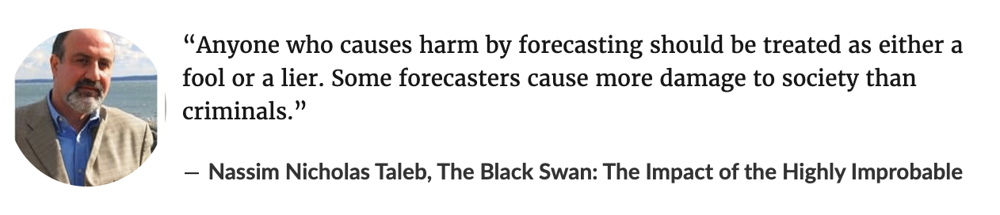
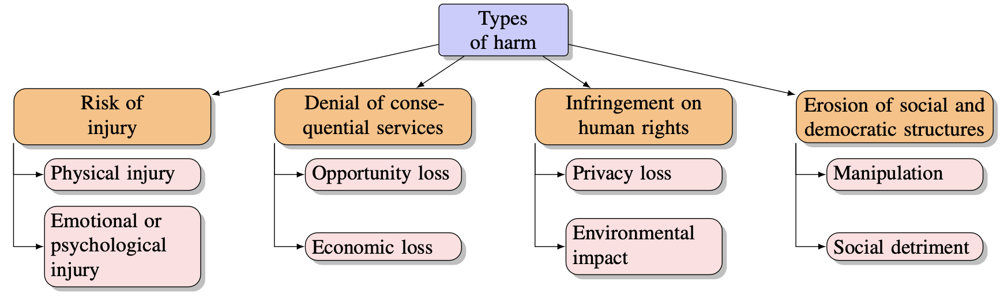
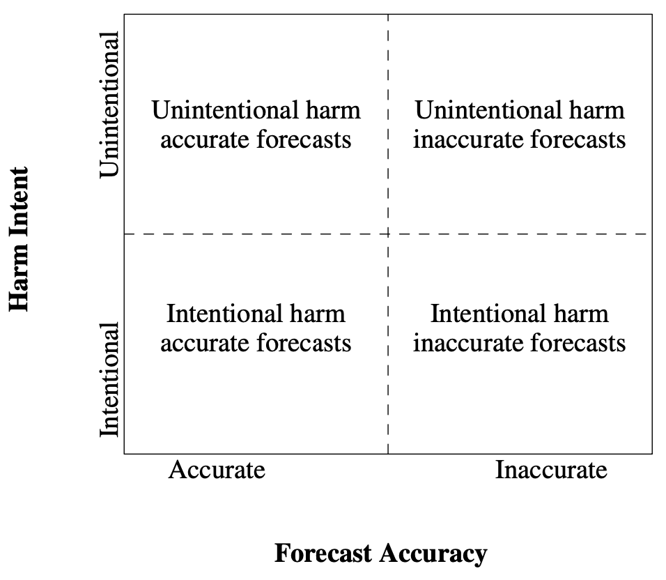
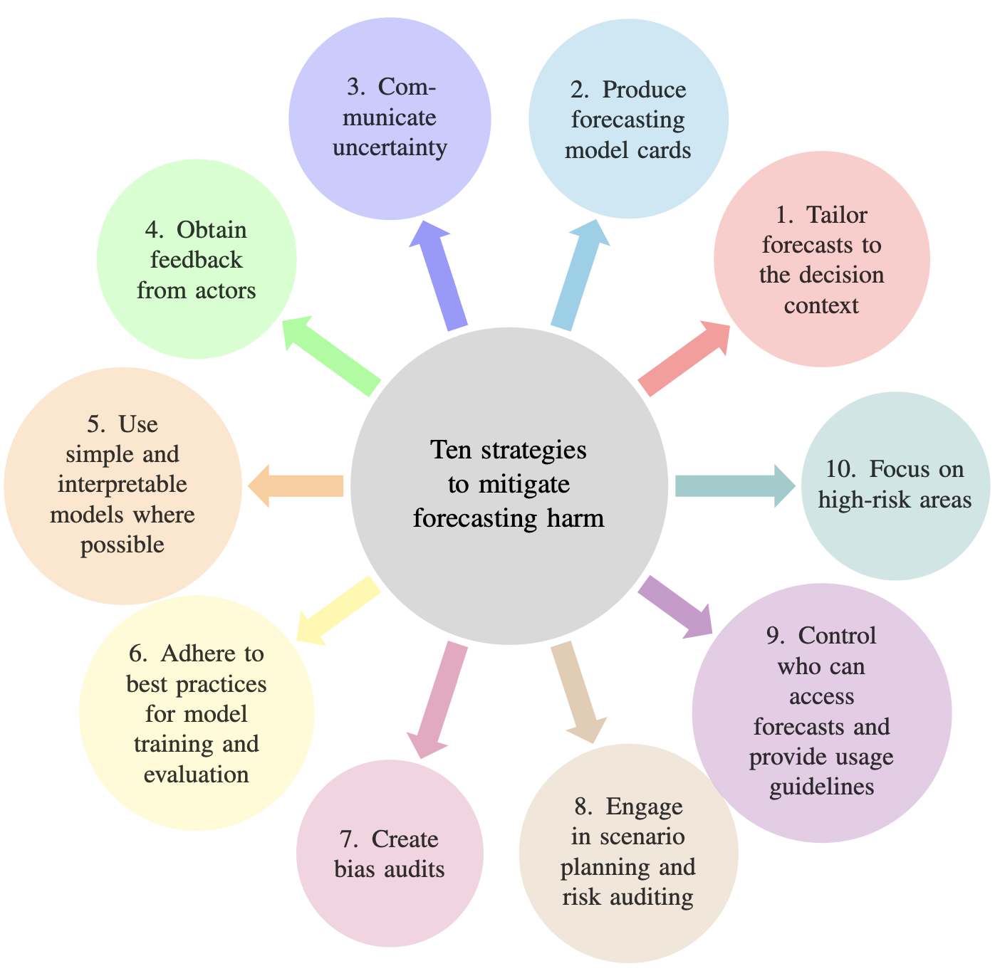

```{r setup, include=FALSE}
options(htmltools.dir.version = FALSE, width = 120)

library(tidyverse)
library(knitr)
library(kableExtra)
library(fontawesome)
library(flair)
library(DT)
library(gapminder)
library(ggthemes)
library(countdown)
library(fpp3)
library(patchwork)
library(ggridges)
library(magick)
opts_chunk$set(
  echo = FALSE, warning = FALSE, message = FALSE, comment = "#>",
  fig.path = 'figure/', cache.path = 'cache/', fig.align = 'center',
  fig.width = 11, fig.height = 5, fig.show = 'hold',
  cache = TRUE, external = TRUE, dev = 'svglite', dev.args = list(bg = "transparent")
)

#fig.width = 12, fig.height = 4

# Few theme
ggplot2::theme_set(ggthemes::theme_few())

```


<br><br><br>
.center[.title[.small[Towards Socially Responsible Forecasting:
Identifying and Typifying Forecasting Harms]]]
.sticker-float[]
.sticker-left[]

.bottom[
### Bahman Rostami-Tabar, Professor of Analytics and Decision Sciences
### Director of Data Lab fro Social Good Reserach Group, Cardiff University
### Co-authors: Travis Greene, Galit Shmueli, Rob J. Hyndman <br>
### EURO 2025, Leeds
]

---
background-image: url("resources/hierarchy-left.jpeg")
background-size: contain
background-position: left
class: middle

.pull-right2[
## Outline

- Problem and motivation

- Methodology

- Findings

- Conclusion and research agenda
]

---
background-image: url("resources/hierarchy-left.jpeg")
background-size: contain
background-position: left
class: middle

.pull-right2[
## Outline

- .remember[Problem and motivation]

- Methodology

- Findings

- Conclusion and research agenda
]

---
## Is forecasting beneficial?

.center[

]


.center[

]


---
## Motovation

- Emerged from candid discussions with forecasting experts in both industry and academia

 >“I hadn’t heard this question posed like this before, but just bringing awareness makes a difference." - EiC of Foresight

- Responsible AI research is growing, but its application to forecasting has received little attention.
    - There is only [one paper](https://academic.oup.com/icesjms/article/76/5/1244/5303214) in the context of marine ecology, and proposes ten guiding principles for ethical forecasting.

---
## What might explain these gaps in our understanding of forecasting harms? 


- forecasting often takes place behind closed doors

- forecasting generally focuses on predicting the behavior of aggregates 

- the focus on aggregates also means that personal data generally plays a smaller role in forecasting, which may contribute to less legal and regulatory scrutiny

- Third, unlike some applications of AI that have provoked major media and journalism reporting (e.g., facial recognition, and criminal risk predictions), applications of forecasting have tended to receive much less popular coverage

---
## Why is this important?

- There is a pressing need for such work given the scale of forecasting’s influence on human behavior and social systems

- Forecasting can involve system-wide scales with catastrophic stakes, as when forecasting events such as financial crises, terrorist attacks, earthquakes, floods, health service,  etc

-  Societies around the world are witnessing rapid growth in the number of sensors and devices that capture and analyse individual-level time series data

- Many forecasting applications involve aspects of automated decision-making, usually subject automated systems to greater regulatory scrutiny than systems where humans are “in the loop”

---
## Distinguish forecasting from other similar terms, such as “predictive AI” 

- Forecasting is forward-looking, providing estimations of the variable of interest’s value at one or more future time periods; 

- Forecasting is based on historical observations of the variable of interest (i.e., time series); 

- The forecasting models can include past and future values of other exogenous variables 

---
## What we mean by harm?

The concept of harm is interrelated with contested notions of wrongs, justice, duties, rights, responsibility, interests, intentions, causality, care, liability, and consent, to name just a few

- Our goal is not to articulate a novel theory of harm specific to forecasting, but to leverage the pre-existing harm-related concepts and frameworks

- We treat the concept of harm as a cluster concept, and provisionally define harm as unjustly or wrongly setting back an interest of an individual or collective of individuals (e.g., a community, an organization)

---
## What do we want to acheive in this study?

Three questions motivate this study:

  1.What are the harms specific to forecasting?; 

  2.How might such harms be mitigated? 

  3.What should a research agenda for responsible forecasting entail? 

>Our focus is primairly on publishing a forecast rater than the entire forecasting workflow.

---
background-image: url("resources/hierarchy-left.jpeg")
background-size: contain
background-position: left
class: middle

.pull-right2[
## Outline

- Problem and motivation

- .remember[Methodology]

- Findings

- Conclusion and research agenda
]

---
## Data collection 

- Semi-structured interview

- Recruited people from academia and diverse organizations with extensive expertise and experience in forecasting

- 21 interviews, each lasting 40 to 65 minutes, all of which were completed online. This produced about 1121 minutes

- Variety of disciplines, including supply chain, business, public health, healthcare operations, humanitarian and
development operations, government bodies, and software development

- Ethical approval for this study was obtained from the Cardiff Business School Research Ethics Committee

---
## Framework - Microsoft Azure harm model 
### harm that technology users might encounter

.pull-left[
**Risk of injury**
  - Physical injury
  - Emotional or psychological injury

**Denial of consequential services**
  - Opportunity loss
  - Economic loss

]

.pull-right[

**Infringement on human rights**
  - Dignity loss
  - Liberty loss
  - Privacy loss
  - Environmental impact
  
**Erosion of social and democratic structures**
  - Manipulation
  - Social detriment

]

---
## Risk of injury- Physical injury

.center[

]

---
## Analysis with Claude

.pull-left[

]

.pull-right[

]

---
## Output of AI analysis


---
## Human-led analysis


---
background-image: url("resources/hierarchy-left.jpeg")
background-size: contain
background-position: left
class: middle

.pull-right2[
## Outline

- Problem and motivation

- Methodology

- .remember[Findings]

- Conclusion and research agenda
]

---
## Typology of harm in forecasting

.center[

]

---
## Typology of harm in forecasting - further details

.pull-left[
**Risk of injury**
- Physical injury
  - Inadequate fail-safes
  - Exposure to unhealthy agents
- Emotional or psychological injury
  - Over-reliance on automation
  - Distortion of reality
  - Reputation damage
  - Attention hijacking
  - Emotional distress

]

.pull-right[

**Denial of consequential services**
- Opportunity loss
    - Benefit discrimination
    - Digital divide
    - Loss of potential investment 
- Economic loss
  - Economic exploitation
  - Misdirection of resources
  - Financial loss
]

---
## Typology of harm in forecasting - further details

.pull-left[

**Infringement on human rights**
- Privacy loss
    - Interference with private life
    - Loss of freedom of movement or assembly
- Environmental impact
  - Exploitation or depletion of resources
  - Waste

]

.pull-right[
**Erosion of social and democratic structures**
- Manipulation
  - Misinformation
  - Behavioral exploitation

- Social detriment
  - Stereotype reinforcement and loss of representation

]


---
## Harm matrix
### Potential harm from forecasting

.center[

]

---
## Domains prone to harm

- Forecasts may cause harm in sensitive domains where human lives, financial stability, and societal well-being are at risk. 

--

- Healthcare, humanitarian and environmental crises, finance & economics, politics, are especially prone to harm, as forecasts can influence critical decisions that have lasting effects on many people’s lives.

--

- Forecasts that involve vulnerable populations. Vulnerable populations often rely on external support, and inaccurate forecasts can exacerbate an already precarious situation.

--

- Societal impact of a forecast is closely tied to the domain it addresses. Forecasts related to elections, inflation, pandemics, migration, wars, or droughts have far-reaching effects on policy-making and public sentiment.


---
## Possible mitigation strategies to minimize harm in forecasting

.center[

]

---
background-image: url("resources/hierarchy-left.jpeg")
background-size: contain
background-position: left
class: middle

.pull-right2[
## Outline

- Problem and motivation

- Methodology

- Findings

- .remember[Conclusions and research agenda]
]

---
## Future research 

- Compensation for forecasting harms

- Developing “fair” forecasting metrics

- Explainability, transparency, and contestability of forecasts

- Addressing forecasting inconsistency

- Managerial override of forecasts

- Statistical education and training for managers


---
##  Conclusions

- Forecasting-specific harms are underexplored compared to broader AI/ML harms.

--

- Harm in forecasting often arises not from prediction itself, but from how forecasts are published, interpreted, and acted upon in social systems.

--

- Forecasting is not inherently harmful, but needs safeguards—abandoning it would increase uncertainty and inefficiency.

--

- Ethical responsibility and professional standards should be developed, especially in high-stakes domains, to mitigate risk.

--

- Responsible forecasting demands reflexivity, transparency, and a willingness to confront difficult questions about impact and accountability.

---
<br><br><br>
.center[.title[.small[Towards Socially Responsible Forecasting:
Identifying and Typifying Forecasting Harms]]]
.sticker-float[]
.sticker-left[]

.bottom[
### Bahman Rostami-Tabar, Professor of Analytics and Decision Sciences
### Director of Data Lab fro Social Good Reserach Group, CARBS, Cardiff University
### Co-authors: Travis Greene, Galit Shmueli, Rob J. Hyndman <br>
### EURO 2025, Leeds
]