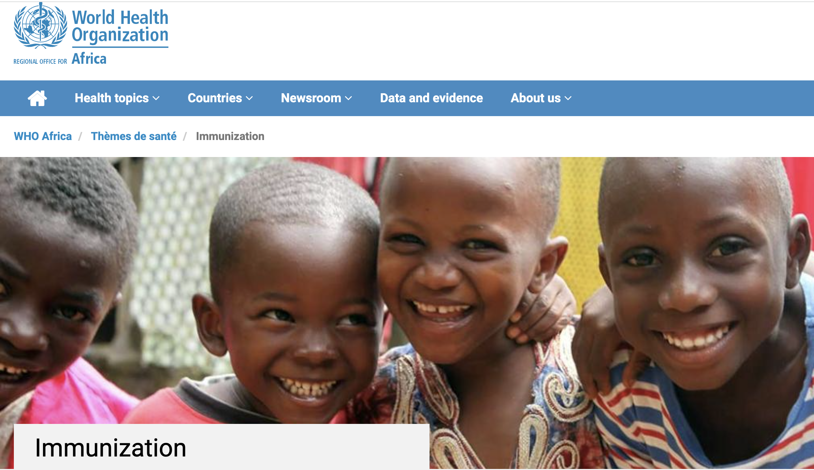
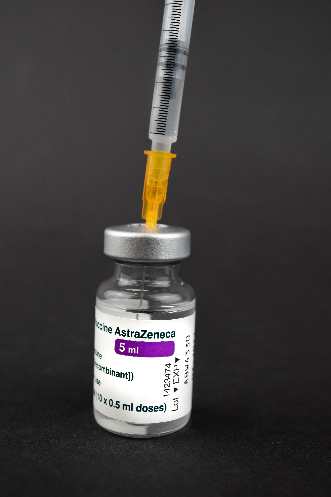
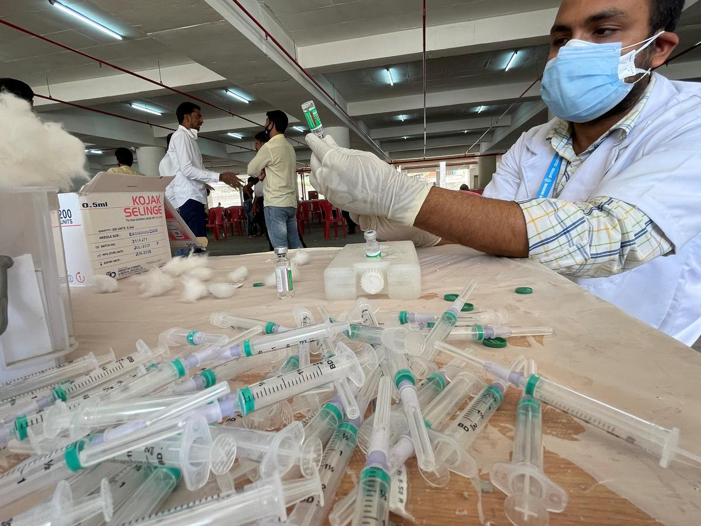
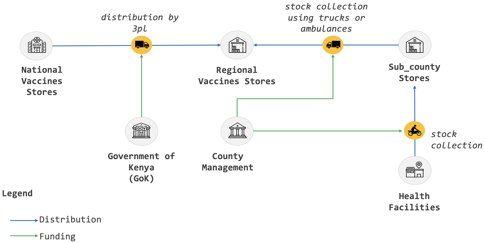
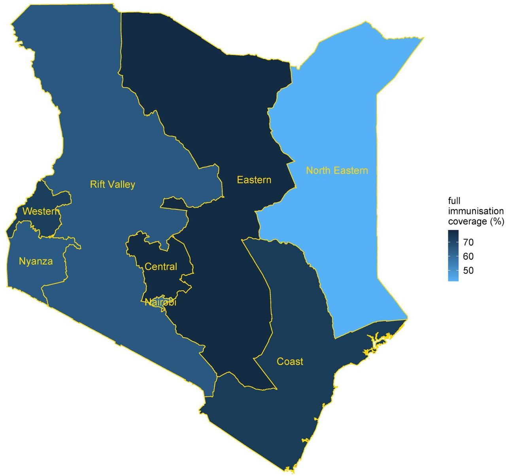
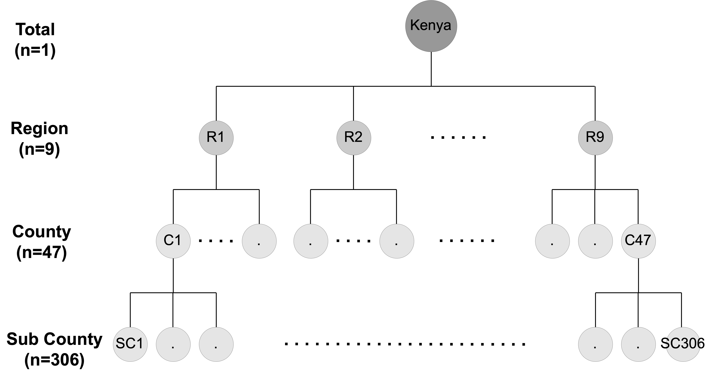
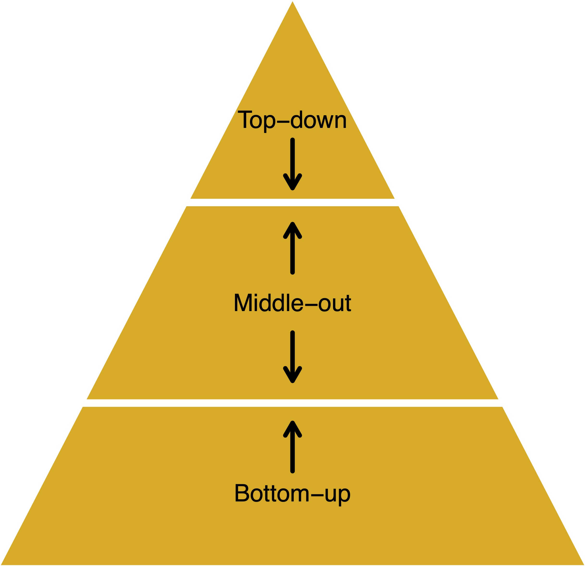
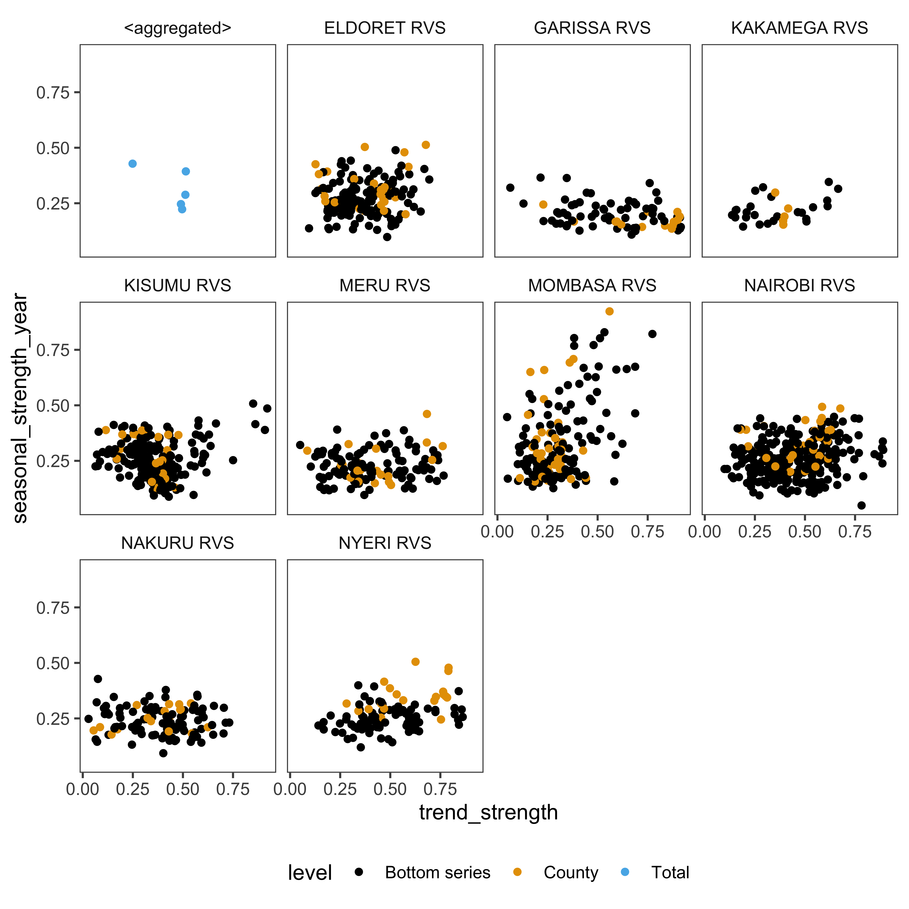

```{r initial,include=FALSE}
library(knitr)
library(fontawesome)
library(readr)
library(DT)
library(tidyverse)
options(htmltools.dir.version = FALSE,
  tibble.width = 60, tibble.print_min = 6)
opts_chunk$set(
  echo = FALSE, warning = FALSE, message = FALSE, comment = "#>",
  fig.path = 'figure/', cache.path = 'cache/', cache = TRUE, fig.retina = 3,
  fig.align = 'center', fig.width = 4.5, fig.height = 4, fig.show = 'hold',
  dpi = 120
)
```


```{r external, include = FALSE, cache = FALSE}
data_forecast <- readr::read_csv("data/nvip_master.csv")
```


.sticker-left[]
.sticker-float[]

<br><br>
.center[.title[Hierarchical forecasting of vaccine supply chain]]

.bottom[
Bahman Rostami-Tabar (`r fa("twitter", fill="#1da1f2")`[@Bahman_R_T](https://twitter.com/Bahman_R_T))
`r fa("chrome")`[www.bahmanrt.com](https://www.bahmanrt.com/)
]

---
background-image: url("resources/hierarchy-left.jpeg")
background-size: contain
background-position: left
class: middle

.pull-right2[
## Outline

- Immunization supply chain 

- Forecasting problem

- Data of vaccine consumption in  & forecasting setup

- Forecast accuracy evaluation

- Next steps
]

---
background-image: url("resources/hierarchy-left.jpeg")
background-size: contain
background-position: left
class: middle

.pull-right2[
## Outline

- .remember[Immunization supply chain]

- .gray[Forecasting problem]

- .gray[Data of vaccine consumption in  & forecasting setup]

- .gray[Forecast accuracy evaluation]

- .gray[Conclusion & next steps]

]

---
class: center, middle
.pull-left[

]

.left[
.pull-right[
- Approximately .remember[1 in 5] African children .remember[do not receive] all basic vaccines.
- More than .remember[30 million children] under five still .remember[suffer from vaccine-preventable diseases (VPDs)] every year in Africa
- Over .remember[half a million children die] from VPDs annually
]]

.footnote[source: [**WHO**](https://www.afro.who.int/health-topics/immunization])

---

## Vaccines

.three-column[
### Vial

]

--

.three-column[
### Dose

]

--

.three-column[
### Administrated
<iframe src="https://giphy.com/embed/xT5LMGfQrJPpmXKUEM" height="600px" allowFullScreen></iframe><p><a href="https://giphy.com/gifs/season-16-the-simpsons-16x11-xT5LMGfQrJPpmXKUEM">via GIPHY</a></p>
]
---
.center[
.pull-left[
### Open wastage

]

.pull-right[
### Close wastage

]
]

---
class: inverse, center, middle

.title[Doses used (consumption/needs) <br> = <br>doses administrated + wastage]

---
## The immunization supply chain



.footnote[Source: Effective Vaccine Management Assessment (EVM), 2021]

---
## What do we want to achieve?

.pull-left[
### High coverage

]

--

.pull-right[
✅  Lower waste

✅ Lower inventory costs

✅  Reduce missed opportunities (stock out)

✅  Lower societal costs

✅  and better coordination
]

.footnote[source:[Allan etal.(2021)](https://www.medrxiv.org/content/10.1101/2021.02.14.21251721v1.full)
]

---
class:inverse, center, middle

.title[ Forecasting accurately the needs for vaccines is one of the key elements in achieving these goals]

---
background-image: url("resources/hierarchy-left.jpeg")
background-size: contain
background-position: left
class: middle

.pull-right2[
## Outline

- .gray[Immunization supply chain]

- .remember[Forecasting problem]

- .gray[Data of vaccine consumption in  & forecasting setup]

- .gray[Forecast accuracy evaluation]

- .gray[Next steps]

]

---
## Hierarchical structure

.center[

]

---
## Classical approaches to forecast vaccine needs

- Demographic methods 
      - expected target population
      - coverage is the expected coverage rate
      - doses/target is the number of doses per target, as per the national vaccination schedule
      - wastage factor

--

- Service-based forecasting method 
      - number of vials per session
      - effective number of vaccination sessions during the year
      - the vial size of the selected vaccine to be used

.alert-note[.remember[**Forecasts are annual and at the national level**]]

---
## Limitations of current forecasting method


❌  Forecasts are yearly and at the national level.

❌  Not useful to inform operational / tactical decisions.

❌  Do not capture the information available at multiple hierarchical levels.

❌  Forecasts ignore the hierarchical nature of the problem, not coherent.

❌  lead to conflicting decisions & lack of coordination.

---
## How to forecast hierarchical time series?

.pull-left[
- Bottom-Up
- Top Down
- Middle-Out
- Optimal reconciliation
]

.pull-right[
```{r pyramid, echo = FALSE, out.width="90%"}

```
]
 
---
 
## Optimal reconceiliation
 
- This approach involves first generating independent base forecast for each series in the hierarchy (i.e. Base)

--

- As these base forecasts are independently generated they will not be “aggregate consistent” (i.e., they will not add up according to the hierarchical structure).

--

- The optimal combination approach optimally combines the independent base forecasts and generates a set of revised forecasts that are as close as possible to the univariate forecasts but also aggregate consistently with the hierarchical structure.

--

- Unlike any other existing method, this approach uses all the information available within a hierarchy.

---
background-image: url("resources/hierarchy-left.jpeg")
background-size: contain
background-position: left
class: middle

.pull-right2[
## Outline

- .gray[Immunization supply chain]

- .gray[Forecasting problem]

- .remember[Data of vaccine consumption in  & forecasting setup]

- .gray[Forecast accuracy evaluation]

- .gray[Next steps]

]

---
## Data

- Vaccine consumption in an African country from January 2013 until December 2021

- Four type of vaccines
    - Measles
    - Bacillus Calmette–Guérin (BCG) - for tuberculosis
    - DPT, a class of combination vaccines against three infectious diseases in humans: diphtheria-tetanus-pertussis
    - OPV, Oral poliovirus vaccines, used in the fight to eradicate polio
  
- 306 sub-county, 47 county & 9 regions
- Total of 1452 time series

<!-- --- -->
<!-- ## Data: vaccine consumption in  -->

<!-- .center[ -->
<!-- .xsmall[ -->
<!-- ```{r nviddata, echo=FALSE, out.width="70%"} -->
<!-- data_forecast1 <- data_forecast[,2:8] -->
<!-- head(data_forecast1,5) %>% -->
<!--   kbl() %>% -->
<!--   kable_classic(full_width = F, html_font = "Cambria") -->
<!-- ``` -->
<!-- ] -->
<!-- ] -->

<!-- <br> -->

<!-- .center[ -->
<!-- .xsmall[ -->
<!-- ```{r nviddata1, echo=FALSE, out.width="70%"} -->

<!-- data_forecast1 <- data_forecast[,2:8] -->

<!-- tail(data_forecast1,5) %>% -->
<!--   kbl() %>% -->
<!--   kable_classic(full_width = F, html_font = "Cambria") -->
<!-- ``` -->
<!-- ] -->
<!-- ] -->

---
## Doses administrated: National & regions

.center[

]

---
## Doses administrated: trend and seasonality features

.center[

]
---
## Doses used: total and regions


---
## Forecasting setup

- Forecasting method: ETS

- Forecast horizon: 12 months

- Time series cross-validation with re-estimation

---
## Accuracy measures

.pull-left[
### Root Mean Squared Scaled Error
$\text{RMSSE} = \sqrt{\text{mean}(q_{j}^2)}$,

where

\begin{equation}
q^2_{j} = \frac{\displaystyle e^2_{j}}
    {\displaystyle\frac{1}{T-m}\sum_{t=m+1}^T (y_{t}-y_{t-m})^2},
\end{equation}
]

.pull-right[
### Mean Absolute Scaled Error
$\text{MASE} = \text{mean}(|q_{j}|).$,

where

\begin{equation}
q_{j} = \frac{\displaystyle e_{j}}
    {\displaystyle\frac{1}{T-m}\sum_{t=m+1}^T |y_{t}-y_{t-m}|}.
\end{equation}
]

---
background-image: url("resources/hierarchy-left.jpeg")
background-size: contain
background-position: left
class: middle

.pull-right2[
## Outline

- .gray[Immunization supply chain]

- .gray[Forecasting problem]

- .gray[Data of vaccine consumption in  & forecasting setup]

- .remember[Forecast accuracy evaluation]

- .gray[Conclusion & next steps]

]

---
## BCG - RMSSE


```{r label, options}
read_csv("data/accuracy_bcg.csv") %>% 
  mutate(across(where(is.numeric), ~round(.,digits = 3))) %>% rename(Method = .model) %>% 
  mutate(Method=case_when(
    Method=="base" ~ "Base",
    Method=="bottom_up" ~ "Bottom Up",
    Method=="top_down" ~ "Top Down",
    Method=="wls_struct" ~ "Optimal Reconciliation",
  )) %>% 
  kbl() %>%
  kable_classic(full_width = F, html_font = "Cambria")
```

---
## DPT - RMSSE

```{r dptaccuracy, options}
read_csv("data/accuracy_dpt.csv") %>% 
  mutate(across(where(is.numeric), ~round(.,digits = 3))) %>% rename(Method = .model) %>% 
  mutate(Method=case_when(
    Method=="base" ~ "Base",
    Method=="bottom_up" ~ "Bottom Up",
    Method=="top_down" ~ "Top Down",
    Method=="wls_struct" ~ "Optimal Reconciliation",
  )) %>% 
  kbl() %>%
  kable_classic(full_width = F, html_font = "Cambria")
```


---
## OPV - RMSSE

```{r opvaccuracy, options}
read_csv("data/accuracy_opv.csv") %>% 
  mutate(across(where(is.numeric), ~round(.,digits = 3))) %>% rename(Method = .model) %>% 
  mutate(Method=case_when(
    Method=="base" ~ "Base",
    Method=="bottom_up" ~ "Bottom Up",
    Method=="top_down" ~ "Top Down",
    Method=="wls_struct" ~ "Optimal Reconciliation",
  )) %>% 
  kbl() %>%
  kable_classic(full_width = F, html_font = "Cambria")
```


---
## Measles - RMSSE

```{r measelsaccuracy, options}
read_csv("data/accuracy_measels.csv") %>% 
  mutate(across(where(is.numeric), ~round(.,digits = 3))) %>% rename(Method = .model) %>% 
  mutate(Method=case_when(
    Method=="base" ~ "Base",
    Method=="bottom_up" ~ "Bottom Up",
    Method=="top_down" ~ "Top Down",
    Method=="wls_struct" ~ "Optimal Reconciliation",
  )) %>% 
  kbl() %>%
  kable_classic(full_width = F, html_font = "Cambria")
```


---
background-image: url("resources/hierarchy-left.jpeg")
background-size: contain
background-position: left
class: middle

.pull-right2[
## Outline

- .gray[Immunization supply chain]

- .gray[Forecasting problem]

- .gray[Data of vaccine consumption in  & forecasting setup]

- .gray[Forecast accuracy evaluation]

- .remember[Next steps]

]

---
## Next steps

- Check and fix the data quality issues for doses used

- Report the forecast accuracy improvement aganist the current approach 

- Create probabilistic forecasts and report its evaluation

- Use some useful predictors

---
## Next steps
### Using conflict data 

.center[
```{r, echo=FALSE, fig.align='center', out.width="100%"}
knitr::include_url("https://ucdp.uu.se/country/501", height = "500px")
```
]

<!-- --- -->
<!-- ## Potential useful predictors -->

<!-- .center[ -->
<!-- .tiny[ -->
<!-- ```{r predictor1, echo=FALSE} -->
<!-- predictor1 <- data_forecast[,-c(6,7,8,9)] -->
<!-- predictor1 %>% select(month,region,county,sub_county,Total_Population,child_pop,state_base_violence,one_sided_violence,non_state_violence,MAM_rainfall_season,OND_rainfall_season,flooding_events,everything(),-`...1`) %>%  -->
<!-- head(5) %>% -->
<!--   kable() %>% -->
<!--   column_spec(column=5:8, width = "1in") %>%  -->
<!--   kable_styling(c("bordered", "condensed"), full_width = F) -->

<!-- ``` -->
<!-- ] -->
<!-- ] -->

---

## Acknowledgement

- John and Snow Inc team (Laila Akhlaghi, Wendy Prosser, Gurmeet Philora)

- The African country government

- [Developers of Tidyverts](https://tidyverts.org/) and [Tidyverse](https://www.tidyverse.org/) packages

- Harsh Charma for his support

---
## References

- Effective Vaccine Management (EVM 2.0) Assessment Report –  2021, WHO

- Vaccine Logistics, WHO training manual

- [Forecasting: Principles and Practice]([https://otexts.com/fpp3/hierarchical.html], (3rd ed, Rob J Hyndman and George Athanasopoulos]

---
.pull-left[
## About me
Bahman Rostami-Tabar <br>
Associate Professor in Business Analytics
Cardiff University, UK
<br><br>

Slides @ [www.bahmanrt.com](www.bahmanrt.com)
`r fa("twitter", fill = "#1da1f2")`[@Bahman_R_T](https://twitter.com/Bahman_R_T)
`r fa("linkedin-in", fill = "blue")` Connect: [Bahman ROSTAMI-TABAR](https://www.linkedin.com/in/bahman-rostami-tabar-1046171a/)
]

.pull-right[
## Outline of my talk

- Immunization supply chain

- Forecasting problem

- Data of vaccine consumption in  & forecasting setup

- Forecast accuracy evaluation

- Next steps
]
