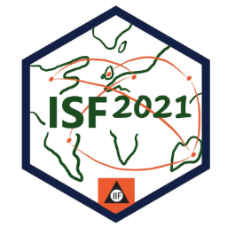
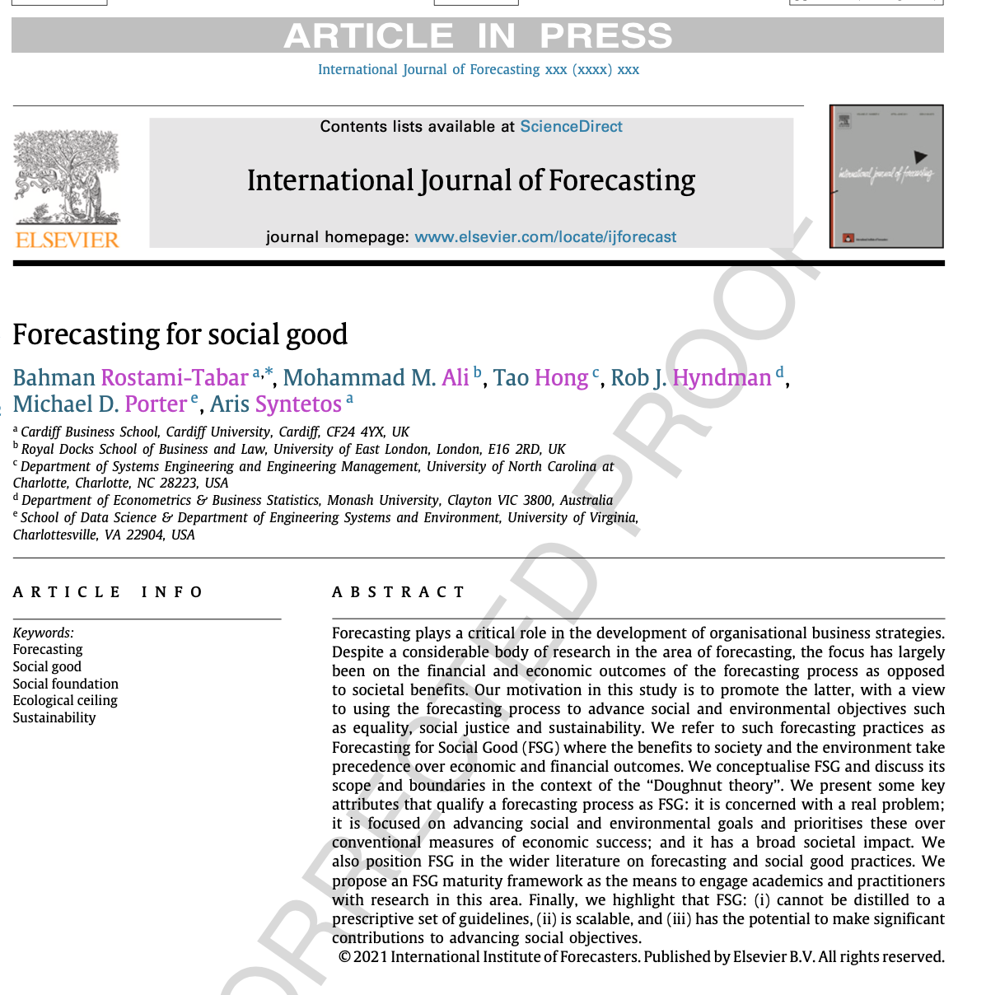
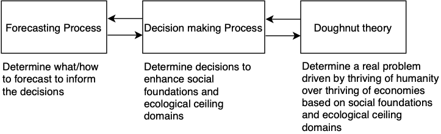
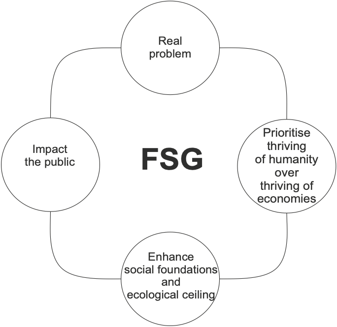
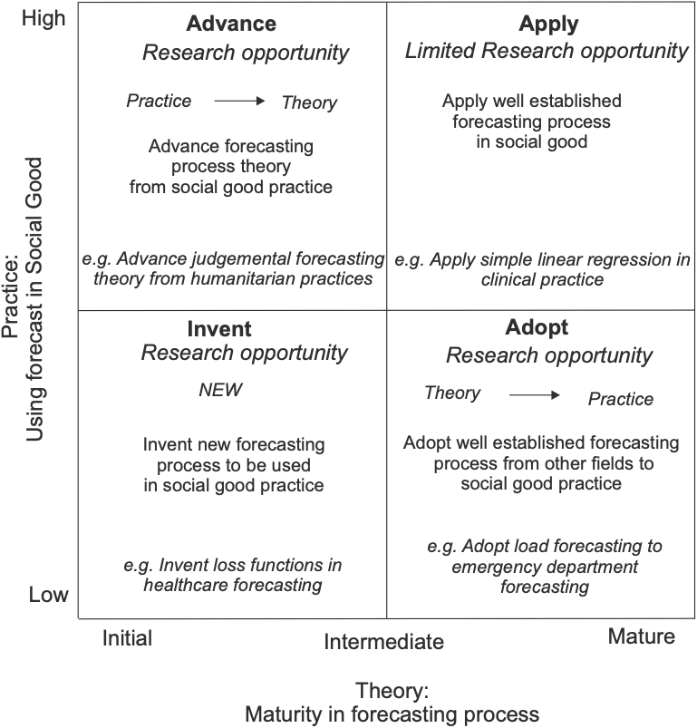

```{r setup, include=FALSE}
options(htmltools.dir.version = FALSE, width = 120)

library(tidyverse)
library(knitr)
library(kableExtra)
library(fontawesome)
library(flair)
library(DT)
library(gapminder)
library(ggthemes)
library(countdown)

opts_chunk$set(
  echo = FALSE, warning = FALSE, message = FALSE, comment = "#>",
  fig.path = 'figure/', cache.path = 'cache/', fig.align = 'center',
  out.width = "70%", fig.show = 'hold',
  cache = TRUE, external = TRUE, dev = 'svglite', dev.args = list(bg = "transparent")
)

#fig.width = 12, fig.height = 4


```

```{r load-data, include=FALSE}

```


<br> <br> <br> <br>
.center[.title[.large[Forecasting for Social Good (F4SG) <br> `r emo::ji('chart_with_upwards_trend')` `r emo::ji('earth_africa')`]]]
.sticker-float[] 
.sticker-left[] 

.bottom[
### Bahman Rostami-Tabar (`r fa("twitter", fill="#1da1f2")`[@Bahman_R_T](https://twitter.com/Bahman_R_T)) <br>
### .remember[Website] [www.bahmanrt.com](https://www.bahmanrt.com/)
### .remember[Slides] [bahmanrt.com/talk/isf2021](https://www.bahmanrt.com/talk/isf2021)
]

---
class: inverse center middle

## What is Forecasting for Social Good?

---

##  What is Forecasting for Social Good?
### An annual workshop: [www.f4sg.org](www.f4sg.org)

.center[
```{r, fig.align='center', out.width="100%"}
knitr::include_url("https://www.f4sg.org/", height = "500px")
```
]

---

##  What is Forecasting for Social Good?
### A Research Grant

.center[
```{r, fig.align='center', out.width="100%"}
knitr::include_url("https://forecasters.org/programs/research-awards/forecasting-for-social-good-research-grant//", height = "500px")
```
]

---

##  What is Forecasting for Social Good?

### A Potential Research Network / IIF section

.center[
```{r, fig.align='center', out.width="100%"}
knitr::include_url("https://fsgrn.netlify.app/", height = "500px")
```
]

---
##  What is Forecasting for Social Good?
### IJF paper

.center[
```{r, fig.align='center', out.width="100%"}
knitr::include_url("https://doi.org/10.1016/j.ijforecast.2021.02.010", height = "500px")
```
]

---
## Democratising Forecasting
### Educating people about forecasting
.pull-left[

```{r, fig.align='center', out.width="100%"}
knitr::include_url("https://forecasters.org/events/iif-workshops/", height = "500px")
```
]

.pull-right[

- 3 days workshop-Foundations of forecasting using R

- .remember[1 day workshop-Forecasting for managers]

]

<!-- ##  Forecasting for Social Good , IJF paper.center[ -->
<!-- ```{r, fig.align='center', fig.height= 12, fig.width=8} -->
<!--  -->
<!-- ```  -->


---
class: inverse middle

### .white[1.] What is meant by F4SG?

--

### .white[2.] What attributes make a forecasting process aligned with F4SG?

--

### .white[3.] How F4SG process might be different from other areas of forecasting?

--

### .white[4.] What are other social good initiatives related to F4SG?

--
### .white[5.] What are research opprtunities in F4SG?

---
class: middle

## Why forecasting?


- You do not forecast for the .remember[sake of forecasting]. 

--

- You do it because you want to base .remember[decisions] on it.

--

- Ideally, make .remember[better decisions] in the .remember[light of forecast].


---

## Make better decisions to ...

.pull-left[

- Increase profit

- Increase economic growth

- Increase resource utilisation

- Reduce Co2 emissions

- To not blow up the business

- ...
]

--

.pull-right[

>.title[With better decisions, we help someone/something to .remember[THRIVE].]

]

---
background-image: url(resources/doughnut.jpg)
background-size: contain
background-position: left
class: middle

.pull-right[.title[Doughnut]]

---
background-image: url(resources/classic_Doughnut.jpg)
background-size: contain
background-position: left
class: middle

.pull-right[.title[Doughnut theory]]

---
background-image: url(resources/classic_Doughnut.jpg)
background-size: 50%
background-position: left
class: middle


.pull-right[
>‘‘Instead of economies that need to grow, whether or not they make us thrive, we need economies that make us .remember[THRIVE], whether or not they grow’’. -- Raworth (2017) 

]


.footnote[Raworth, K. (2017). Doughnut economics: seven ways to think like a 21st century economist. Chelsea Green Publishing.]

---
background-image: url(resources/classic_Doughnut.jpg)
background-size: 45%
background-position: left
class: middle

.pull-right[

- The theory combines the concept of .remember[social foundation] with that of the .remember[ecological ceiling] in a single framework.

- .remember[Social foundation*:] to ensure that no one falls short on life’s essentials.

- .remember[Ecological ceiling**:] ensure we do not overshoot the planet’s capacity for critical life-supporting systems.

]

<br><br>

.footnote[
[* Transforming our world : the 2030 agenda for sustainable development, 2015.](https://sdgs.un.org/2030agenda)

** [Rockström, Johan, et al. "A safe operating space for humanity." Nature, 2009, 472-475](https://www.nature.com/articles/461472a?foxtrotcallb) 

]


---
background-image: url(resources/classic_Doughnut.jpg)
background-size: 50%
background-position: left
class: middle

.pull-right[
## Where do we want to be?

Between the .remember[social foundation] and the .remember[ecological ceiling] lies a space in which it is possible to .remember[meet the needs of all people] within the .remember[means of the living planet] — **an ecologically safe and socially just space in which humanity can .remember[THRIVE]**.

]


---
background-image: url(resources/classic_Doughnut.jpg)
background-size: 50%
background-position: left
class: middle

.pull-right[
## .remember[Inform decisions that brings us into the space]

- The decision-making process needs to support all activities that bring us into the Doughnut space — an environmentally safe and socially just space — in which humanity thrives. 

- This is where forecasting plays a role: .remember[to inform those decisions].
]

---
class: middle, center

## FSG process

```{r, out.width="100%"}

```

---
class: middle, center

## Attributes of FSG

```{r, out.width="50%"}

```

---
class: middle

## F4SG versus other area of forecasting

.center[]

---

background-image: url(figure/other_fsg.png)
background-size: cover

---
class: middle

## Are there research opprtunities?
.center[
### FSG research maturity framework
]

```{r, out.width="42%"}

```


---
class: middle

**The purpose of F4SG initiative is to:**

- .remember[Motivate engagement] with .remember[important issues] that .remember[our world and society face], and not only focus on forecast accuracy, methodological advancement and profit;

--

- .remember[Increase awareness and interest] from academics and practitioners in the potential impact of F4SG;

--

- .remember[Encourage] interested academics and practitioners .remember[to engage] in the FSG agenda;

--

- .remember[Inspire] the development of new forecasting methodologies tailored to social good applications.


---
class: middle

>.title[Qualifying what constitutes F4SG should permit academics and practitioners to appreciate the .remember[opportunity cost of not engaging with its scalable agenda].]

---
background-image: url("resources/question2.jpeg")
background-size: contain
background-position: left
class: middle

.pull-right2[

.hand-large[Thank you]

### Resources:
### [Forecasting for Social Good conference](www.f4sg.org)
### [Forecasting for Social Good Reseqarch Grant](https://forecasters.org/programs/research-awards/forecasting-for-social-good-research-grant/#:~:text=The%20Forecasting%20for%20Social%20Good,good%20practices%20and%20drive%20developments)
### [Forecasting for Social Good Paper](https://doi.org/10.1016/j.ijforecast.2021.02.010)
### [Democratising Forecasting](https://forecasters.org/blog/2018/07/10/new-iif-workshop-initiative-democratizing-forecasting/)

]

.pull-right2[
<br>
### `r fa("twitter", fill = "deepskyblue")` Say hello: [@Bahman_R_T](https://twitter.com/Bahman_R_T)
]


