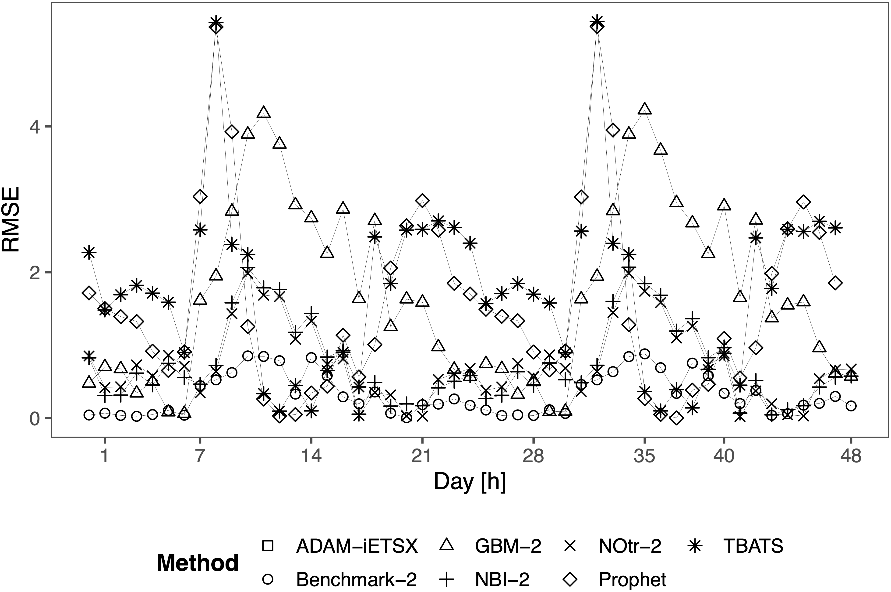

```{r initial,include=FALSE}
library(knitr)
library(fontawesome)
library(readr)
library(DT)
options(htmltools.dir.version = FALSE,
  tibble.width = 60, tibble.print_min = 6)
opts_chunk$set(
  echo = FALSE, warning = FALSE, message = FALSE, comment = "#>",
  fig.path = 'figure/', cache.path = 'cache/', cache = TRUE, fig.retina = 3,
  fig.align = 'center', fig.width = 4.5, fig.height = 4, fig.show = 'hold',
  dpi = 120
)
```


```{r external, include = FALSE, cache = FALSE}

```


.sticker-left[]
.sticker-float[]

.center[.title[Probabilistic forecasting of hourly Emergency Department arrivals]]

.bottom[
Bahman Rostami-Tabar (`r fa("twitter", fill="#1da1f2")`[@Bahman_R_T](https://twitter.com/Bahman_R_T)) <br>With [Jethro Browell ](http://www.jethrobrowell.com/about-me.html) & [Ivan Svetunkov](https://www.lancaster.ac.uk/lums/people/ivan-svetunkov)
`r fa("chrome")`[www.bahmanrt.com](https://www.bahmanrt.com/)
]

---
background-image: url("resources/hierarchy-left.jpeg")
background-size: contain
background-position: left
class: middle

.pull-right2[
## Outline

- Forecasting in Emergency Departments

- Data and forecasting setup

- Forecasting model development

- Forecast evaluation 
 
- Conclusion & future works
]

---
background-image: url("resources/hierarchy-left.jpeg")
background-size: contain
background-position: left
class: middle

.pull-right2[
## Outline

- .remember[Forecasting in Emergency Departments]

- .gray[Data and forecasting setup]

- .gray[Forecasting model development]

- .gray[Forecast evaluation]
 
- .gray[Conclusion & future works]

]

---
.pull-left[


]

.pull-right[


]

---
background-image: url("resources/as-staff.jpg")
background-size: 50%
background-position: right
 

.pull-left[
## Staffing problem
.large[How many nurses/doctors and When?]

- Demand/capacity planning
- Staffing
- Scheduling
]

--

.pull-right[
## Accurate staffing
- Reduces congestion in the service
- Improves the quality of provision for patients
- Reduce costs for the health system
- ...
]

---
## Forecasting meets staffing

```{r forecastingstaffing,echo=FALSE, out.width= "100%"}

```


---
.tiny[
```{r summarylit, cache=FALSE, fig.width=1}
li <- readxl::read_xlsx("table/literature.xlsx")

DT::datatable(li,
              fillContainer = FALSE, options = list(pageLength = 12))
```
]

---
## Literature limitations: relying on point forecast

.pull-left[
❌ Studies are limited to only predicting future arrivals as a point forecast (a single number)

- Point forecast is just an expected value and it creates the illusion of certainty

- An .remember[average is misleading and may be hiding somethings]
]

--

.pull-right[
<iframe width="600" height="550" src="https://www.youtube.com/embed/fZBW7rZB0I4?t=11" /iframe>

]


???
<!-- --- -->

<!-- .pull-left[ -->
<!--  -->
<!-- ] -->

<!-- .pull-right[ -->
<!-- <iframe width="600" height="550" src="https://www.youtube.com/embed/fZBW7rZB0I4"/iframe> -->
<!-- ] -->

---
## Literature limitations

❌   most of studies do not consider the full extent of the multiple seasonality and changing profile over time

❌   Publications are not reproducible as underlying data and code are not available

❌   studies are limited in terms of the length of historical data used for training and forecast performance evaluation

❌   some studies in this area .remember[lack a rigorous experimental design], i.e. they do not use benchmark methods, report forecast accuracy or use cross-validation.


---
## Research Objetives

Based on this analysis and the literature review, we should consider developing probabilistic models that can take the following into account:

- Hour-of-day, day-of-week, and week-of-year seasonalities,
- Long-term trend (or a slowly changing level),
- Calendar events, such as holidays,
- Lags of calendar events to accommodate the potential changes in demand the next day after a
holiday,
- Other events, such as sporting fixtures,
- Temperature effects.

---
background-image: url("resources/hierarchy-left.jpeg")
background-size: contain
background-position: left
class: middle

.pull-right2[
## Outline

- .gray[Forecasting in Emergency Departments]

- .remember[Data and forecasting setup]

- .gray[Forecasting model development]

- .gray[Forecast evaluation]
 
- .gray[Conclusion & future works]
]

 
---

.pull-left[
]

.pull-right[
- Daily seasonality
- Weekly seasonality
- Hourly attendance interacting with day of week
]

---
## Daily seasonality

.pull-left1[

]

.pull-right1[
- Consistent pattern which repeats .remember[every 24 hours]
- Variation changes with mean
]

---
## Weekly seasonality

.pull-left1[

]

.pull-right1[
- Consistent pattern which repeats .remember[every 7 days]
- but of course with lots of variation
]

---
## Week of year seasonality

.center[

]
---

## Special events & holidays
### Effect of holidays and special events

.center[

]

---
## Forecasting setup

- Forecast horizon: 48 hours
- Time series cross validation with re-estimation
- One year of data for test

---
## Forecast accuracy metrics
### Point forecast

Evaluate the accuracy of point forecasts using Root Mean Squared Error (RMSE)

$RMSE = \sqrt{\frac{1}{h} \sum_{j=1}^h e_{t+j}^2}$

---
## Forecast accuracy metrics
### Probabilistic forecast

- Quantile Bias

    - Shows the difference between the nominal exceedance of prediceted quantiles and the observed frequency of exceedance.
    
- Pinball score

.center[

]

where $\mathcal{p} = \{0.05,0.1,...,0.95\}$ is the set of quantiles being estimated.

---
background-image: url("resources/hierarchy-left.jpeg")
background-size: contain
background-position: left
class: middle

.pull-right2[
## Outline

- Staffing & Forecasting in Emergency Departments

- Data and experiment design

- Forecasting model development

- Forecast evaluation & findings

- Conclusion & future works
]

---
## Benchmark methods

- Poisson Regression

- ETS - Exponential Smoothing

- Prophet

- TBATS

- Gradient Boosting Machines

---
## ADAM: multiple seasonal iETSX

.center[
```{r, echo=FALSE, fig.align='center', out.width="100%"}
knitr::include_url("https://openforecast.org/adam/", height = "500px")
```
]

---
## ADAM: multiple seasonal iETSX
.small[
.pull-left[
\begin{equation}
	\begin{aligned}
	  & y_t = o_t z_t \\
		& \log z_t = \log l_{t-1} + \log s_{1,t-24} +\\
		&\log s_{2,t-168} + \\
	&	\mathbf{x}_t' \boldsymbol{\beta} + \log \left(1 + \epsilon_{t} \right) \\
		& \log l_{t} = \log l_{t-1} + \log( 1  + \alpha \epsilon_{t}) \\ 
		& \log s_{1,t} = \log s_{1,t-m} + \log( 1  + \gamma_1 \epsilon_{t}) \\
		& \log s_{2,t} = \log s_{2,t-m} + \log( 1  + \gamma_2 \epsilon_{t}) \\
		& o_t \sim \text{Bernoulli} \left(\mu_{a,t} \right) \\
		& a_t = l_{a,t-1} \left(1 + \epsilon_{a,t} \right) \\
		& l_{a,t} = l_{a,t-1}( 1  + \alpha_{a} \epsilon_{a,t}) \\
		& \mu_{a,t} = \min(l_{a,t-1}, 1)
	\end{aligned}
\end{equation}
]
]

.pull-right[
.small[
- where $\alpha$, $\beta$, $\gamma_1$, $\gamma_2$ and $\alpha_a$ are the smoothing parameters, defining how adaptive the components of the model should be
- $l_t$ is the level component for the demand sizes and $S_{t,1}$ and $S_{t,2}$ are the seasonal components
- $\beta$ is the vector of parameters for the explanatory variables
- $o_t$  when demand occurs  is 1, otherwise 0
- $l_{a,t-1}$ is the level component for the occurrence part of the model, 
- scale of the distribution: $(1 + \epsilon_t)$ ∼ $Γ(s−1, s)$, where $s=\frac{1}{T} \sum_{t=1}^{T} e_{t}^2$
- $a_t$ is an unobservable series, underlying the occurrence part of the model and $(1 + \epsilon_{a,t})$ is an unobservable error term for $a_t$.
]
]

---
## Generalised Additive Models for Location, Scale and Shape (GAMLSS)

- Assuming our forecast distribution follows a given parametric distribution. 
- The forecast task would be to predict the future values of that distribution’s parameters. 

- We then can use Generalised Additive Models for Location, Scale and Shape (GAMLSS). 

- These are the distributional regression models where the parameters are modelled as additive functions of explanatory variables. 

- This provides a powerful and flexible framework for probabilistic forecasting.

---
## Generalised Additive Models for Location, Scale and Shape (GAMLSS)

- $F_t(y_t)$ is a predictive cumulative probability distribution of $y_t$
- $F_t(y_t)$ is modelled via a parametric model, $F(y_t|\theta_t)$, where $\theta_t$ is an $m$-dimensional vector of parameters
- In the GAMLSS framework [1] the elements $j=1,...,m$ of $\theta_t$ are modelled as

\begin{equation}
    g_j(\theta_{j,t})=\mathbf{A}_{j,t} \beta_j + \sum_{i} f_{j,i}({x}^{S_{j,i}}_t), \;\;\; \text{for} \;\;\; j = 1, \dots, m,
\end{equation}
\begin{equation}
    f_{j,i}(x^{S_{j,i}}) = \sum_{k=1}^{K_{j,i}} b^{ji}_k (x^{S_{j,i}}) \beta_k^{ji},
\end{equation}

.footnote[1 Rigby, R.A. and Stasinopoulos, D.M., 2005. Generalized additive models for location, scale and shape. Journal of the Royal Statistical Society: Series C (Applied Statistics), 54(3), pp.507-554.]

---
## GAMLSS

We start with a Poisson distribution with an additive model for $\log \lambda_t$ of the form

\begin{equation}
  \log(\lambda_t) = \sum_{i=1}^7 \beta_i \delta(D_i(t)-i) + \sum_{j=1}^7 D_j(t) f_j(H(t)) + t f_\text{Y}(Y(t)) + f_\text{Temp}(Y(t),C_t) \quad .
\end{equation}

The functions $H(t)$, $D(t)$ and $Y(t)$ return the hour of the day (1-24), day of the week (1-7), and day of the year (1-366) at time $t$, respectively, and $C_t$ is the temperature at time $t$. This model is called Poisson-1 in discussions below.

- we consider an extension to the additive models to incorporate school and public holidays into $D$. These models are labelled Poisson-2

---
More flexible, two-parameter distributions: the truncated Normal distribution, with truncation at 0. 

\begin{equation}
F_t(y_t,\mu_t,\sigma_t) =  \frac{\Phi\left( \frac{y_t-\mu_t}{\sigma_t} \right) - \Phi\left( \frac{-y_t}{\sigma_t} \right)}{1 - \Phi\left( \frac{-y_t}{\sigma_t} \right)}
(\#eq:truncatedn)
\end{equation}

\begin{align*}
	& \mu_t = \sum_{i=1}^{10} \beta_i D^{+}_i(t) + \sum_{j=1}^{10} D^{+}_j(t) f_j(H(t)) + t f_\text{Y}(Y(t)) + f_\text{Temp}(Y(t),C_t) \\
	& log(\sigma_t) = \sum_{i=1}^{10} D^{+}_i(t) f(H(t))
\end{align*}


---
## A free course on GAM in R

.center[
```{r, echo=FALSE, fig.align='center', out.width="100%"}
knitr::include_url("https://noamross.github.io/gams-in-r-course/", height = "500px")
```
]

---
## Detailed introduction to *GAM/GAMLSS*

.center[
```{r, echo=FALSE, fig.align='center', out.width="100%"}
knitr::include_url("https://www.taylorfrancis.com/books/mono/10.1201/9781315370279/generalized-additive-models-simon-wood", height = "500px")
```
]

---
background-image: url("resources/hierarchy-left.jpeg")
background-size: contain
background-position: left
class: middle

.pull-right2[
## Outline

- Staffing & Forecasting in Emergency Departments

- Data and experiment design

- Forecasting model development

- Forecast evaluation & findings

- Conclusion & future works
]

---
## Summary results

.xsmall[
```{r label, options}
results_table <- read_rds("figure/isf_ed/results/results_table.rds") %>% arrange(`Quantile Bias`)
results_table <- results_table %>% 
  mutate(Method = 
           case_when(Method == "tbats" ~ "TBATS",
                     Method == "prophet" ~ "Prophet",
                     TRUE ~ Method))
results_table <- results_table %>% mutate(`Quantile Bias` = round(`Quantile Bias`,digits = 3), Pinball = round(Pinball,digits = 3), RMSE = round(RMSE,digits = 3), `Runnin Time` = round(Time,digits = 3))
knitr::kable(results_table, format = 'html')
```
]
---
## Pinball

.pull-left1[

]

.pull-right1[
- Consistent pattern which repeats .remember[every 24 hours]
- Weekly seasonality
- Hourly attendance interacting with day of week
]

---
## Quantile Bias

.pull-left1[

]

.pull-right1[
- Consistent pattern which repeats .remember[every 24 hours]
- Weekly seasonality
- Hourly attendance interacting with day of week
]

---
## Root Mean Squared Error

.pull-left1[

]

.pull-right1[
- Consistent pattern which repeats .remember[every 24 hours]
- Weekly seasonality
- Hourly attendance interacting with day of week
]

---
## Accuracy vs. running time

.center[

]

---
background-image: url("resources/hierarchy-left.jpeg")
background-size: contain
background-position: left
class: middle

.pull-right2[
## Outline

- Staffing & Forecasting in Emergency Departments

- Data and experiment design

- Forecasting model development

- Forecast evaluation & findings

- Conclusion & future works
]

---
## Conclusions

- Two approaches produced highly accurate, calibrated probabilistic forecasts:
      1. The first is ADAM-iESTX
      2. Labeled NOtr-2 
- The point prediction produced by ADAM-iESTX had a lower RMSE than NOtr-2, while NOtr-2 produced forecasts with a lower pinball score. 

--

- The .remember[choice of distribution assumed] for probabilistic forecasts and choice of .remember[model features] are as if not more important than the type of model employed; 

--

- The best performing models .remember[handled the non-negative and skewed nature] of the data automatically without the need for post-processing. 

---
## Conclusions

- Methods based on continuous-valued distributions are not adversely affected by the fact that the data are integer-valued. .remember[Rounding up predictive quantiles] to the next integer does not make predictions worse

--

- Out-of-the-box models, which require minimal tuning or manual development, do not perform as well as well-considered statistical approaches

--

- Of the models requiring a modest amount of user input and expertise, exponential smoothing (ETS) was found to perform well. However, its probabilistic forecasts were considerably worse than  NOtr-2 in terms of pinball score

--

- These observations reflect the characteristics of the data, which is representative of ED arrivals

---
## Future works


- More research is needed in the forecasting of other important variables such as .remember[length of stay, bed occupancy and waiting time], in addition to patient arrivals and admissions. This may require considering the dynamics among various services, including General Practitioners, Emergency Departments, Ambulance and Fire & Rescue services.

- .remember[Linking probabilistic forecasts] with .remember[upstream (ambulance call-outs) and downstream (medical outcomes)] 

---
.pull-left[
Bahman Rostami-Tabar <br>
Associate Professor in Business Analytics
Cardiff University, UK
<br><br>

Slides @ [www.bahmanrt.com](www.bahmanrt.com)
`r fa("twitter", fill = "#1da1f2")`[@Bahman_R_T](https://twitter.com/Bahman_R_T)
`r fa("linkedin-in", fill = "blue")` Connect: [Bahman ROSTAMI-TABAR](https://www.linkedin.com/in/bahman-rostami-tabar-1046171a/)
]

.pull-right[
## Outline

- Vaccine supply chain, challenges & the forecasting task

- Analysis of previous vaccine consumption & forecasting setup

- Hierarchical forecasting approaches

- Forecast accuracy improvement against the benchmark from the industry

- Conclusion & next steps
]
