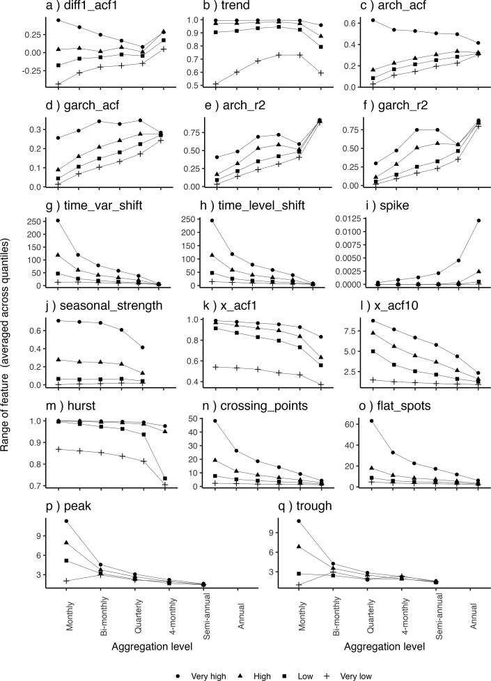
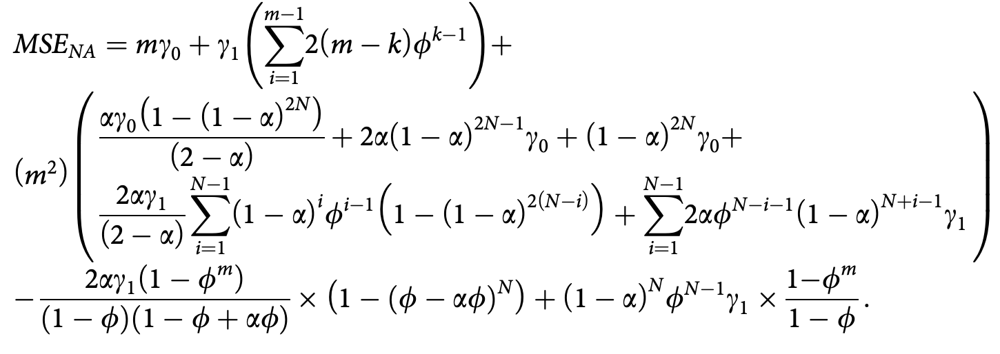

```{r setup, include=FALSE}
options(htmltools.dir.version = FALSE, width = 120)

library(tidyverse)
library(knitr)
library(kableExtra)
library(fontawesome)
library(flair)
library(DT)
library(gapminder)
library(ggthemes)
library(countdown)
library(fpp3)
library(patchwork)
library(ggridges)
library(magick)
opts_chunk$set(
  echo = FALSE, warning = FALSE, message = FALSE, comment = "#>",
  fig.path = 'figure/', cache.path = 'cache/', fig.align = 'center',
  fig.width = 11, fig.height = 5, fig.show = 'hold',
  cache = TRUE, external = TRUE, dev = 'svglite', dev.args = list(bg = "transparent")
)

#fig.width = 12, fig.height = 4

# Few theme
ggplot2::theme_set(ggthemes::theme_few())

```


<br><br><br>
.center[.title[.small[To aggregate or not to aggregate: Forecasting of finiteautocorrelated demand]]]
.sticker-float[]
.sticker-left[]

.center[JORS Research in Focus Webinar - 25 July 2025]

<br>
Bahman Rostami-Tabar, Professor of Analytics <br>
Director of Data Lab for Social Good Reserach Group, Cardiff University <br>
[Read paper:https://doi.org/10.1080/01605682.2022.2118631](https://www.tandfonline.com/doi/full/10.1080/01605682.2022.2118631) <br>
Slides: https://bahmanrt.netlify.app/talk/


---
background-image: url("resources/hierarchy-left.jpeg")
background-size: contain
background-position: left
class: middle

.pull-right2[
## Outline

- Introduction & Framing

- Literature Background & Contributions

- Model Setup 

- Results: Analytical & Empirical

- Conclusion, Limitations & Future Work

]

---
background-image: url("resources/hierarchy-left.jpeg")
background-size: contain
background-position: left
class: middle

.pull-right2[
## Outline

- .remember[Introduction & Framing]

- Literature Background & Contributions

- Model Setup 

- Results: Analytical & Empirical

- Conclusion, Limitations & Future Work

]

---


---
## Should we forecast at hourly or weekly frequency?

.pull-left[
### Motivating Example: Hospital Admissions

- Hourly data on patient admissions is available.

- The planning task requires weekly forecasts to allocate resources.

- Key decision: .remember[Forecast using hourly data directly and then aggregate forecast or aggregate to weekly and then forecast?]
]

--

.pull-right[
### Common across domains and time granulrity

Data is often collected at higher frequency (e.g., Minutes, hours) than the forecasting target frequency (e.g., day, week, month, quarter).

- Retail
- Energy
- Transportation
- Finance
- Manufacturing
- Agriculture
- and more

]

???
for example, assume you are the planenr in a hopital, data are colelted for each hour showing how many patiens youa dmitted, but you are interested in the weekly number of patients admitted to the hospital to plan your resourced for the nxt 6 weeks. in this case, you need to forecast for the next 6 weeks, but the data is collected at a higher frequency (hourly). So, you have a choice to use data at a higher frequency (hourly) or aggregate it to a lower frequency (weekly) and then forecast. but which one gi
ves you better forecast accuracy?

you can generalie this to any other situation where data is collected at a higher frequency than the frequency of interest, such as:
- sales data collected at daily frequency, but you are interested in forecasting weekly sales
- energy consumption data collected at hourly frequency, but you are interested in forecasting daily or weekly consumption
- weather data collected at hourly frequency, but you are interested in forecasting daily or weekly weather patterns
- 

---
## Temporal aggregation
### Transforming higher-frequency data into lower-frequency data


--


---
## Temporal aggregation - a tardeoff

.pull-left[

]

.pull-right[
<br><br><br>
- Signal-to-noise

- Model complexity
]

.footnote[Kourentzes, Nikolaos, Bahman Rostami-Tabar, and Devon K. Barrow. "Demand forecasting by temporal aggregation: Using optimal or multiple aggregation levels?." Journal of Business Research 78 (2017): 1-9.]

---
## How TA affects time series features
### .small[Rostami-Tabar & Mircetic. Neurocomputing 548 (2023): 126376.]

.pull-left[

]


.pull-right[

]

---
background-image: url("resources/hierarchy-left.jpeg")
background-size: contain
background-position: left
class: middle

.pull-right2[
## Outline

- .graylight[Introduction & Framing]

- .remember[Literature Background & Contributions]

- Model Setup 

- Results: Analytical & Empirical

- Conclusion, Limitations & Future Work

]

---
## Temporal aggregation - a very brief history

.pull-left[

- The term .rememebr[temporal aggregation (TA)] emerged in the context of econometrics and time series analysis, dating back to the 1970s.
- "TA affects the specification of models, estimation of parameters an efficiency of forecasting" (Brewer (1973), Wei (1979).
]


.pull-right[

The term became particularly important in studies on:

- Macroeconomic modeling
- Autoregressive Integrated Moving Average (ARMA) processes.
- Forecasting

]

.footnote[Brewer, K.R.W. (1973). Some consequences of temporal aggregation and systematic sampling for ARIMA and ARMAX models. J. Econometrics 1, 133-154.
 
 Wei, W.W.S. (1979). Some consequences of temporal aggregation in seasonal time series models. In Seasonal Analysis of Economic Time Series, Ed. A. Zellner, pp. 433-444. Washington, D.C.; U.S. Department of
 Commerce, Bureau of the Census]
 

???
 Autoregressive moving average (ARMA) processes, where it was shown that temporal aggregation can change the order and structure of the process.

Macroeconomic modeling, where data are often available at different temporal resolutions (e.g., GDP quarterly, inflation monthly), requiring aggregation or disaggregation.

- Forecasting, where aggregation affects forecast accuracy and the horizon of predictability.

---
class: 
## Two Distinct Approaches to Forecasting with Temporal Aggregation

.pull-left[
### Approach 1: Understanding and Optimizing 

- Investigates how and when TA improves forecast accuracy.

- Focuses on finding the optimal aggregation level for a given forecasting task.

- Evaluates trade-offs between noise reduction and information loss.
]

--

.pull-right[
### Approach 2: Combining Information Across Temporal Resolutions

- Leverages data from multiple levels of aggregation simultaneously (e.g., hourly + daily + weekly).

- Aims to improve forecast performance through multi-scale modeling or reconciliation.

- Reflects the hierarchical nature of many real-world decision processes.
]

---
## How and when TA is useful? Finding optmial aggregation level

- Nikolopoulos, Konstantinos, et al. JORS 62.3 (2011): 544-554.
  - Empirical evaluation on intermittent series
  - TA can improve accuracy of forecasts
  - There might be an optimal aggregation level

- Rostami‐Tabar, Bahman, et al. Naval Research Logistics (NRL) 60.6 (2013): 479-498.
  - Assuming autocorrelated series, AR processes, and SES
  - Analytical MSE expressions for non-aggregated and non-overlappin aggregated series
  - There is an optimal aggregation level depending the autocorrelation of the series

---
## Combining information from different levels

.pull-left[
- Kourentzes, Nikolaos, et al. International Journal of Forecasting 30.2 (2014): 291-302.
  - Multiple temporal aggregation levels
  
    
]

.pull-right[
- Athanasopoulos, George, et al. EJOR 262.1 (2017): 60-74.
  - Temporal Hierarchies
  
  
]

---

.pull-left[
### Motivation for this paper

- Previous research focused solely on non-overlapping temporal aggregation 
- Previous research assumed infinite history length
- This paper considers both overlapping and non-overlapping temporal aggregation and compare with non-aggregation approach.

]

--

.pull-right[
### Contributions

[1.] We derive analytical MSE expressions under the three approaches when a finite history length is used.

[2.] We evaluate the performance of the three approaches by analysing
the impact of the length of the series, the aggregation level and the process parameters on the forecast performance.

[3.] Using monthly time series from the M4 competition, we empirically evaluate  the performance of the three approaches.

]

---
background-image: url("resources/hierarchy-left.jpeg")
background-size: contain
background-position: left
class: middle

.pull-right2[
## Outline

- .graylight[Introduction & Framing]

- .graylight[Literature Background & Contributions]

- .remember[Model Setup]

- Results: Analytical & Empirical

- Conclusion, Limitations & Future Work

]


---
## Assumption about data

We assume that the non-aggregated series $d_{t}$, follows an ARMA(1,1) process:

$$d_t = C + \epsilon_t + \phi d_{t-1} - \theta \epsilon_{t-1} \quad \text{where } |\theta| \leq 1,\ |\phi| \leq 1$$

with a constant $C$, autoregressive coefficient $\phi$, and moving average coefficient $\theta$, and $\epsilon_t \sim \mathcal{N}(0, \sigma^2)$

$\gamma_k = \text{Cov}(d_t, d_{t-k})$ =

\begin{cases}
\displaystyle \frac{(1 - 2\phi\theta + \theta^2)}{1 - \phi^2} \sigma^2 & k = 0, \\
\displaystyle \frac{(\phi - \theta)(1 - \phi\theta)}{1 - \phi^2} \sigma^2 & |k| = 1, \\
\phi^{|k|-1} \gamma_1 & |k| > 1.
\end{cases}

---
## Autocorrelation associated with an ARMA(1,1) process

.center[]

---
## Forecast 

- Simple Exponential Smoothing (SES) is used
- We aim to forecast the cumulative (aggregated) demand, written as follows:


$$f_t = \sum_{k=1}^{N} \alpha (1 - \alpha)^{k-1} d_{t-k} + (1 - \alpha)^N f_0$$

$$F^{1}_{T, \text{OA}} = \sum_{k=1}^{N - m + 1} \beta_0 (1 - \beta_0)^{k-1} D_{T-k, \text{OA}} + (1 - \beta_0)^{N - m + 1} F_{0, \text{OA}}$$

$$F^{1}_{T,\text{OA}} = \sum_{k=1}^{N - m + 1} \beta_0 (1 - \beta_0)^{k - 1} D_{T - k,\text{OA}} + (1 - \beta_0)^{N - m + 1} F_{0,\text{OA}}$$

---
## Compare three approaches


---
## Evaluation Criteria

- We analyse the performance of three approaches to produce the cumulative forecast over horizon $m$ for periods $t, t+1, \dots, t+m-1$. 

$$D_T = d_t + d_{t+1} + \cdots + d_{t+m-1}.$$

- The effectiveness of these approaches on forecast accuracy improvement is evaluated using the MSE measure.


$$Var(D_{T})=\gamma_0' = m \gamma_0 + \gamma_1 \left( \sum_{k=1}^{m-1} 2(m - k) \phi^{k-1} \right).$$

---
## MSE for three approaches
.pull-left[
<br><br>
$$\text{MSE}_{\text{NA}} = \mathrm{var}(D_T - f_t^m) ,$$

$$\text{MSE}_{\text{NOA}} = \mathrm{var}\left(D_T - F_{T,\text{NOA}}^1\right),$$

$$\text{MSE}_{\text{OA}} = \mathrm{var}\left(D_T - F_{T,\text{OA}}^1\right).$$
]

.pull-right[
- NA: forecasting method applied to non-aggregated data, then summed over horizon $m$

- NOA: forecasting method applied to non-overlapping aggregated data but a direct model for the cumulative target,

- OA: forecasting method applied to overlapping aggregated data but a direct model for the cumulative target,
]

---
## MSE of non-aggrgate approach
.center[]

---
## MSE of non-overlapping aggregation approach
.center[]


---
## MSE of overlapping aggregation approach
.center[]

---
background-image: url("resources/hierarchy-left.jpeg")
background-size: contain
background-position: left
class: middle

.pull-right2[
## Outline

- .graylight[Introduction & Framing]

- .graylight[Literature Background & Contributions]

- .graylight[Model Setup]

- .remember[Results: Analytical & Empirical]

- Conclusion, Limitations & Future Work

]

---
## Results

.center[]

---
## Results - empirical data

<br>

.pull-left[
.center[]
]


.pull-right[
.center[]
]


---
background-image: url("resources/hierarchy-left.jpeg")
background-size: contain
background-position: left
class: middle

.pull-right2[
## Outline

- .graylight[Introduction & Framing]

- .graylight[Literature Background & Contributions]

- .graylight[Model Setup]

- .graylight[Results: Analytical & Empirical]

- .remember[Conclusion, Limitations & Future Work]

]

---
## Conclusion


- .remember[High positive autocorrelation:] Non-aggregated data yields lower MSEs.
- .remember[Negative autocorrelation]: Temporal aggregation (TA) outperforms non-aggregated forecasts.
- .remember[Alternating autocorrelation signs]: TA performs better than non-aggregated approaches.
- .remember[Longer forecast horizons:] Both overlapping and non-overlapping TA show improved accuracy.
- .remember[Short time series:] Overlapping TA is superior; differences diminish as history length increases.
- .remember[Diminishing returns:] The improvement in forecast accuracy decreases slowly beyond a certain series length for TA approaches.

---
## Limitations


- Data generation process: We assume that the disaggregated (non-aggregated) time series follows a stationary ARMA(1,1) process.

- Forecasting model: We rely exclusively on Simple Exponential Smoothing (SES) as the forecasting method. 

- Forecasting horizon: The current framework focuses on generating a cumulative forecast over a fixed horizon $M$, effectively making it a one-step-ahead forecast in the aggregated setting.


---
## Future Work
### Despite the contributions of this work, a key .remember[open question] remains

>There is still no .remember[general analytical framework] that explains when and how temporal aggregation affects forecast accuracy. 

While specific cases (e.g., ARMA processes with SES) can be studied in isolation, a global understanding—one that applies across models, aggregation schemes, and forecasting horizons—remains elusive.


---

.center[]

