```{r initial,include=FALSE}
library(knitr)
library(fontawesome)
library(readr)
library(DT)
library(tidyverse)
options(htmltools.dir.version = FALSE,
  tibble.width = 60, tibble.print_min = 6)
opts_chunk$set(
  echo = FALSE, warning = FALSE, message = FALSE, comment = "#>",
  fig.path = 'figure/', cache.path = 'cache/', cache = TRUE, fig.retina = 3,
  fig.align = 'center', fig.width = 4.5, fig.height = 4, fig.show = 'hold',
  dpi = 120
)
```


```{r external, include = FALSE, cache = FALSE}
data_forecast <- readr::read_csv("data/nvip_master.csv")
```


.sticker-float[]

<br><br>
.center[.title[Probabilistic Forecast Reconciliation in Global Health Supply Chain Operations]]

.bottom[
Bahman Rostami-Tabar, Associate Professor 
`r fa("envelope")`[rostami-tabarb@cardiff.ac.uk](rostami-tabarb@cardiff.ac.uk)
`r fa("chrome")`[www.bahmanrt.com](https://www.bahmanrt.com/)
]

---
background-image: url("resources/hierarchy-left.jpeg")
background-size: contain
background-position: left
class: middle

.pull-right2[
## Outline

- Forecast reconciliation in global health suply chains

- Immunization supply chains

- Forecasting problem

- Forecasting experiment setup

- Forecast accuracy evaluation

- Conclusions & next steps
]

---
background-image: url("resources/hierarchy-left.jpeg")
background-size: contain
background-position: left
class: middle

.pull-right2[
## Outline

- .remember[Forecast reconciliation in global health supply chains]

- .gray[Immunization supply chains]

- .gray[Forecasting problem]

- .gray[Forecasting experiment setup]

- .gray[Forecast accuracy evaluation]

- .gray[Conclusions & next steps]

]

---
## Hierarchical structures are evrywhere

.pull-left[
- Tourism forecasting by region, purpose of travel
- Unemployment by region
- Calls received in a call center by type, region
- Ambulance demand by region, station, priority
- Sales by product family, type of customer, brand
- and many more
]

.pull-right[

]

---
## Forecasting medical item
.pull-left[
```{r hierarchy-icrc, echo=FALSE, out.width="100%"}
data <- data.frame(
  level1 = "Total",
  level2 = c(
    "Abuja", "Abuja", "Abuja",
    "Erbil", "Erbil", "Erbil"
  ),
  level3 = c("AF", "SY", "IR", "NI", "CO", "ML")
)
# transform it to a edge list!
edges_level1_2 <- data %>%
  select(level1, level2) %>%
  unique() %>%
  rename(from = level1, to = level2)
edges_level2_3 <- data %>%
  select(level2, level3) %>%
  unique() %>%
  rename(from = level2, to = level3)
edge_list <- rbind(edges_level1_2, edges_level2_3)

mygraph <- igraph::graph_from_data_frame(edge_list)
ggraph::ggraph(mygraph, layout = "dendrogram", circular = FALSE) +
  ggraph::geom_edge_diagonal() +
  ggraph::geom_node_point(color = "#dddddd", size = 10) +
  ggraph::geom_node_text(
    aes(label = c(
      "Total",
      "Abuja", "Erbil", 
      "AF", "SY", "IR", "NI", "CO", "ML"
    ))
  ) +
  theme_void()

```
]

.pull-right[
- International Committee of the Red Cross (ICRC), Geneva
- 47 products
- 2,674 time series
- 19 regional hub, 6 country warehouses
- Forecasting monthly for 1-12 months ahead
- Intermittent time series
- Presence of obsolete items
]

---
## Forecasting pharmacitcal products

.pull-left[
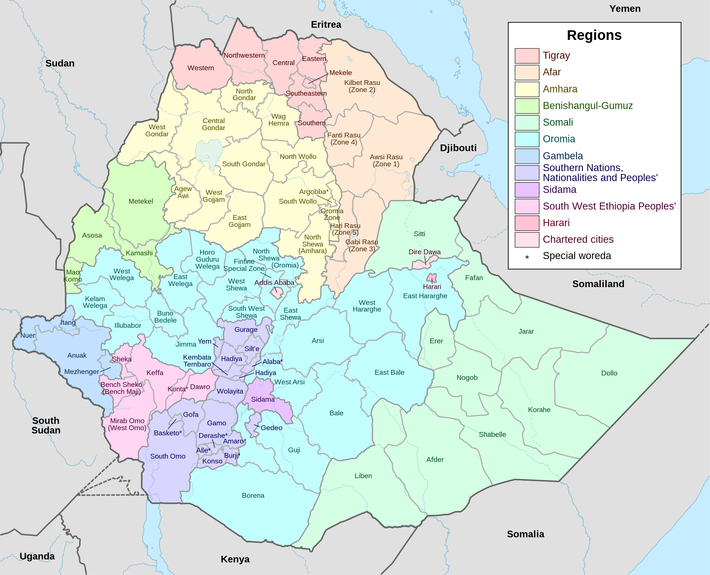
]

.pull-right[
- Ethiopian Pharmaceuticals Supply Service - EPSS
- 19 regional hub
- 45 zones
- 48 products
- 7,674 time series
- Forecasting monthly for 1-12 months ahead
- Data quality issues
]

---
## Forecasting vaccine doses

.pull-left[
.center[
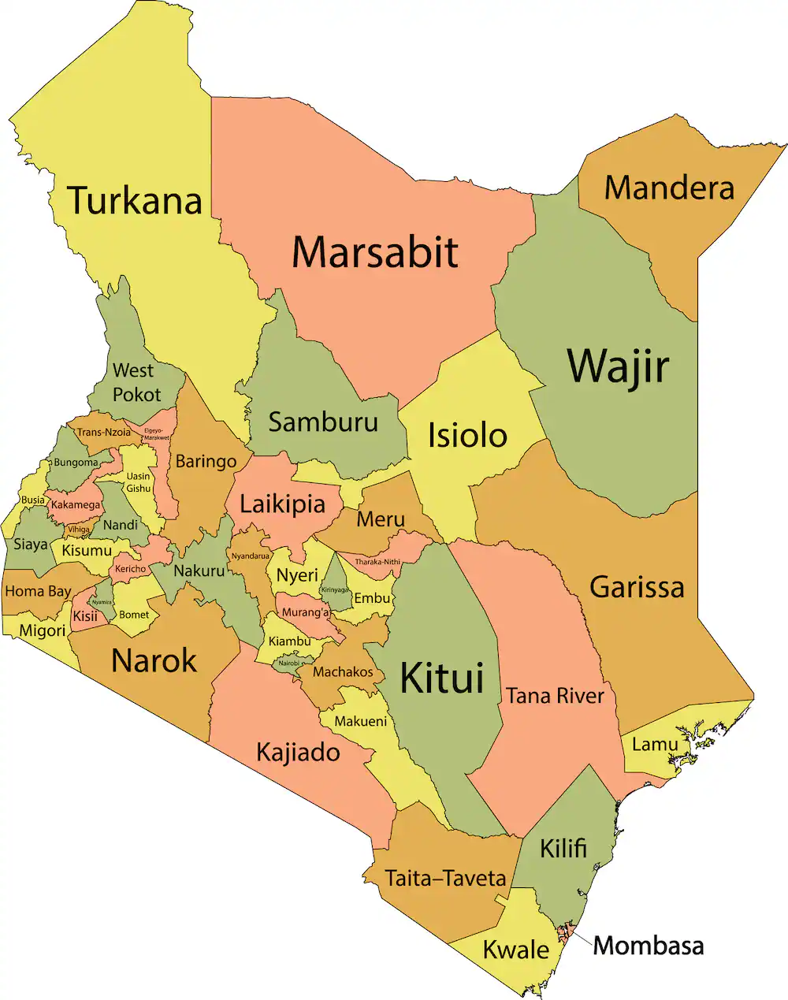
]
]

.pull-right[
- John Snow Inc. - JSI
- 9 regions
- 47 county
- 306 sub-county
- 4 types of vaccine
- 1,452 time series
- Forecasting monthly for 1-12 months ahead
- Data quality issues
]

---
background-image: url("resources/hierarchy-left.jpeg")
background-size: contain
background-position: left
class: middle

.pull-right2[
## Outline

- .gray[Forecast reconciliation in global health supply chains]

- .remember[Immunization supply chains]

- .gray[Forecasting problem]

- .gray[Forecasting experiment setup]

- .gray[Forecast accuracy evaluation]

- .gray[Conclusions & next steps]

]

---
.pull-left[
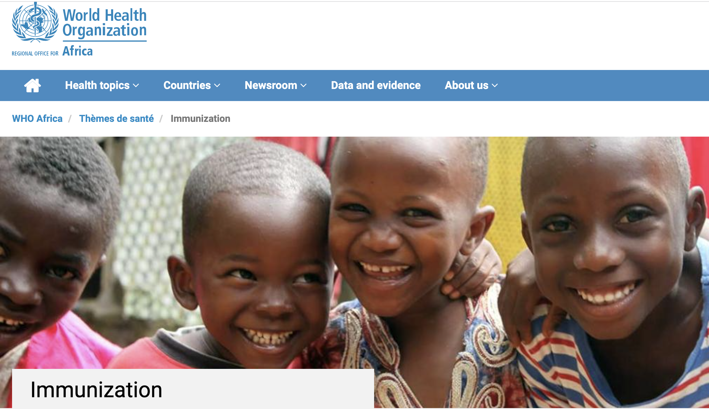
]

.left[
.pull-right[
- Approximately .remember[1 in 5] African children .remember[do not receive] all basic vaccines.
- More than .remember[30 million children] under five still. .remember[suffer from vaccine-preventable diseases (VPDs)] every year in Africa.
- Over .remember[half a million children die] from VPDs annually
- Supply chain issues contribute to this pressing issue*.

]

.footnote[Source: [**WHO**](https://www.afro.who.int/health-topics/immunization]), [*Boeck et al., 2023](https://www.emerald.com/insight/content/doi/10.1108/JHLSCM-07-2022-0078/full/html)]

---
## What do we want to achieve?

.pull-left[
### High coverage
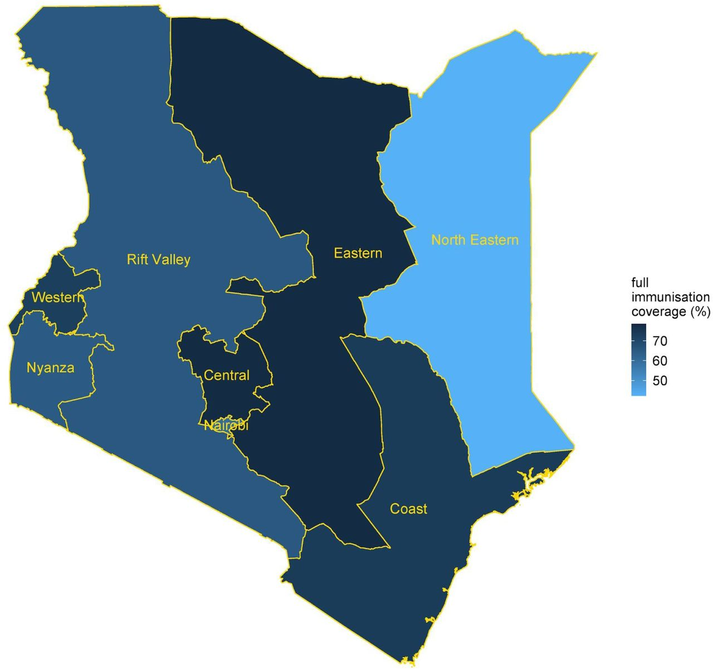
]

--

.pull-right[

✅  Reduce stock outs

✅  Reduce missed opportunities 

✅  Lower waste

✅ Lower inventory costs

✅  and better coordination
]

.footnote[source:[Allan etal.(2021)](https://www.medrxiv.org/content/10.1101/2021.02.14.21251721v1.full)
]

---
class:inverse, center, middle

.title[ Forecasting accurately the needs for vaccines is one of the key elements in achieving these goals]

---
## The immunization supply chain

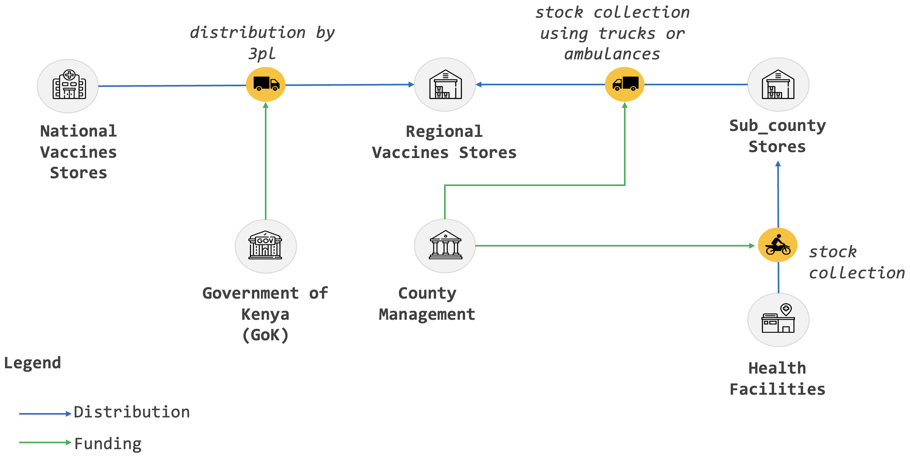

.footnote[Source: Effective Vaccine Management Assessment (EVM), 2021]

---

## Vaccines

.three-column[
### Vial

]

--

.three-column[
### Dose

]

--

.three-column[
### Administrated
<iframe src="https://giphy.com/embed/xT5LMGfQrJPpmXKUEM" height="600px" allowFullScreen></iframe><p><a href="https://giphy.com/gifs/season-16-the-simpsons-16x11-xT5LMGfQrJPpmXKUEM">via GIPHY</a></p>
]
---
.center[
.pull-left[
### Open wastage
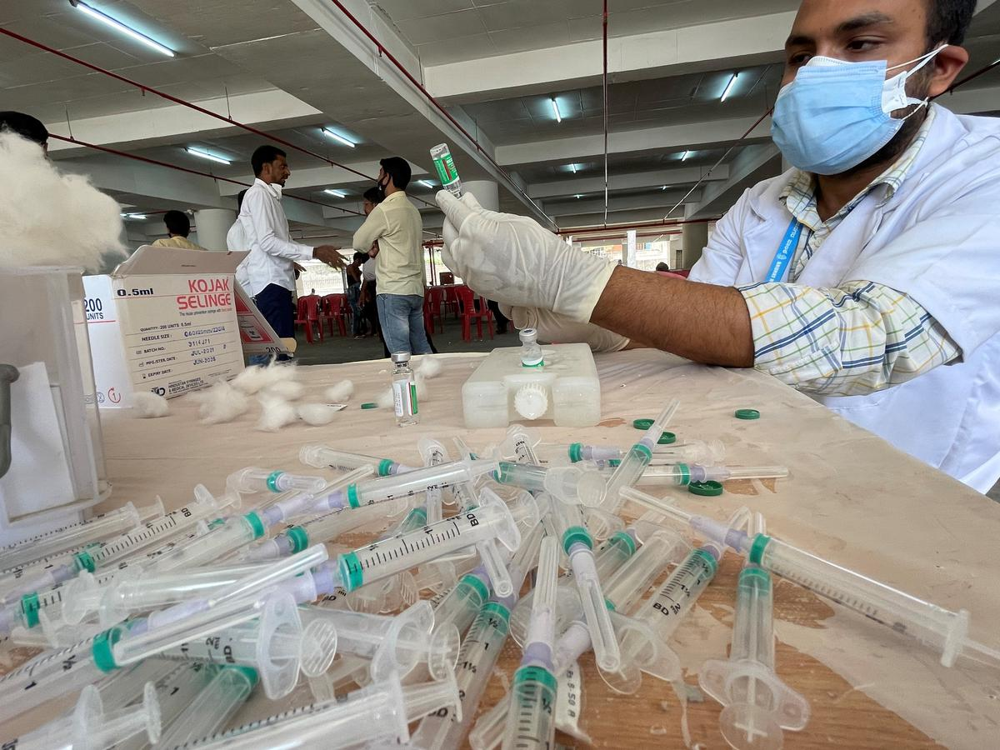
]

.pull-right[
### Close wastage
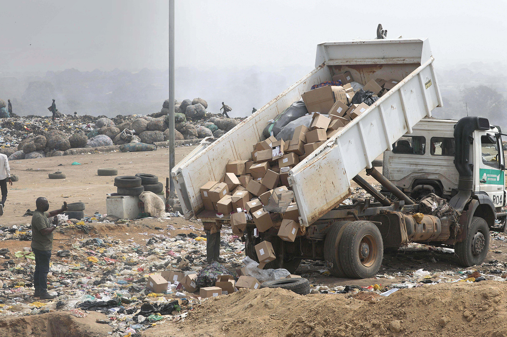
]
]

---
class: inverse, center, middle

.title[Doses used (consumption/needs) <br> = <br>doses administrated + wastage]

---
background-image: url("resources/hierarchy-left.jpeg")
background-size: contain
background-position: left
class: middle

.pull-right2[
## Outline

- .gray[Forecast reconciliation in global health supply chains]

- .gray[Immunization supply chains]

- .remember[Forecasting problem]

- .gray[Forecasting experiment setup]

- .gray[Forecast accuracy evaluation]

- .gray[Conclusions & next steps]

]

---
## Map of Kenya

.center[

]

---
## Structure of vaccine data

.center[

]

---
## Hierarchical structure

.pull-left[
```{r hierarchy-icrchs, echo=FALSE, out.width="100%"}
data <- data.frame(
  level1 = "Total",
  level2 = c(
    "R1", "R1", "R1",
    "R2", "R2", "R2"
  ),
  level3 = c("C1", "C2", "C3", "C4", "C5", "C6")
)
# transform it to a edge list!
edges_level1_2 <- data %>%
  select(level1, level2) %>%
  unique() %>%
  rename(from = level1, to = level2)
edges_level2_3 <- data %>%
  select(level2, level3) %>%
  unique() %>%
  rename(from = level2, to = level3)
edge_list <- rbind(edges_level1_2, edges_level2_3)

mygraph <- igraph::graph_from_data_frame(edge_list)
ggraph::ggraph(mygraph, layout = "dendrogram", circular = FALSE) +
  ggraph::geom_edge_diagonal() +
  ggraph::geom_node_point(color = "#dddddd", size = 10) +
  ggraph::geom_node_text(
    aes(label = c(
      "Total",
      "R1", "R2", 
      "C1", "C2", "C3", "C4", "C5", "C6"
    ))
  ) +
  theme_void()
```
]

.pull-right[A .remember[hierarchical time series] is a collection of several time series that are linked together in a hierarchical structure (attributes naturally disaggregate in a unique hierarchical manner).
]

---
## Grouped structure

.pull-left[
```{r hierarchy3-definition, echo=FALSE, out.width="100%"}
data <- data.frame(
  level1 = "Total",
  level2 = c(
    "vaccine 1", "vaccine 1", "vaccine 1", "vaccine 2", "vaccine 2",  "vaccine 2"
  ),
  level3 = c("Age 1", "Age 2", "Age 3", "Age 1", "Age 2", "Age 3")
)
# transform it to a edge list!
edges_level1_2 <- data %>%
  select(level1, level2) %>%
  unique() %>%
  rename(from = level1, to = level2)
edges_level2_3 <- data %>%
  select(level2, level3) %>%
  unique() %>%
  rename(from = level2, to = level3)
edge_list <- rbind(edges_level1_2, edges_level2_3)

mygraph <- igraph::graph_from_data_frame(edge_list)
ggraph::ggraph(mygraph, layout = "dendrogram", circular = FALSE) +
  ggraph::geom_edge_diagonal() +
  ggraph::geom_node_point(color = "#dddddd", size = 10) +
  ggraph::geom_node_text(
    aes(label = c(
      "Total",
      "vaccine 1", "vaccine 2", 
      "Age 1", "Age 2", "Age 3", "Age 1", "Age 2", "Age 3"
    ))
  ) +
  theme_void()
```
]

.pull-right[
A .remember[grouped time series] is a collection of time series that can be grouped together in a number of non-uniquely hierarchical ways (attributes do not naturally disaggregate in a unique hierarchical manner).
]

---
## Classical approaches to forecast vaccine needs

- Demographic methods (developed by WHO, one-size-fits-all model)
      - expected target population
      - coverage: is the expected coverage rate
      - doses/target: is the number of doses per target, as per the national vaccination schedule
      - wastage factor


.alert-note[.remember[**Forecasts are annual and at the national level**]]

---
## Limitations of current forecasting method


❌  Forecasts are yearly and at the national level(not useful to inform operational / tactical decisions.)

❌  Forecasts are  often produced based on unrealistic assumptions.

❌  Forecasts do not acknowledge uncertainty.

❌  Do not capture the information available at multiple hierarchical levels.

❌  Forecasts ignore the hierarchical nature of the problem, not coherent.

❌  Lead to conflicting decisions & lack of coordination.

---
## How to forecast hierarchical time series?

.pull-left[
- Base forecast (generated using any forecasting model)
- Bottom-Up
- Top Down
- Middle-Out
- .remember[Forecast reconciliation]
]

.pull-right[
```{r pyramid, echo = FALSE, out.width="90%"}
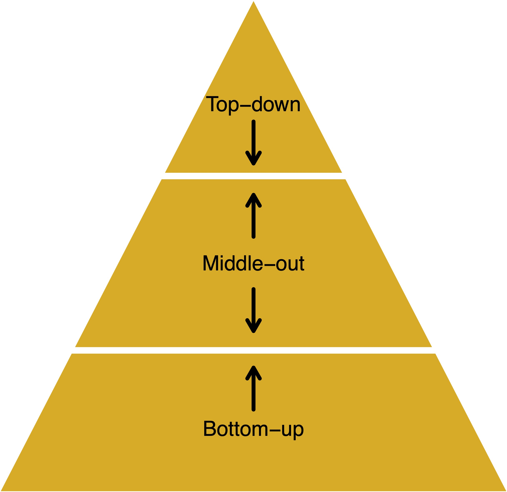
```
]

<!-- --- -->
<!-- ## Top-down forecasting -->

<!-- .pull-left[ -->
<!-- ### Advantages -->

<!-- - Works well in presence of low counts. -->
<!-- - Single forecasting model -->
<!-- - Easy to build -->
<!-- - Provides reliable forecasts for aggregate levels. -->

<!-- ] -->

<!-- .pull-right[ -->
<!-- ### Disadvantages -->

<!-- - Loss of information, especially individual series dynamics. -->
<!-- - Distribution of forecasts to lower levels can be difficult -->
<!-- - No prediction intervals -->
<!-- ] -->

<!-- --- -->
<!-- ## Bottom-up forecasting -->

<!-- .pull-left[ -->
<!-- ### Advantages -->
<!-- - No loss of information. -->
<!-- - Better captures dynamics of individual series. -->

<!-- ] -->

<!-- .pull-right[ -->
<!-- ### Disadvantages -->
<!-- - Large number of series to be forecast. -->
<!-- - Constructing forecasting models is harder because of noisy data at bottom level. -->
<!-- - No prediction intervals -->
<!-- ] -->

---
 
## Forecast reconciliation
 
- This approach involves first generating independent base forecast for each series in the hierarchy (i.e. Base)

--

- As these base forecasts are independently generated they will not be “aggregate consistent” (i.e., they will not add up according to the hierarchical structure). They are .remember[not coherent].

--

- The reconciliation approaches combine the independent base forecasts and generates a set of revised forecasts that are as close as possible to the univariate forecasts but also aggregate consistently with the hierarchical structure.

--

- Unlike any other existing method, this approach uses all the information available within a hierarchy.


---
## Reconciled forecasts-notations

- Let $\large {b}_t$ be a vector of $\large n_b$ _bottom-level_ time series at time $\large t$, and let $\large {a}_t$ be a corresponding vector of $\large n_a = n-n_b$ aggregated time series, where $\large a_t = {A}{b}_t,$

--

- $\large A$ is the $\large n_a\times n_b$ "aggregation" matrix specifying how the bottom-level series ${b}_t$ are to be aggregated to form $\large {a}_t$. 

--

- The full vector of time series is given by $\large y_t = \begin{bmatrix}{a}_t \\{b}_t\end{bmatrix}.$

--

- This leads to the $\large n\times n_b$ "summing" or "structural" matrix given by
$\large S = \begin{bmatrix}{A} \\ {I}_{n_b}\end{bmatrix}$, such that $\large {y}_t = {S}{b}_t$.

- Similar approach can be used to create reconciled forecasts, $\large \tilde{{y}}_t = {SG}{\hat{y}}_t$.

---
class: middle, center

## Coherency and reconciliation

.pull-left[
```{r simple-hierarchy1, echo=FALSE, out.width="120%"}
data <- data.frame(
  level1 = "Total",
  level2 = c("A", "B", "C")
  )
# transform it to a edge list!
edges_level1_2 <- data %>%
  select(level1, level2) %>%
  unique() %>%
  rename(from = level1, to = level2)

edge_list <- edges_level1_2

mygraph <- igraph::graph_from_data_frame(edge_list)
ggraph::ggraph(mygraph, layout = "dendrogram", circular = FALSE) +
  ggraph::geom_edge_diagonal() +
  ggraph::geom_node_point(color = "#dddddd", size = 10) +
  ggraph::geom_node_text(
    aes(label = c(
      "Total",
      "A", "B", "C"
    ))
  ) +
  theme_void()
```
]

.pull-right[
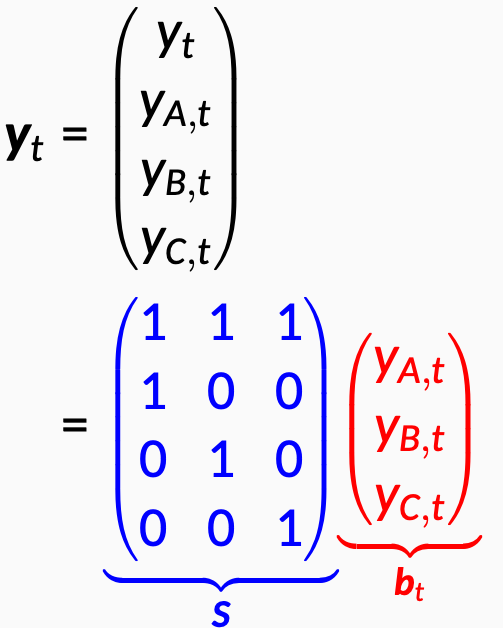
]

---
## Hierarchical, and linearly constrained time series
.pull-left[
```{r hierarchy1-linear, echo=FALSE, out.width="100%"}
data <- data.frame(
  level1 = "Total",
  level2 = c(
    "Central & West", "Central & West", "Central & West",
    "North", "South & East", "South & East", "South & East"
  ),
  level3 = c("HD", "SB", "PO", "BC", "CV", "CT", "AB")
)
# transform it to a edge list!
edges_level1_2 <- data %>%
  select(level1, level2) %>%
  unique() %>%
  rename(from = level1, to = level2)
edges_level2_3 <- data %>%
  select(level2, level3) %>%
  unique() %>%
  rename(from = level2, to = level3)
edge_list <- rbind(edges_level1_2, edges_level2_3)

mygraph <- igraph::graph_from_data_frame(edge_list)
ggraph::ggraph(mygraph, layout = "dendrogram", circular = FALSE) +
  ggraph::geom_edge_diagonal() +
  ggraph::geom_node_point(color = "#dddddd", size = 10) +
  ggraph::geom_node_text(
    aes(label = c(
      "Total",
      "Central & West", "North", "South & East",
      "HD", "SB", "PO", "BC", "CV", "CT", "AB"
    ))
  ) +
  theme_void()

```
]

.pull-right[
- Total = Central & West + North South & East
- Central & West = HD + SB + PO
- North = BC
- South & East = CV + CT + AB
]

.remember[Coherent forecast] satisfies these aggregation constraints.

<!-- --- -->
<!-- ## How does reconciliation work? -->

<!-- .center[ -->
<!-- 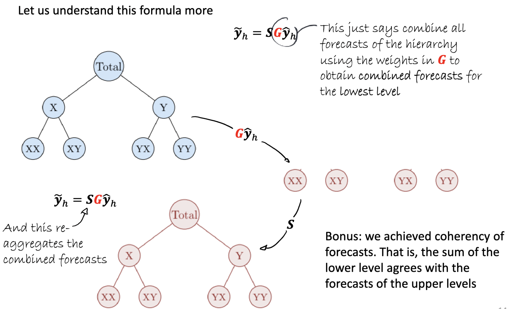 -->
<!-- ] -->

---
##  Linear reconciliation methods, Bottom-up and others

Forecast reconciliation approaches combine and reconcile all the base forecasts in order to produce coherent forecasts. 

--

Linear reconciliation methods (Wickramasuriya, Athanasopoulos, and Hyndman 2019) can be written as

$$\large \tilde{{y}}_h = {S}({S}'{W}^{-1}{S})^{-1}{W}^{-1}\hat{{y}}_h ={S}{G}\hat{{y}}_h = {M}\hat{{y}}_h,$$

where ${W}$ is an $n \times n$ positive definite matrix, and $\hat{{y}}_h$ contains the $h$-step forecasts of ${y}_{T+h}$ given data to time $T$. ${W}^{-1}$ is the variance-covariance matrix of h-step ahead errors. 

- W is the only unknown to get the reconciled forecast.

<!-- --- -->
<!-- ## Choosing W -->

<!-- - Different choices for ${W}$ lead to different solutions such as Ordinary Least Squares (OLS), Weighted Least Squares (WLS) and Minimum Trace (MinT).  -->
<!-- - We use the implementation of these methods in the `hts` package in R in the experiment. -->

<!-- .center[ -->
<!-- 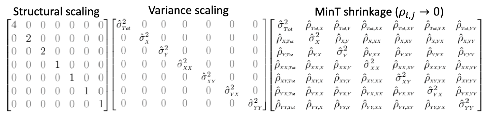 -->
<!-- ] -->

---
## Producing probabilistic forecasts

- We use bootstrapping to generate probabilistic forecasts:

    - Suppose that $(\hat{{y}}_h^{[1]},\dots,\hat{{y}}_h^{[B]})$ are a set of $B$ simulated sample paths, generated independently from the models used to produce the base forecasts. 
    - Then $({S}({S}'{W}^{-1}{S})^{-1}{W}^{-1}\hat{{y}}_h^{[1]},\dots,{S}({S}'{W}^{-1}{S})^{-1}{W}^{-1}\hat{{y}}_h^{[B]})$ provides a set of reconciled sample paths, from which percentiles can be calculated.

---
class: center
## Probabilistic forecast

.center[
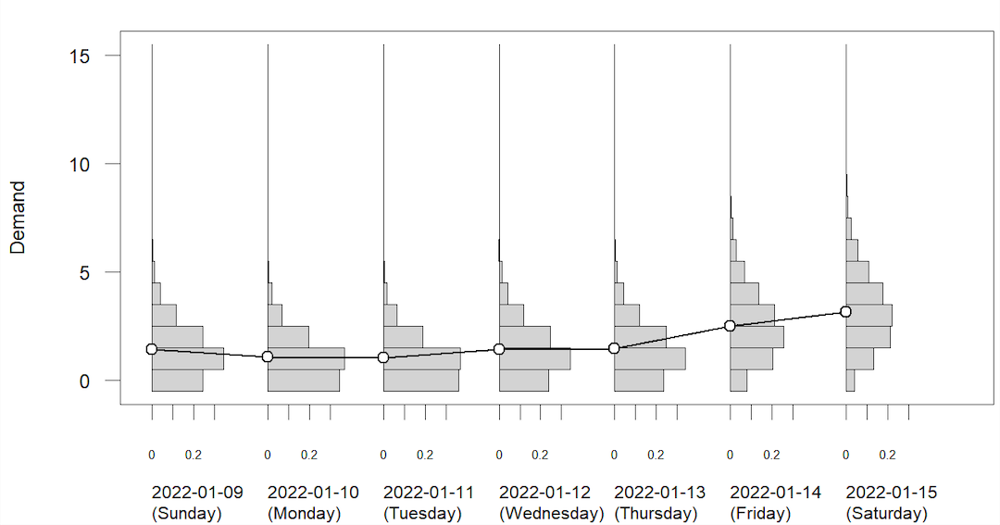
]

---
background-image: url("resources/hierarchy-left.jpeg")
background-size: contain
background-position: left
class: middle

.pull-right2[
## Outline

- .gray[Forecast reconciliation in global health supply chains]

- .gray[Immunization supply chains]

- .gray[Forecasting problem]

- .remember[Forecasting experiment setup]

- .gray[Forecast accuracy evaluation]

- .gray[Conclusions & next steps]

]


---
## Data

- Monthly vaccine consumption in Kenya from January 2013 until December 2021

- Four type of vaccines
    - Measles
    - Bacillus Calmette–Guérin (BCG) - for tuberculosis
    - DPT, a class of combination vaccines against three infectious diseases in humans: diphtheria-tetanus-pertussis
    - OPV, Oral poliovirus vaccines, used in the fight to eradicate polio
- 306 sub-county, 47 county & 9 regions
- Total of 1452 time series
- Useful predictors including child population, conflicts, strike, extreme weather conditions.

---
## Total number of series for each type of vaccine

<br><br>
```{r series-number, echo=FALSE, out.width="50%"}
agg_level <- tibble::tribble(
  ~Level, ~`Number of series`,
  "All country (Total)", 1,
  "Regions", 9,
  "County", 47,
  "Sub-county", 306,
  "Total", 363
)
kbl(agg_level) %>%
kable_styling(bootstrap_options = "striped",font_size = 20, full_width = F)
```

---
## Doses used (raw data): total and regions


---
## Doses used: National & regions

.center[
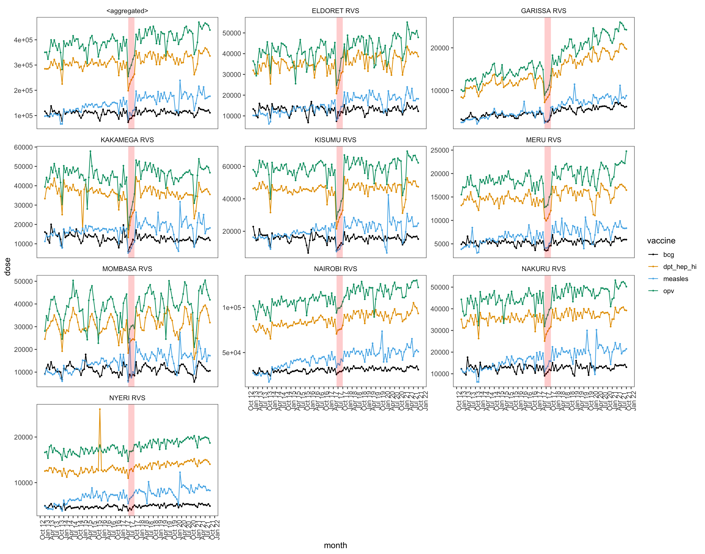
]

---
## Doses used: trend and seasonality features

.center[
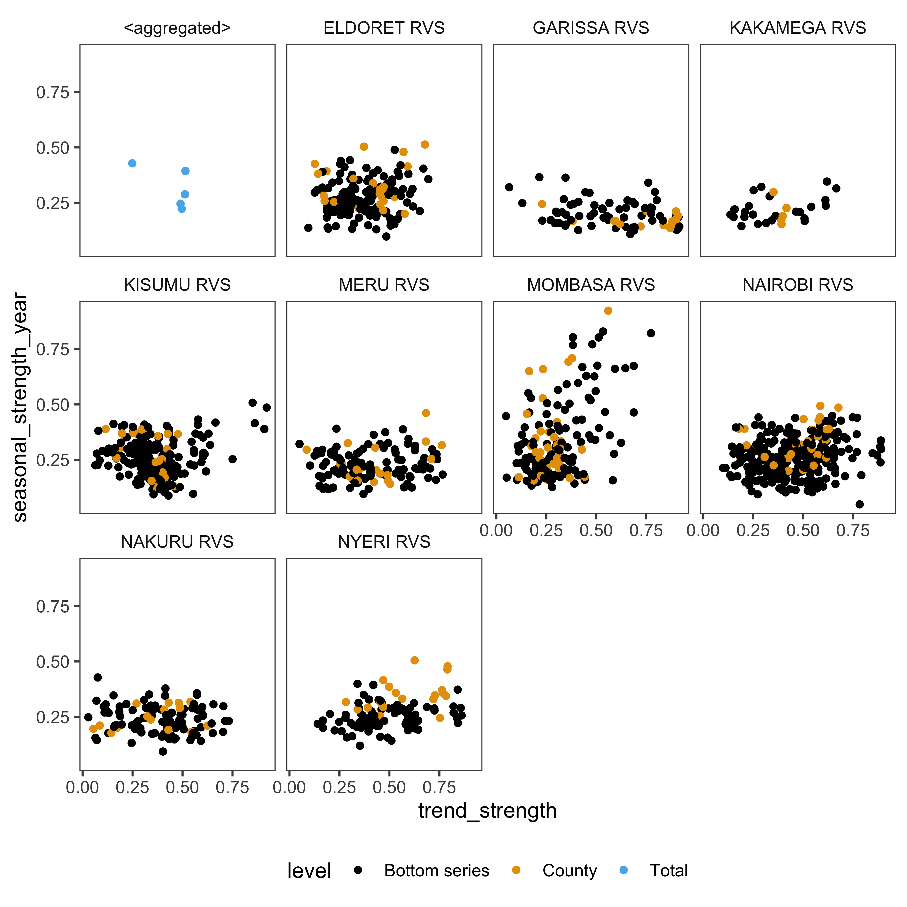
]

---
## Forecasting setup

- Forecast horizon: 12 months
- Point and probabilistic forecasts are generated and evaluated for the entire hierarchy
- Forecast evaluation

    - Time series cross-validation with re-estimation
    - Used 36 months as test set

---
## Forecasting models

- **Naive:** Assuming that the future days will be similar to past days. We use the empirical distribution of the past daily demand
- **Exponential Smoothing State Space model (ETS):** ETS models can combine trend, seasonality, and error components in a time series
- **Poisson Regression using tscount (TSGLM):** Poisson regression model that takes into account serial dependence and predictors
- **Ensemble method:** Finally, we use an ensemble method that combines the forecasts generated from the Naive, ETS, and TSGLM models to form a mixture distribution

---
## Forecasting performance metrics- point forecast

.pull-left[
### Mean Absolute Scaled Error
$$\large \text{MASE} = \text{mean}(|q_{j}|),$$

where

$$q_{j} = \frac{ e_{j}}
 {\displaystyle\frac{1}{T-m}\sum_{t=m+1}^T |y_{t}-y_{t-m}|},$$
]

.pull-right[
### Mean Squared Scaled Error 

$$\large \text{MSSE} = \text{mean}(q_{j}^2),$$ 

where,

$$q^2_{j} = \frac{ e^2_{j}}
 {\displaystyle\frac{1}{T-m}\sum_{t=m+1}^T (y_{t}-y_{t-m})^2},$$
]

---
## Forecasting performance metrics- probabilistic forecast

.pull-left[

$$\large \text{CRPS} = \text{mean}(p_j),$$ 

where

$$p_j = \int_{-\infty}^{\infty} \left(G_j(x) - F_j(x)\right)^2dx,$$

]

.pull-right[
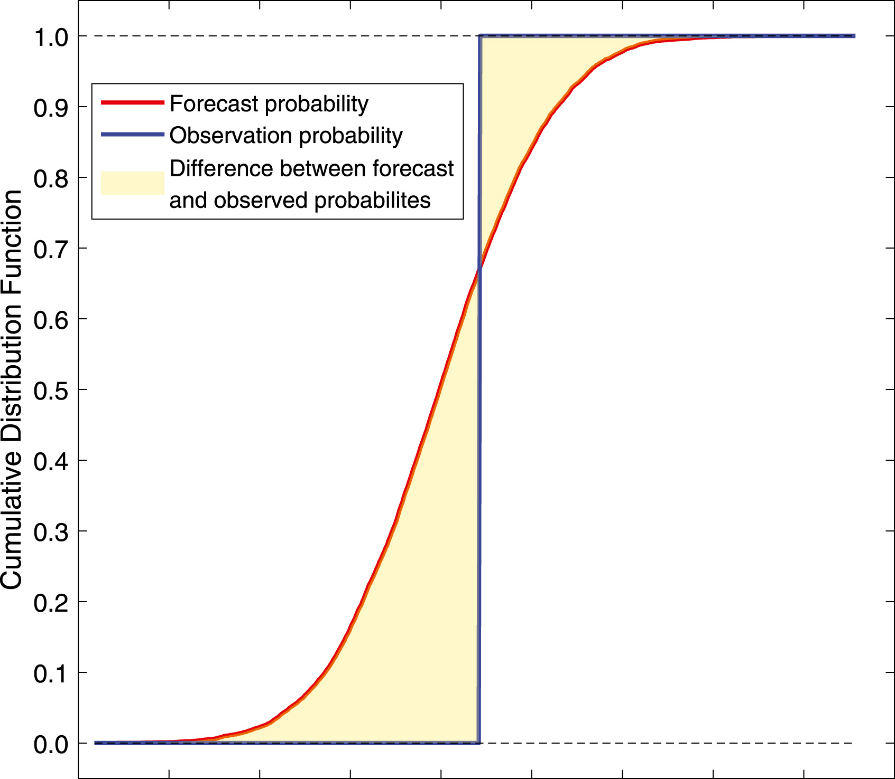
]

---
background-image: url("resources/hierarchy-left.jpeg")
background-size: contain
background-position: left
class: middle

.pull-right2[
## Outline

- .gray[Forecast reconciliation in global health supply chains]

- .gray[Immunization supply chains]

- .gray[Forecasting problem]

- .gray[Forecasting experiment setup]

- .remember[Forecast accuracy evaluation]

- .gray[Conclusions & next steps]

]

---
## Overall forecast accuracy

.small[
```{r MMSE, out.width= "70%"}
read_csv("data/accuracy_bcg_poms_mmse.csv") |> 
  mutate(across(where(is.numeric), ~round(.,digits = 3))) %>% rename(Method = .model) %>% 
  kbl(caption = "MSSE") %>%
  kable_classic(full_width = F,html_font = "Cambria")
```


```{r CRPS, out.width= "70%"}
read_csv("data/accuracy_bcg_poms_crps.csv") %>% 
  drop_na() |> 
  mutate(across(where(is.numeric), ~round(.,digits = 3))) %>% rename(Method = .model) %>% 
  kbl(caption = "CRPS") %>%
  kable_classic(full_width = F,html_font = "Cambria")
```
]

.footnote[Forecast accuracy improvement against the current approach in immunization programs is calculated but not included in the presentation]

---
## Accuracy over horizon
.pull-left[
### CRPS
```{r accuracy-h, out.width= "80%"}
crps_h <- read_csv("data/accuracyh.csv") |> pivot_longer(cols = 3:14, names_to = "h", values_to = "CRPS") |> mutate(Level=as_factor(Level))
  ggplot(data=crps_h, aes(x =as.integer(h), y = CRPS, group = Method, col = Method)) +
  geom_line() +
  geom_point(size = .5) +
    scale_x_continuous(breaks=1:12)+
  facet_wrap(vars(Level), ncol = 2 , scales = "free_y") +
  labs(y = "CRPS", x = "Month ahead") +
  ggthemes::scale_color_colorblind() +
  ggthemes::theme_few()+
    theme(legend.position = "bottom")
```
]

.pull-right[
### MSSE
```{r accuracy-hmsse, out.width= "80%"}
crps_h <- read_csv("data/accuracyh_mmse.csv") |> pivot_longer(cols = 3:14, names_to = "h", values_to = "CRPS") |> mutate(Level=as_factor(Level))
  ggplot(data=crps_h, aes(x = as.integer(h), y = CRPS, group = Method, col = Method)) +
  geom_line() +
  geom_point(size = .5) +
  scale_x_continuous(breaks=1:12)+
  facet_wrap(vars(Level), ncol = 2 , scales = "free_y") +
  labs(y = "MSSE", x = "Month ahead") +
  ggthemes::scale_color_colorblind() +
  ggthemes::theme_few()+
    theme(legend.position = "bottom")
```
]

---
background-image: url("resources/hierarchy-left.jpeg")
background-size: contain
background-position: left
class: middle

.pull-right2[
## Outline

- .gray[Forecast reconciliation in global health supply chains]

- .gray[Immunization supply chains]

- .gray[Forecasting problem]

- .gray[Forecasting experiment setup]

- .gray[Forecast accuracy evaluation]

- .remember[Conclusions & next steps]

]

---
## Conclusions
### Benefit of hierarchical forecasting

✅  Plans at any level are based on .remember[coherent forecasts] and therefore can be aligned. 

✅  Hierarchical forecasting framework can be used as a tool to .remember[improve coordination] between teams across the supply chain at the national, sub-national, regional and local levels.

✅  Result can be .remember[more accurate than the independent (base) forecasts].

✅  Hierarchical forecasting framework an be used to create coherent forecast, regardless of how base forecasts are created, even with judgmental forecasts.

---
## Next steps

- Developing an impact case study with JSI

- Developing hybrid methods that integrates current forecasting method in immunization programs

- Evaluate the implication of forecast accuracy on utilities such as cost, service level, coordination, etc by linking to replenishment policies.

---

## Acknowledgement

- John and Snow Inc. (JSI) team

- The representative of the National Vaccine Immunization Program in Kenya 

- [Developers of Tidyverts](https://tidyverts.org/) and [Tidyverse](https://www.tidyverse.org/) packages

---
## References

- Effective Vaccine Management (EVM 2.0) Assessment Report –  2021, WHO

- Vaccine Logistics, WHO training manual

- [Bahman Rostami-Tabar, Rob J Hyndman (2023), Probabilistic Forecast Reconciliation For Emergency Services Demand]([https://robjhyndman.com/seminars/fem.html)

- [Hyndman and George Athanasopoulos, Forecasting: Principles and Practice,3rd ed](https://otexts.com/fpp3/hierarchical.html)

---
## My new book
### [https://dfep.netlify.app/](https://dfep.netlify.app/)

.center[

]

---
.pull-left[
## About me
Bahman Rostami-Tabar <br>
Associate Professor of Data-Driven Decision Science
Cardiff University, UK
<br><br>

Slides @ [www.bahmanrt.com](www.bahmanrt.com)
`r fa("twitter", fill = "#1da1f2")`[@Bahman_R_T](https://twitter.com/Bahman_R_T)
`r fa("linkedin-in", fill = "blue")` Connect: [Bahman ROSTAMI-TABAR](https://www.linkedin.com/in/bahman-rostami-tabar-1046171a/)
]

.pull-right[
## Outline

- Forecast reconciliation in global health supply chains

- Forecasting problem

- Forecasting experiment setup

- Forecast accuracy evaluation

- Conclusions & next steps
]


