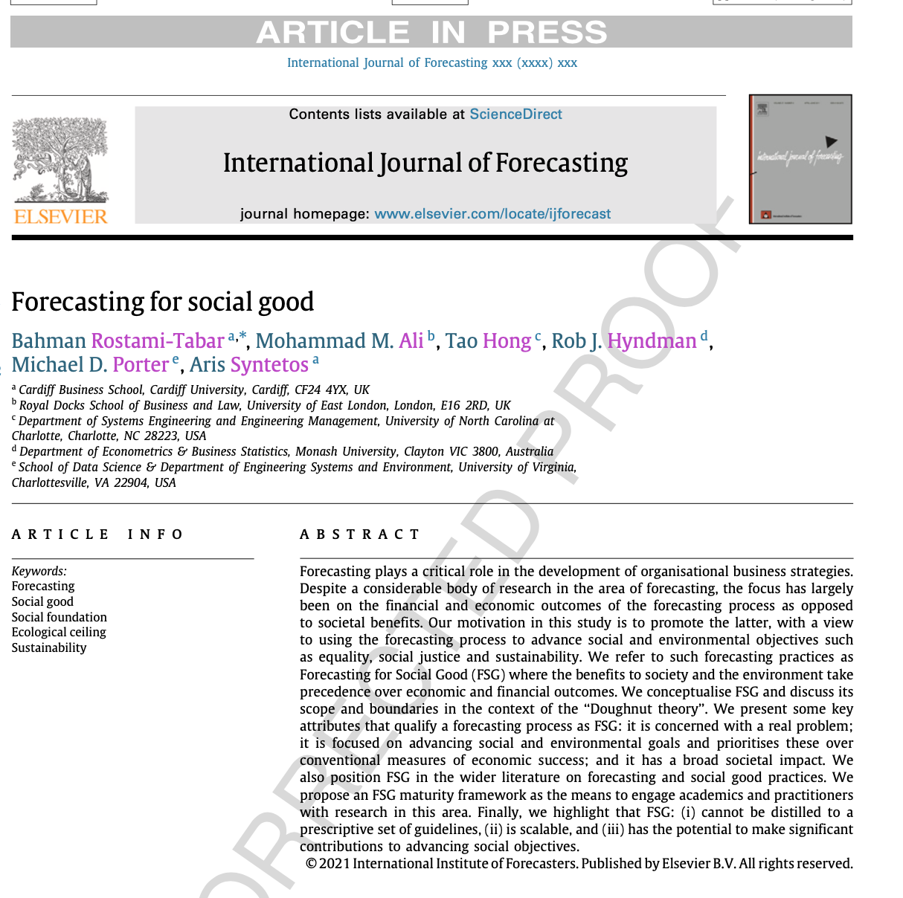
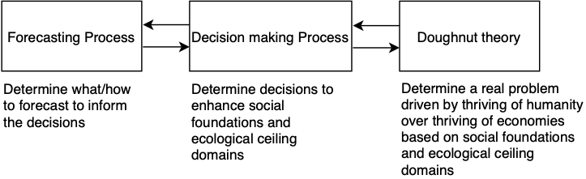
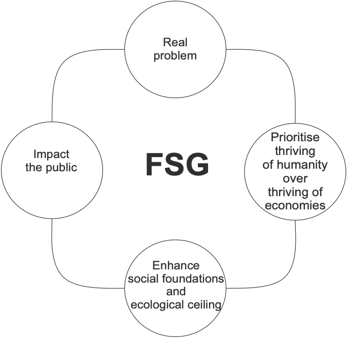

class: inverse
background-image:  url("resources/outline3.jpg")
background-size: cover

```{r setup, include=FALSE}
options(htmltools.dir.version = FALSE, width = 120)

library(tidyverse)
library(knitr)
library(kableExtra)
library(fontawesome)
library(flair)
library(DT)
library(gapminder)
library(ggthemes)
library(countdown)

opts_chunk$set(
  echo = FALSE, warning = FALSE, message = FALSE, comment = "#>",
  fig.path = 'figure/', cache.path = 'cache/', fig.align = 'center',
  out.width = "70%", fig.show = 'hold',
  cache = TRUE, external = TRUE, dev = 'svglite', dev.args = list(bg = "transparent")
)

#fig.width = 12, fig.height = 4

mp4_vid <- function(src){
  HTML(
    paste0(
      '<video autoplay>
        <source src="', src, '" type="video/mp4">
      </video>'
    )
  )
}


theme_set(
  theme_grey(base_size = 16) +
  theme(
    legend.position = "bottom",
    plot.background = element_rect(fill = "transparent"),
    legend.background = element_rect(fill = "transparent")
  )
)
```

```{r load-data, include=FALSE}

```

```{css, echo=FALSE}
/* custom.css */
.left-code {
  color: #777;
  width: 42%;
  height: 92%;
  float: left;
}
.right-plot {
  width: 56%;
  float: right;
  padding-left: 1%;
}
```


.title[Forecasting for Social Good (FSG)]
<!-- .sticker-float[] -->


.bottom[
### Bahman Rostami-Tabar (`r fa("twitter", fill="#1da1f2")`[@Bahman_R_T](https://twitter.com/Bahman_R_T)) 
### Website [www.bahmanrt.com](https://www.bahmanrt.com/)
<!-- ### Slides @ [slides.mitchelloharawild.com/nhs2020](https://slides.mitchelloharawild.com/nhs2020) -->
### LSDG Meeting
### 18 May 2021
]

---
class: inverse, center
background-image:  url("resources/fsg_beer.jpg")
background-size: contain

.larger[Que demander de mieux?]

---
class: center, middle

## What is Forecasting for Social Good?

---

##  What is Forecasting for Social Good?
### An annual workshop: [www.f4sg.org](www.f4sg.org)

.center[
```{r, fig.align='center', out.width="100%"}
knitr::include_url("https://www.f4sg.org/", height = "500px")
```
]

---

##  What is Forecasting for Social Good?
### A Research Grant

.center[
```{r, fig.align='center', out.width="100%"}
knitr::include_url("https://forecasters.org/programs/research-awards/forecasting-for-social-good-research-grant//", height = "500px")
```
]

---

##  What is Forecasting for Social Good?

### A Research Network

.center[
```{r, fig.align='center', out.width="100%"}
knitr::include_url("https://fsgrn.netlify.app/", height = "500px")
```
]

---

##  What is Forecasting for Social Good?

### A Research area

.center[
```{r, fig.align='center', fig.height= 12, fig.width=8}

```
]

---
class: inverse, middle
background-image: linear-gradient(to right, rgba(50, 50, 50, .5), rgba(50, 50, 50, .4)), url("resources/questions.jpg")
background-size: cover

.larger[.larger[1.] What is meant by FSG?]

--

.larger[.larger[2.]What attributes make a forecasting process aligned with FSG?]

---
class: middle

## Why forecasting?

.pull-left[

- You do not forecast for the .remember[sake of forecasting]. 

- You do it because you want to base .remember[decisions] on it.

- Ideally, make .remember[better decisions] in the .remember[light of forecast].

]

.pull-right[
<iframe src="https://giphy.com/embed/l3vR0GgCQnpxS7s3e" width="480" height="270" frameBorder="0" class="giphy-embed" allowFullScreen></iframe><p><a href="https://giphy.com/gifs/southparkgifs-l3vR0GgCQnpxS7s3e"></a></p>
]


---

## Make better decisions to ...

- Increase profit

- Increase economic growth

- Increase resource utilisation

- Increase customer satisfaction

- Reduce Co2 emissions

- To not blow up the business

- ...

--

>.larger[With better decisions, we make something to .remember[THRIVE] .]


---
background-image: url(resources/doughnut.jpg)
background-size: contain
background-position: left
class: middle

.pull-right[.larger[Doughnut time]]

---
background-image: url(resources/classic_Doughnut.jpg)
background-size: contain
background-position: left
class: middle

.pull-right[.larger[Doughnut theory]]

---
background-image: url(resources/classic_Doughnut.jpg)
background-size: contain
background-position: left
class: middle


.pull-right[
>‘‘Instead of economies that need to grow, whether or not they make us thrive, we need economies that make us .remember[THRIVE], whether or not they grow’’. -- Raworth (2017) 

]


.footnote[Raworth, K. (2017). Doughnut economics: seven ways to think like a 21st century economist. Chelsea Green Publishing.]

---
background-image: url(resources/classic_Doughnut.jpg)
background-size: contain
background-position: left
class: middle

.pull-right[

- The theory combines the concept of .remember[**social foundation**] with that of the .remember[**ecological ceiling**] in a single framework.

- .remember[**Social foundation:**] to ensure that no one falls short on life’s essentials.

- .remember[**Ecological ceiling:**] ensure we do not overshoot the planet’s capacity for critical life-supporting systems.

]

---
background-image: url(resources/classic_Doughnut.jpg)
background-size: contain
background-position: left
class: middle

.pull-right[
## Where do we want to be?

Between the .remember[social foundation] and the .remember[ecological ceiling] lies a space in which it is possible to .remember[meet the needs of all people] within the .remember[means of the living planet] — **an ecologically safe and socially just space in which humanity can .remember[THRIVE]**.
]

---
background-image: url(resources/classic_Doughnut.jpg)
background-size: contain
background-position: left
class: middle

.pull-right[
## Inform decisions that brings us into the space

- The forecasting and the decision-making process needs to support all activities that bring us into the Doughnut space — an environmentally safe and socially just space — in which humanity thrives. 

- This is where forecasting plays a role: .remember[inform those decisions].
]

---
class: middle, center

## FSG process

```{r, out.width="100%"}

```

---
class: middle, center

## Attributes of FSG

```{r, out.width="50%"}

```

---
class: middle, center

## Are there research opprtunities?
### FSG research maturity framework

```{r, out.width="45%"}
knitr::include_graphics("figure/lomsac/quad.png")
```

---
class: middle

**The purpose of FSG initiative is to:**

- .remember[Increase awareness and interest] from academics and practitioners in the potential impact of FSG;


- .remember[Encourage] interested academics and practitioners .remember[to engage] in the FSG agenda;


- .remember[Inspire] the development of new forecasting methodologies tailored to social good applications.

---
class: middle

**The intention of FSG is to:**

- .remember[Motivate engagement] with important issues that our world and society face, 

- Allow best (forecasting) practices to emerge. 

---
class: middle

.alert[.larger[Qualifying what constitutes FSG should permit academics and practitioners to appreciate the opportunity cost of not engaging with its scalable agenda.]]


---
class: inverse, top
background-image: linear-gradient(to right, rgba(300, 300, 300, .4), rgba(300, 300, 300, .5)), url("resources/questions.jpg")
background-size: cover

.hand-large[Thank you]

.remember[.larger[Question?]]

`r fa("twitter", fill = "white")` Say hello: [@Bahman_R_T](https://twitter.com/Bahman_R_T)


