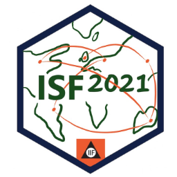
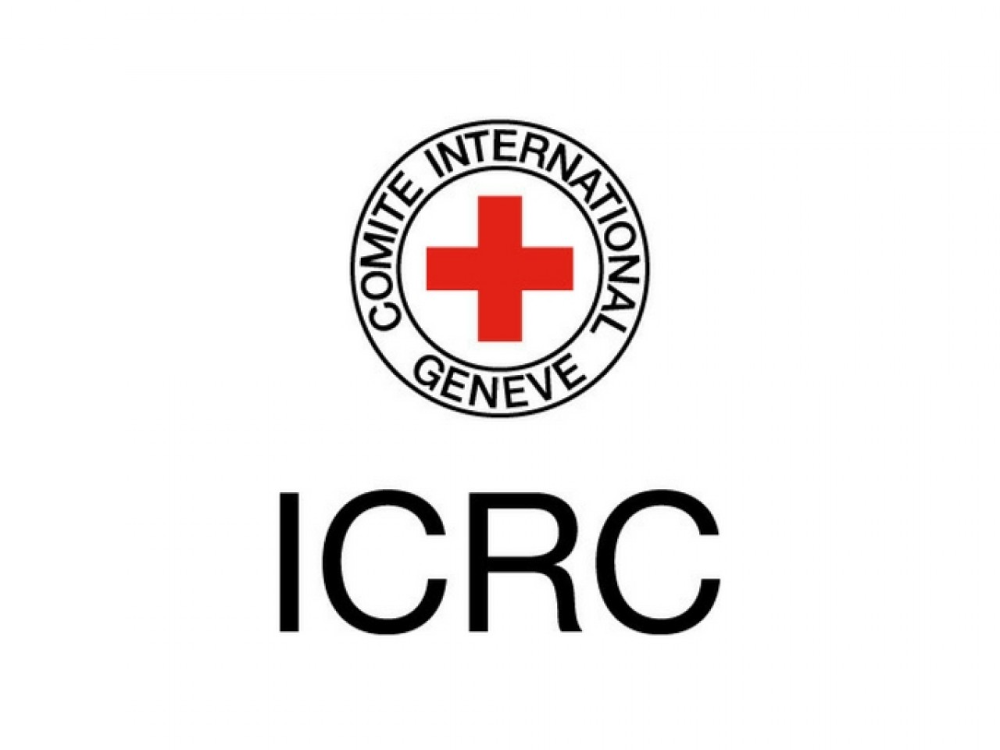

```{r setup, include=FALSE}
options(htmltools.dir.version = FALSE, width = 120)

library(tidyverse)
library(knitr)
library(kableExtra)
library(fontawesome)
library(flair)
library(DT)
library(gapminder)
library(ggthemes)
library(countdown)

opts_chunk$set(
  echo = FALSE, warning = FALSE, message = FALSE, comment = "#>",
  fig.path = 'figure/', cache.path = 'cache/', fig.align = 'center',
  out.width = "70%", fig.show = 'hold',
  cache = TRUE, external = TRUE, dev = 'svglite', dev.args = list(bg = "transparent")
)

#fig.width = 12, fig.height = 4


```

```{r load-data, include=FALSE}

```


<br> <br>
.center[.vlarge[My Research Projects with Organisations] <br>
Forecasting, machine learning & modelling
<br> .vlarge[`r emo::ji('file_folder')`]]
.sticker-float[] 

<!-- .sticker-left[]  -->

.bottom[
### Bahman Rostami-Tabar (`r fa("twitter", fill="#1da1f2")`[@Bahman_R_T](https://twitter.com/Bahman_R_T)) <br>
### .remember[Website] [www.bahmanrt.com](https://www.bahmanrt.com/)
### .remember[Slides] [bahmanrt.com/talk/myresearch](https://www.bahmanrt.com/slides/myprojects.html)
]

---
background-image: url("resources/hierarchy-left.jpeg")
background-size: contain
background-position: left
class: middle

.pull-right2[
## Outline

- Current Research Projects

- Current Ph.D. Research Projects

- Current MS.c. Research Projects

- Past MS.c. Research Projects

]

---
background-image: url("resources/hierarchy-left.jpeg")
background-size: contain
background-position: left
class: middle

.pull-right2[
## Outline

- .remember[Current Research Projects]

- .graylight[Current Ph.D. Research Projects]

- .graylight[Current MS.c. Research Projects]

- .graylight[Past MS.c. Research Projects]

]

---

**.strong-blue[Project title:]** Long-term forecasting for Critical Care in Wales

**.strong-blue[Aim:]** To develop a forecasting model to generate daily admissions in 20 years' time for elective and emergency services of Critical Care in Wales.

**.strong-blue[Methods:]** Time series forecasting, hierarchical time series, exponential smoothing, judgmental forecasting methods

**.strong-blue[Organisation:]** NHS Wales Delivery Unit  

**.strong-blue[Collaborators:]** Jennifer Morgan, Victoria Sachser, Eduard Incze, Michael Ware, Craig Spencer 

**.strong-blue[Funding body:]** Health Foundation 

---

**.strong-blue[Project title:]**    Hierarchical and grouped time series forecasting of incidents in Wales

**.strong-blue[Aim:]** To create innovative methodologies to forecast the count nature of incidents and admissions for each health board, priority and nature of incidents


**.strong-blue[Organisation:]** Welsh Ambulance Service Trust (WAST)  

**.strong-blue[Collaborators:]** [Prof. Rob Hyndman, Monash University, Australia](https://robjhyndman.com/)

**.strong-blue[Funding body:]** Cardiff Business School 

---

**.strong-blue[Project title:]**    Forecasting and inventory optimisation of vaccine distribution supply chain in Africa 

**.strong-blue[Aim:]** To i) develop machine learning models to forecast vaccine doses admistrated, used and wasted ii) estimate return on investement of vaccines, iii) model zero-dose vaccines in Africa

**.strong-blue[Organisation:]** John Snow, Inc (JSI)  

**.strong-blue[Collaborators:]** [Prof. Zied Babai, Kedge Business School, France](https://student.kedge.edu/faculty-directory/mohamed-zied-babai)

**.strong-blue[Funding body:]** None

---

**.strong-blue[Project title:]** Supply chain of medical items in conflict zones

**.strong-blue[Aim:]** To develop an integrated forecasting and inventory optimisation tool for medical items with obsolescence

**.strong-blue[Organisation:]** International Committee of the Red Cross (ICRC)  

**.strong-blue[Collaborators:]** [Zied Babai](https://robjhyndman.com/)

**.strong-blue[Funding body:]** Cardiff Business School 

---

**.strong-blue[Project title:]** Probabilistic forecasting for community and in-patient mental health services  

**.strong-blue[Aim:]** To develop machine learning models to accurately forecast demand of mental health services considering the impact of Covid-19 

**.strong-blue[Organisation:]** Surrey and Borders Partnership NHS Foundation Trust  

**.strong-blue[Collaborators:]** [Prof. Pierre Pinson, Imperial College London](https://pierrepinson.com/)

**.strong-blue[Funding body:]** None

---
background-image: url("resources/hierarchy-left.jpeg")
background-size: contain
background-position: left
class: middle

.pull-right2[
## Outline

- .graylight[Current Research Projects]

- .remember[Current Ph.D. Research Projects]

- .graylight[Current MS.c. Research Projects]

- .graylight[Past MS.c. Research Projects]
]

---

**.strong-blue[Project title:]**  Forecasting improvements for better reproductive health and family planning operations in global health supply chains

**.strong-blue[Aim:]** To create an innovative machine learning approach in the presence of low-quality data considering a hierarchical structure of the proble and inventory optimisation through an appropriate determination of the underlying loss function.

**.strong-blue[Organisation:]** United States Agency for International Development  

**.strong-blue[Collaborators:]** Mr. Harsha Charma (Ph.D. student), 
Bahman Rostami-Tabar (Lead), Aris Syntetos, Federico Liberatore, Mr. Glenn Milano

**.strong-blue[Funding body:]** ESRC Collaborative Studentship 

---

**.strong-blue[Project title:]** Improving unscheduled planning in urgent and emergency care: Using predictive modeling to deliver quality care

**.strong-blue[Aim:]** To improve the efficiency of unplanned care by identifying sources of uncertainty, building reliable statistical and machine learning models and incorporate them in the resource planning.

**.strong-blue[Organisation:]** Welsh Ambulance Service Trust (WAST)  

**.strong-blue[Collaborators:]** Mr. Mingzhe Shi (Ph.D. student), 
Bahman Rostami-Tabar (Lead), Daniel Gartner

**.strong-blue[Funding body:]** Cardiff Business School Scholarship 

---

**.strong-blue[Project title:]** Patient flow forecasting and operational efficiency simulation based on the Major Trauma Network (MTN) in South Wales

**.strong-blue[Aim:]** To evaluate the operational performance of introducing the major trauma network and develop machine learning models to forecast length of stay and mortality rates.   

**.strong-blue[Organisation:]** South Wales Trauma Network Wales  

**.strong-blue[Collaborators:]** Mr. Zihao Wang (Ph.D. student), 
Bahman Rostami-Tabar (Lead), Jane Haider, Mohammad Naim

**.strong-blue[Funding body:]** Self- Funded

---

**.strong-blue[Project title:]** Forecast and optimization of container port carbon emission based on combined models

**.strong-blue[Aim:]** To develop models to accurately estimate and predict port carbon emissions to allocate resources, formulate future emission reduction plans and verify the effects of different schemes

**.strong-blue[Organisation:]** None 

**.strong-blue[Collaborators:]** Mr. Ruikai Sun (Ph.D. student), 
Bahman Rostami-Tabar (co-Lead), Wessam Abouarghoub (co-Lead), Emrah Demir

**.strong-blue[Funding body:]** Chinese Council Scholarship

---
background-image: url("resources/hierarchy-left.jpeg")
background-size: contain
background-position: left
class: middle

.pull-right2[
## Outline

- .graylight[Current Research Projects]

- .graylight[Current Ph.D. Research Projects]

- .remember[Current MS.c. Research Projects]

- .graylight[Past MS.c. Research Projects]
]

---
## Current MS.c. Research Projects

* Developing and applying forecasts and risk indentification models at Shropshire Council with the Early Help function, **Shropshire Council, Local Government**
* All Wales Ambulance Station Database, **Welsh Ambulance Services NHS Trust**
* Forecasting 999 calls and estimate time of arrival for an ambulance, **Welsh Ambulance Services NHS Trust**
* Exploring the use and applicability of QALYs (Quality-Adjusted Life Year) and DALYs (Disability-Adjusted Life Year) in calculating the return on investment of increasing/decreasing vaccine buffer stocks/ordering quantities in global health immunization programmes, **John Snow, Inc.**


---
background-image: url("resources/hierarchy-left.jpeg")
background-size: contain
background-position: left
class: middle

.pull-right2[
## Outline

- .graylight[Current Research Projects]

- .graylight[Current Ph.D. Research Projects]

- .graylight[Current MS.c. Research Projects]

- .remember[Past MS.c. Research Projects]
]

---
## Past MS.c. Research Projects (2019-2021)

* Long Range Forecasting Best Practice, **ViiV Healthcare**
* Forecasting with special events, **Welsh Ambulance Services NHS Trust**
* Forecasting hourly calls, **Welsh Ambulance Services NHS Trust**
* Exploring the effect of exogenous variables in ED forecasting, **NHS Wales Delivery Unit**
* Patient flow modelling in Major Trauma Network (MTN) Wales, **Cardiff and Vale University LHB**
* Investigating specialist rehabilitation pathway efficiency in Major Trauma Network (MTN) Wales, **Cardiff and Vale University LHB**
* Using Demand and Capacity to identify current and future population health needs for a GP Practice, **NHS Wales Delivery Unit**