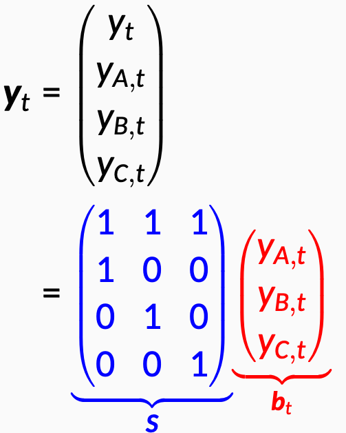
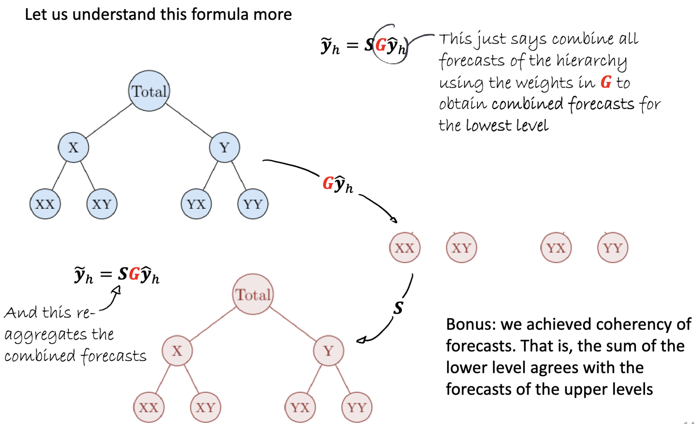

```{r initial,include=FALSE}
library(knitr)
library(fontawesome)
library(readr)
library(DT)
library(readxl)
library(tidyverse)
library(fpp3)
options(htmltools.dir.version = FALSE,
  tibble.width = 100, tibble.print_min = 8)
opts_chunk$set(
  echo = FALSE, warning = FALSE, message = FALSE, comment = "#>",
  fig.path = 'figure/', cache.path = 'cache/', cache = TRUE, fig.retina = 3,
  fig.align = 'center', fig.width = 9, fig.height = 4, fig.show = 'hold',
  dpi = 120
)
```


```{r ambulance-data, echo=FALSE, message=FALSE, cache=TRUE}
incidents_gt <- read_rds("data/incidents_gt.rds")
incidents_tsbl <- read_rds("data/incidents_tsbl.rds") |>
  mutate(region = case_when(
    lhb_code == "CT" ~ "S",
    lhb_code == "PO" ~ "C",
    lhb_code == "AB" ~ "S",
    lhb_code == "BC" ~ "N",
    lhb_code == "CV" ~ "S",
    lhb_code == "HD" ~ "C",
    lhb_code == "SB" ~ "C"
  )) |> select(date,region, everything())
```

.sticker-left[]

.center[.title[Probabilistic Forecast Reconciliation For Health Services]]
<br>
.bottom[
**_Presenter:_** Dr. Bahman Rostami-Tabar (`r fa("twitter", fill="#1da1f2")`[@Bahman_R_T](https://twitter.com/Bahman_R_T)), Cardiff University, UK. <br>
**_Co-author:_** Prof. Rob J Hyndman (`r fa("twitter", fill="#1da1f2")`[@robjhyndman](https://twitter.com/robjhyndman)), Monash University, Australia.

`r fa("chrome")`[www.bahmanrt.com](https://www.bahmanrt.com/)
]

---
background-image: url("resources/hierarchy-left.jpeg")
background-size: contain
background-position: left
class: middle

.pull-right2[
## Outline

- Hierarchical and grouped time series structures

- Hierarchical forecasting approaches

- Forecasting experiment setup

- Forecasting performance evaluation

- Conclusion
 
]

---
background-image: url("resources/hierarchy-left.jpeg")
background-size: contain
background-position: left
class: middle

.pull-right2[
## Outline

- .remember[Hierarchical and grouped time series structures]

- .gray[Hierarchical forecasting approaches]

- .gray[Forecasting experiment setup]

- .gray[Forecasting performance evaluation]

- .gray[Conclusion]

]

---
## Hierarchical data structures are everywhere

- Ambulance demand
- Accident and Emergency admissions
- Calls received in a call center
- Length of Stay
- Waiting time
- pharmaceutical product
- and many more

---
## Verified incidents in Wales 

.center[

]

---
## Hierarchical structure

```{r hierarchy1, echo=FALSE, out.width="100%"}
data <- data.frame(
  level1 = "Total",
  level2 = c(
    "Central & West", "Central & West", "Central & West",
    "North", "South & East", "South & East", "South & East"
  ),
  level3 = c("HD", "SB", "PO", "BC", "CV", "CT", "AB")
)
# transform it to a edge list!
edges_level1_2 <- data %>%
  select(level1, level2) %>%
  unique() %>%
  rename(from = level1, to = level2)
edges_level2_3 <- data %>%
  select(level2, level3) %>%
  unique() %>%
  rename(from = level2, to = level3)
edge_list <- rbind(edges_level1_2, edges_level2_3)

mygraph <- igraph::graph_from_data_frame(edge_list)
ggraph::ggraph(mygraph, layout = "dendrogram", circular = FALSE) +
  ggraph::geom_edge_diagonal() +
  ggraph::geom_node_point(color = "#dddddd", size = 10) +
  ggraph::geom_node_text(
    aes(label = c(
      "Total",
      "Central & West", "North", "South & East",
      "HD", "SB", "PO", "BC", "CV", "CT", "AB"
    ))
  ) +
  theme_void()

```

---
## Hierarchical structure

A .remember[hierarchical time series] is a collection of several time series that are linked together in a hierarchical structure (attributes naturally disaggregate in a unique hierarchical manner).

```{r hierarchy1-repeat, echo=FALSE, out.width="70%"}
data <- data.frame(
  level1 = "Total",
  level2 = c(
    "Central & West", "Central & West", "Central & West",
    "North", "South & East", "South & East", "South & East"
  ),
  level3 = c("HD", "SB", "PO", "BC", "CV", "CT", "AB")
)
# transform it to a edge list!
edges_level1_2 <- data %>%
  select(level1, level2) %>%
  unique() %>%
  rename(from = level1, to = level2)
edges_level2_3 <- data %>%
  select(level2, level3) %>%
  unique() %>%
  rename(from = level2, to = level3)
edge_list <- rbind(edges_level1_2, edges_level2_3)

mygraph <- igraph::graph_from_data_frame(edge_list)
ggraph::ggraph(mygraph, layout = "dendrogram", circular = FALSE) +
  ggraph::geom_edge_diagonal() +
  ggraph::geom_node_point(color = "#dddddd", size = 10) +
  ggraph::geom_node_text(
    aes(label = c(
      "Total",
      "Central & West", "North", "South & East",
      "HD", "SB", "PO", "BC", "CV", "CT", "AB"
    ))
  ) +
  theme_void()

```


---
## Grouped structure


```{r hierarchy2, echo=FALSE, out.width="100%"}
data <- data.frame(
  level1 = "Total",
  level2 = c(
    "Red", "Red", "Amber", "Amber", "Green", "Green"
  ),
  level3 = c("Falls", "Hearth problems", "Falls", "Hearth problems", "Falls", "Hearth problems")
)
# transform it to a edge list!
edges_level1_2 <- data %>%
  select(level1, level2) %>%
  unique() %>%
  rename(from = level1, to = level2)
edges_level2_3 <- data %>%
  select(level2, level3) %>%
  unique() %>%
  rename(from = level2, to = level3)
edge_list <- rbind(edges_level1_2, edges_level2_3)

mygraph <- igraph::graph_from_data_frame(edge_list)
ggraph::ggraph(mygraph, layout = "dendrogram", circular = FALSE) +
  ggraph::geom_edge_diagonal() +
  ggraph::geom_node_point(color = "#dddddd", size = 10) +
  ggraph::geom_node_text(
    aes(label = c(
      "Total",
      "Red", "Amber", "Green",
      "Falls", "Hearth problems", "Falls", "Hearth problems", "Falls", "Hearth problems"
    ))
  ) +
  theme_void()

```

---
## Grouped structure


```{r hierarchy3, echo=FALSE, out.width="100%"}
data <- data.frame(
  level1 = "Total",
  level2 = c(
    "Falls", "Falls", "Falls", "Hearth problems", "Hearth problems",  "Hearth problems"
  ),
  level3 = c("Red", "Amber", "Green", "Red", "Amber", "Green")
)
# transform it to a edge list!
edges_level1_2 <- data %>%
  select(level1, level2) %>%
  unique() %>%
  rename(from = level1, to = level2)
edges_level2_3 <- data %>%
  select(level2, level3) %>%
  unique() %>%
  rename(from = level2, to = level3)
edge_list <- rbind(edges_level1_2, edges_level2_3)

mygraph <- igraph::graph_from_data_frame(edge_list)
ggraph::ggraph(mygraph, layout = "dendrogram", circular = FALSE) +
  ggraph::geom_edge_diagonal() +
  ggraph::geom_node_point(color = "#dddddd", size = 10) +
  ggraph::geom_node_text(
    aes(label = c(
      "Total",
      "Falls", "Hearth problems", 
      "Red","Amber","Green", "Red","Amber","Green"
    ))
  ) +
  theme_void()
```

---
## Grouped structure

A .remember[grouped time series] is a collection of time series that can be grouped together in a number of non-uniquely hierarchical ways (attributes do not naturally disaggregate in a unique hierarchical manner).

.pull-left[
```{r hierarchy3-definition, echo=FALSE, out.width="100%"}
data <- data.frame(
  level1 = "Total",
  level2 = c(
    "Falls", "Falls", "Falls", "Hearth problems", "Hearth problems",  "Hearth problems"
  ),
  level3 = c("Red", "Amber", "Green", "Red", "Amber", "Green")
)
# transform it to a edge list!
edges_level1_2 <- data %>%
  select(level1, level2) %>%
  unique() %>%
  rename(from = level1, to = level2)
edges_level2_3 <- data %>%
  select(level2, level3) %>%
  unique() %>%
  rename(from = level2, to = level3)
edge_list <- rbind(edges_level1_2, edges_level2_3)

mygraph <- igraph::graph_from_data_frame(edge_list)
ggraph::ggraph(mygraph, layout = "dendrogram", circular = FALSE) +
  ggraph::geom_edge_diagonal() +
  ggraph::geom_node_point(color = "#dddddd", size = 10) +
  ggraph::geom_node_text(
    aes(label = c(
      "Total",
      "Falls", "Hearth problems", 
      "Red","Amber","Green", "Red","Amber","Green"
    ))
  ) +
  theme_void()
```
]

.pull-right[
```{r hierarchy2-definition, echo=FALSE, out.width="100%"}
data <- data.frame(
  level1 = "Total",
  level2 = c(
    "Red", "Red", "Amber", "Amber", "Green", "Green"
  ),
  level3 = c("Falls", "Hearth problems", "Falls", "Hearth problems", "Falls", "Hearth problems")
)
# transform it to a edge list!
edges_level1_2 <- data %>%
  select(level1, level2) %>%
  unique() %>%
  rename(from = level1, to = level2)
edges_level2_3 <- data %>%
  select(level2, level3) %>%
  unique() %>%
  rename(from = level2, to = level3)
edge_list <- rbind(edges_level1_2, edges_level2_3)

mygraph <- igraph::graph_from_data_frame(edge_list)
ggraph::ggraph(mygraph, layout = "dendrogram", circular = FALSE) +
  ggraph::geom_edge_diagonal() +
  ggraph::geom_node_point(color = "#dddddd", size = 10) +
  ggraph::geom_node_text(
    aes(label = c(
      "Total",
      "Red", "Amber", "Green",
      "Falls", "Hearth problems", "Falls", "Hearth problems", "Falls", "Hearth problems"
    ))
  ) +
  theme_void()

```
]

---
class: centre
## Hierarchical and grouped structure

.pull-left[
```{r hierarchy12, echo=FALSE, out.width="120%"}
data <- data.frame(
  level1 = "Total",
  level2 = c(
    "Central & West", "Central & West", "Central & West",
    "North", "South & East", "South & East", "South & East"
  ),
  level3 = c("HD", "SB", "PO", "BC", "CV", "CT", "AB")
)
# transform it to a edge list!
edges_level1_2 <- data %>%
  select(level1, level2) %>%
  unique() %>%
  rename(from = level1, to = level2)
edges_level2_3 <- data %>%
  select(level2, level3) %>%
  unique() %>%
  rename(from = level2, to = level3)
edge_list <- rbind(edges_level1_2, edges_level2_3)

mygraph <- igraph::graph_from_data_frame(edge_list)
ggraph::ggraph(mygraph, layout = "dendrogram", circular = FALSE) +
  ggraph::geom_edge_diagonal() +
  ggraph::geom_node_point(color = "#dddddd", size = 10) +
  ggraph::geom_node_text(
    aes(label = c(
      "All country",
      "Central & West", "North", "South & East",
      "HD", "SB", "PO", "BC", "CV", "CT", "AB"
    ))
  ) +
  theme_void()

```
]

.pull-right[
```{r group, echo=FALSE, out.width="90%"}

```
]

---
## Incident data

.remark-code[
```{r incidents_tsbl}
incidents_tsbl |> rename(nature=nature_of_incident, priority=category,control=region)|> update_tsibble(key = c(control,lhb_code,priority,nature)) |> arrange(desc(incidents))
```
]

---
## Hierarchically aggregated incident data

```{r incidents_gt}
incidents_gt |> rename(priority=category,control=region) |> select(date,control,lhb, priority,nature,incident)
```


---
## Total number of series

```{r series-number, echo=FALSE, out.width="20%"}
agg_level <- tibble::tribble(
  ~Level, ~`Number of series`,
  "All country (Total)", 1,
  "Control", 3,
  "Health board", 7,
  "Priority", 3,
  "Priority * Control", 9,
  "Priority * Health board", 21,
  "Nature of incident", 35,
  "Nature of incident * Control", 105,
  "Nature of incident * Health board", 245,
  "Priority * Nature of incident", 104,
  "Control * Priority * Nature of incident", 306,
  "Control * Health board * Priority * Nature of incident (Bottom level)", 691,
  "Total", 1530
)
kbl(agg_level) %>%
kable_styling(bootstrap_options = "striped",font_size = 20, full_width = F)
```

---
## Forecasts are often required at all levels

How to produce a coherent forecast for a large collections of related time series

.pull-left[
### Hierarchical levels
- National or area level (strategic and long-term) such as workforce resource planning and budgeting; 
- Health board level (tactical and medium-term) such as temporary capacity expansions, resource sharing, and staffing;
- hospital or station level (operational and short-term) such as planning rosters.]

.pull-right[
### Grouped levels

Forecasts might also be required at different levels for a specific area of interest:

  - nature of incidents 
  - priority levels
  - gender
  - age group
  - etc
]

---
background-image: url("resources/hierarchy-left.jpeg")
background-size: contain
background-position: left
class: middle

.pull-right2[
## Outline

- .gray[Hierarchical and grouped time series structures]

- .remember[Hierarchical forecasting approaches]

- .gray[Forecasting experiment setup]

- .gray[Forecasting performance evaluation]

- .gray[Conclusion]

]

---

.pull-left[
.smalll[
```{r series-number1, echo=FALSE, out.width="20%"}
agg_level <- tibble::tribble(
  ~Level, ~`Number of series`,
  "All country", 1,
  "Control", 3,
  "Health board", 7,
  "Priority", 3,
  "Priority * Control", 9,
  "Priority * Health board", 21,
  "Nature of incident", 35,
  "Nature of incident * Control", 105,
  "Nature of incident * Health board", 245,
  "Priority * Nature of incident", 104,
  "Control * Priority * Nature of incident", 306,
  "Control * Health board * Priority * Nature of incident (Bottom level)", 691,
  "Total", 1530
)
kbl(agg_level) %>%
kable_styling(bootstrap_options = "striped",font_size = 20, full_width = F)
```
]
]

.pull-right[
---
## Base forecast

- Producing independent forecasts, also refereed to as base forecasts, typically by different teams as the need for such forecasts arise.

- Same or different forecasting model could be used in each level.

- Forecasts are not coherent, the would not add up as time series does.
]

---
class: middle
.pull-left[
### Hierarchical series
```{r hierarchy-series, echo=FALSE, out.width="75%"}
knitr::include_graphics("figure/wast_hiararchy/fig-dataviz2-1.png")
```
]

.pull-right[
### Hierarchical forecasting approaches
```{r pyramid, echo = FALSE, out.width="90%"}

```
]


<!-- --- -->
<!-- ## Top-down forecasting -->

<!-- .pull-left[ -->
<!-- ### Advantages -->

<!-- - Works well in presence of low counts. -->
<!-- - Single forecasting model -->
<!-- - Easy to build -->
<!-- - Provides reliable forecasts for aggregate levels. -->

<!-- ] -->

<!-- .pull-right[ -->
<!-- ### Disadvantages -->

<!-- - Loss of information, especially individual series dynamics. -->
<!-- - Distribution of forecasts to lower levels can be difficult -->
<!-- - No prediction intervals -->
<!-- ] -->

<!-- --- -->
<!-- ## Bottom-up forecasting -->

<!-- .pull-left[ -->
<!-- ### Advantages -->
<!-- - No loss of information. -->
<!-- - Better captures dynamics of individual series. -->

<!-- ] -->

<!-- .pull-right[ -->
<!-- ### Disadvantages -->
<!-- - Large number of series to be forecast. -->
<!-- - Constructing forecasting models is harder because of noisy data at bottom level. -->
<!-- - No prediction intervals -->
<!-- ] -->

---
## Reconciled forecasts

- This approach involves first generating independently  base forecast for each series in the hierarchy (they will not add up according to the hierarchical structure). 
- Reconciliation is a post-forecasting process aimed at improving the accuracy of the base forecasts (however obtained) 
- The Reconciliation approach combines the base forecasts and generates a set of revised forecasts that aggregate consistently with the hierarchical structure (they are coherent).

---
class: center
## Probabilistic forecast

.center[

]

---
background-image: url("resources/hierarchy-left.jpeg")
background-size: contain
background-position: left
class: middle

.pull-right2[
## Outline

- .gray[Hierarchical and grouped time series structures]

- .gray[Hierarchical forecasting approaches]

- .remember[Forecasting experiment setup]

- .gray[Forecasting performance evaluation]

- .gray[Conclusion]

]

---
## Time series of ambulance demand

**An inherent hierarchical and grouped structure**

- Historical daily demand for over 5 years
- Demand for ambulance services at the country level can be disaggregated into:

    - a geographical hierarchy into control, health boards
    - groups (attributes) such as the nature of incidents and priority. 


---
## Strength of trend and seasonality

.center[

]

---
## Time plots: few examples

.center[

]

---
## Forecasting setup

- Forecasting to inform a planning horizon of 42 days
- The forecast horizon is 84 days ahead
- Point and probabilistic forecasts are generated and evaluated for the entire hierarchy
- Forecasts are evaluated using time series cross validation tested on the last year of data

.center[

]

---
## Forecasting models

- **Naive:** Assuming that the future days will be similar to past days. We use the empirical distribution of the past daily demand
- **Exponential Smoothing State Space model (ETS):** ETS models can combine trend, seasonality, and error components in a time series
- **Generalized Linear Model (GLM):** GLMs are a family of models developed to extend the concept of linear regression models to non-Gaussian distributions 
- **Poisson Regression using tscount (TSGLM):** We also consider another Poisson regression model that takes into account serial dependence
- **Ensemble method:** Finally, we use an ensemble method that combines the forecasts generated from the Naive, ETS, GLM and TSGLM models to form a mixture distribution

---
## Forecasting performance metrics- point forecast

.pull-left[
$$\large \text{MASE} = \text{mean}(|q_{j}|),$$

where

$$q_{j} = \frac{ e_{j}}
 {\displaystyle\frac{1}{T-m}\sum_{t=m+1}^T |y_{t}-y_{t-m}|},$$
]

.pull-right[
$$\large \text{MSSE} = \text{mean}(q_{j}^2),$$ 

where,

$$q^2_{j} = \frac{ e^2_{j}}
 {\displaystyle\frac{1}{T-m}\sum_{t=m+1}^T (y_{t}-y_{t-m})^2},$$
]

---
## Forecasting performance metrics- probabilistic forecast

.pull-left[
$$\large \text{CRPS} = \text{mean}(p_j),$$ 

where

$$p_j = \int_{-\infty}^{\infty} \left(G_j(x) - F_j(x)\right)^2dx,$$
]

.pull-right[

]

---
background-image: url("resources/hierarchy-left.jpeg")
background-size: contain
background-position: left
class: middle

.pull-right2[
## Outline

- .gray[Hierarchical and grouped time series structures]

- .gray[Hierarchical forecasting approaches]

- .gray[Forecasting experiment setup]

- .remember[Forecasting performance evaluation]

- .gray[Conclusion]

]

---
## Forecast accuracy result

.center[

]

---
## Forecast accuracy result- optimal reconciliation

.center[

]

---
background-image: url("resources/hierarchy-left.jpeg")
background-size: contain
background-position: left
class: middle

.pull-right2[
## Outline

- .gray[Hierarchical and group time series structure]

- .gray[Time series of ambulance demand & forecasting setup]

- .gray[Forecasting models]

- .gray[Hierarchical and grouped time series forecasting approaches]

- .gray[Forecasting performance]

- .remember[Conclusion]

]

---
## What if hierarchies are ignored

❌  Forecasts are not consistent  no  coherency.

❌  Base forecasts can result in lack of consistency and coordination, leading to less effective planning and decision making. 

❌  Teams operating in isolation leading to conflicts, duplication work, rework, or work that runs counter to the overall goal to improve the quality of delivery service.

❌ Not using all information available at the other levels of hierarchy to improve your forecast.

---
## Benefit of hierarchical/grouped time series forecasting

✅  Plans at any level are based on .remember[coherent forecasts] and therefore can be aligned. 

✅  Hierarchical forecasting framework can be used as a tool to .remember[improve coordination] between teams across the care services at the national, sub-national, regional and local levels.

✅  Result in .remember[more accurate than the independent (base) forecasts].

✅  Hierarchical forecasting can be used to create coherent forecast, regardless of how base forecasts are created, even with judgmental forecasts.

---
## Temporal and cross-temporal hierarchies

- Here we discussed hierarchical and grouped time series, which deals with these structure at a one time granularity.

- The same issues arise when you need to forecast across different temporal granularities. You have an hourly time series, you want to forecast future daily, weekly, monthly, quarterly demand

- It is also possible to combine hierarchical and temporal hierarchies together

---
## Potential topics for research

- High dimensional hierarchical forecasting
- Forecasting with high frequency data
- Probabilistic hierarchical forecasting for discrete distributions
- Machine learning and AI approaches to hierarchical forecasting
- Hierarchical forecasting with explanatory variables
- Applications of hierarchical forecasting to other services in healthcare

---
## My new book
### [https://dfep.netlify.app/](https://dfep.netlify.app/)

.center[

]

---

.pull-left[
Presenter: Dr. Bahman Rostami-Tabar (`r fa("twitter", fill="#1da1f2")`[@Bahman_R_T](https://twitter.com/Bahman_R_T)), Cardiff University, UK. <br>
Co-author: Prof. Rob J Hyndman (`r fa("twitter", fill="#1da1f2")`[@robjhyndman](https://twitter.com/robjhyndman)), Monash University, Australia.

`r fa("chrome")`[www.bahmanrt.com](https://www.bahmanrt.com/)

]

.pull-right[
## Outline

- Hierarchical and grouped time series structures

- Hierarchical forecasting approaches

- Forecasting experiment setup

- Forecasting performance evaluation

- Conclusion

]

---
## Reconciled forecasts-notations

- Let $\large {b}_t$ be a vector of $\large n_b$ _bottom-level_ time series at time $\large t$, and let $\large {a}_t$ be a corresponding vector of $\large n_a = n-n_b$ aggregated time series, where $\large a_t = {A}{b}_t,$

--

- $\large A$ is the $\large n_a\times n_b$ "aggregation" matrix specifying how the bottom-level series ${b}_t$ are to be aggregated to form $\large {a}_t$. 

--

- The full vector of time series is given by $\large y_t = \begin{bmatrix}{a}_t \\{b}_t\end{bmatrix}.$

--

- This leads to the $\large n\times n_b$ "summing" or "structural" matrix given by
$\large S = \begin{bmatrix}{A} \\ {I}_{n_b}\end{bmatrix}$, such that $\large {y}_t = {S}{b}_t$.

---
class: middle, center

.pull-left[
```{r simple-hierarchy1, echo=FALSE, out.width="120%"}
data <- data.frame(
  level1 = "Total",
  level2 = c("A", "B", "C")
  )
# transform it to a edge list!
edges_level1_2 <- data %>%
  select(level1, level2) %>%
  unique() %>%
  rename(from = level1, to = level2)

edge_list <- edges_level1_2

mygraph <- igraph::graph_from_data_frame(edge_list)
ggraph::ggraph(mygraph, layout = "dendrogram", circular = FALSE) +
  ggraph::geom_edge_diagonal() +
  ggraph::geom_node_point(color = "#dddddd", size = 10) +
  ggraph::geom_node_text(
    aes(label = c(
      "Total",
      "A", "B", "C"
    ))
  ) +
  theme_void()
```
]

.pull-right[

]

---
## Hierarchical, and linearly constrained time series
.pull-left[
```{r hierarchy1-linear, echo=FALSE, out.width="100%"}
data <- data.frame(
  level1 = "Total",
  level2 = c(
    "Central & West", "Central & West", "Central & West",
    "North", "South & East", "South & East", "South & East"
  ),
  level3 = c("HD", "SB", "PO", "BC", "CV", "CT", "AB")
)
# transform it to a edge list!
edges_level1_2 <- data %>%
  select(level1, level2) %>%
  unique() %>%
  rename(from = level1, to = level2)
edges_level2_3 <- data %>%
  select(level2, level3) %>%
  unique() %>%
  rename(from = level2, to = level3)
edge_list <- rbind(edges_level1_2, edges_level2_3)

mygraph <- igraph::graph_from_data_frame(edge_list)
ggraph::ggraph(mygraph, layout = "dendrogram", circular = FALSE) +
  ggraph::geom_edge_diagonal() +
  ggraph::geom_node_point(color = "#dddddd", size = 10) +
  ggraph::geom_node_text(
    aes(label = c(
      "Total",
      "Central & West", "North", "South & East",
      "HD", "SB", "PO", "BC", "CV", "CT", "AB"
    ))
  ) +
  theme_void()

```
]

.pull-right[
- Total = Central & West + North South & East
- Central & West = HD + SB + PO
- North = BC
- South & East = CV + CT + AB
]

.remember[Coherent forecast] satisfies these aggregation constraints.


<!-- --- -->
<!-- ## How does reconciliation work? -->

<!-- .center[ -->
<!--  -->
<!-- ] -->

---
##  Linear reconciliation methods, Bottom-up and others

Forecast reconciliation approaches combine and reconcile all the base forecasts in order to produce coherent forecasts. 

--

Linear reconciliation methods (Wickramasuriya, Athanasopoulos, and Hyndman 2019) can be written as

$$\large \tilde{{y}}_h = {S}({S}'{W}^{-1}{S})^{-1}{W}^{-1}\hat{{y}}_h ={S}{G}\hat{{y}}_h = {M}\hat{{y}}_h,$$

where ${W}$ is an $n \times n$ positive definite matrix, and $\hat{{y}}_h$ contains the $h$-step forecasts of ${y}_{T+h}$ given data to time $T$. 

--

.small[
- Different choices for ${W}$ lead to different solutions such as Ordinary Least Squares (OLS), Weighted Least Squares (WLS) and Minimum Trace (MinT). 
- We use the implementation of these methods in the `hts` package in R in the experiment.
]

<!-- --- -->
<!-- ## Choosing W -->

<!-- - Different choices for ${W}$ lead to different solutions such as Ordinary Least Squares (OLS), Weighted Least Squares (WLS) and Minimum Trace (MinT).  -->
<!-- - We use the implementation of these methods in the `hts` package in R in the experiment. -->

<!-- .center[ -->
<!--  -->
<!-- ] -->
---
## Producing probabilistic forecasts

- We use bootstrapping to generate probabilistic forecasts:

    - Suppose that $(\hat{{y}}_h^{[1]},\dots,\hat{{y}}_h^{[B]})$ are a set of $B$ simulated sample paths, generated independently from the models used to produce the base forecasts. 
    - Then $({S}({S}'{W}^{-1}{S})^{-1}{W}^{-1}\hat{{y}}_h^{[1]},\dots,{S}({S}'{W}^{-1}{S})^{-1}{W}^{-1}\hat{{y}}_h^{[B]})$ provides a set of reconciled sample paths, from which percentiles can be calculated.
